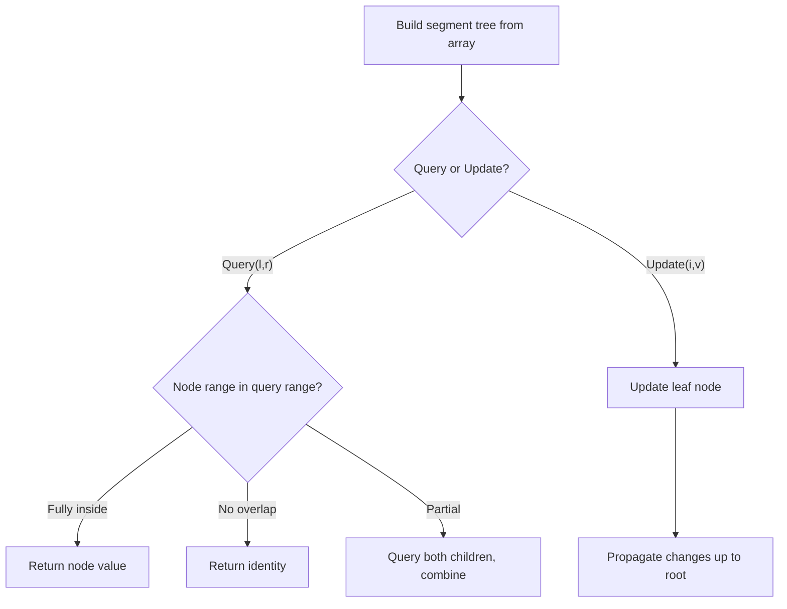

# Problem 2179: Count Good Triplets in an Array

**Difficulty:** Hard  
**Tags:** Array, Binary Search, Divide and Conquer, Binary Indexed Tree, Segment Tree, Merge Sort, Ordered Set  
**Pattern:** Segment Tree  
**Link:** [leetcode.com/problems/count-good-triplets-in-an-array](https://leetcode.com/problems/count-good-triplets-in-an-array/)

## Description

You are given two **0-indexed** arrays `nums1` and `nums2` of length `n`, both of which are **permutations** of `[0, 1, ..., n - 1]`.

A **good triplet** is a set of `3` **distinct** values which are present in **increasing order** by position both in `nums1` and `nums2`. In other words, if we consider `pos1v` as the index of the value `v` in `nums1` and `pos2v` as the index of the value `v` in `nums2`, then a good triplet will be a set `(x, y, z)` where `0 <= x, y, z <= n - 1`, such that `pos1x < pos1y < pos1z` and `pos2x < pos2y < pos2z`.

Return *the **total number** of good triplets*.

 

Example 1:

```

**Input:** nums1 = [2,0,1,3], nums2 = [0,1,2,3]
**Output:** 1
**Explanation:** 
There are 4 triplets (x,y,z) such that pos1x < pos1y < pos1z. They are (2,0,1), (2,0,3), (2,1,3), and (0,1,3). 
Out of those triplets, only the triplet (0,1,3) satisfies pos2x < pos2y < pos2z. Hence, there is only 1 good triplet.

```

Example 2:

```

**Input:** nums1 = [4,0,1,3,2], nums2 = [4,1,0,2,3]
**Output:** 4
**Explanation:** The 4 good triplets are (4,0,3), (4,0,2), (4,1,3), and (4,1,2).

```

 

**Constraints:**

	- `n == nums1.length == nums2.length`
	- `3 <= n <= 10^5`
	- `0 <= nums1[i], nums2[i] <= n - 1`
	- `nums1` and `nums2` are permutations of `[0, 1, ..., n - 1]`.

## Approach: Segment Tree

Build a segment tree for range queries (sum, min, max) with point or range updates. Each node covers a range; queries are answered by combining relevant segments.

## Pseudocode

```
1. Build segment tree from array (O(n))
2. Query(l, r):
   - If node range within [l,r]: return node value
   - If no overlap: return identity
   - Else: combine query(left_child) and query(right_child)
3. Update(i, val): update leaf and propagate up
```

## Algorithm Flow



## Complexity Analysis

- **Time:** O(n log n) build, O(log n) query/update
- **Space:** O(n)

## Solution (Python3)

```python
class Solution:
    def goodTriplets(self, nums1: List[int], nums2: List[int]) -> int:
        # Segment tree for range queries - O(n log n) build, O(log n) query
        n = len(nums1)
        tree = [0] * (4 * n)
        
        def build(node, start, end):
            if start == end:
                tree[node] = nums1[start]
                return
            mid = (start + end) // 2
            build(2*node, start, mid)
            build(2*node+1, mid+1, end)
            tree[node] = tree[2*node] + tree[2*node+1]
        
        def query(node, start, end, l, r):
            if r < start or end < l:
                return 0
            if l <= start and end <= r:
                return tree[node]
            mid = (start + end) // 2
            return query(2*node, start, mid, l, r) + query(2*node+1, mid+1, end, l, r)
        
        build(1, 0, n-1)
        return 0
```

## Solution (C++)

```cpp
#include <functional>
#include <string>
#include <vector>
using namespace std;

class Solution {
public:
    int goodTriplets(vector<int>& nums1, vector<int>& nums2) {
        // Segment tree for range queries
        int n = nums1.size();
        vector<int> tree(4 * n, 0);
        function<void(int, int, int)> build = [&](int node, int s, int e) {
            if (s == e) { tree[node] = nums1[s]; return; }
            int mid = (s + e) / 2;
            build(2*node, s, mid);
            build(2*node+1, mid+1, e);
            tree[node] = tree[2*node] + tree[2*node+1];
        };
        function<int(int, int, int, int, int)> query = [&](int node, int s, int e, int l, int r) -> int {
            if (r < s || e < l) return 0;
            if (l <= s && e <= r) return tree[node];
            int mid = (s + e) / 2;
            return query(2*node, s, mid, l, r) + query(2*node+1, mid+1, e, l, r);
        };
        build(1, 0, n-1);
        return 0;
    }
};
```
