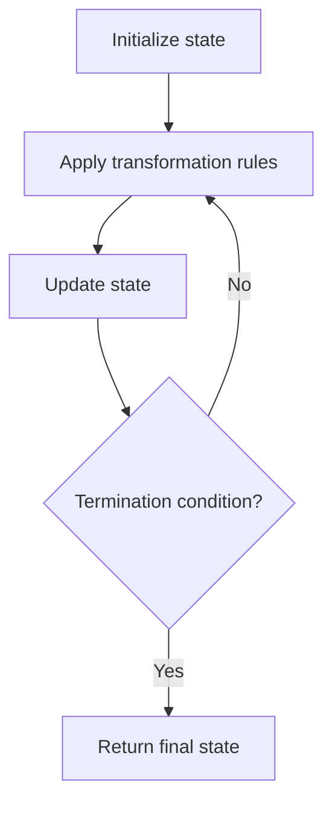

# Problem 2180: Count Integers With Even Digit Sum

**Difficulty:** Easy  
**Tags:** Math, Simulation  
**Pattern:** Simulation  
**Link:** [leetcode.com/problems/count-integers-with-even-digit-sum](https://leetcode.com/problems/count-integers-with-even-digit-sum/)

## Description

Given a positive integer `num`, return *the number of positive integers **less than or equal to*** `num` *whose digit sums are **even***.

The **digit sum** of a positive integer is the sum of all its digits.

 

Example 1:

```

**Input:** num = 4
**Output:** 2
**Explanation:**
The only integers less than or equal to 4 whose digit sums are even are 2 and 4.    

```

Example 2:

```

**Input:** num = 30
**Output:** 14
**Explanation:**
The 14 integers less than or equal to 30 whose digit sums are even are
2, 4, 6, 8, 11, 13, 15, 17, 19, 20, 22, 24, 26, and 28.

```

 

**Constraints:**

	- `1 <= num <= 1000`

## Approach: Simulation

Simulate the process described in the problem step by step. Follow the rules exactly, tracking state at each step.

## Pseudocode

```
1. Initialize state (grid, pointers, counters)
2. For each step / iteration:
   a. Apply the transformation rules
   b. Update state
   c. Check termination condition
3. Return final state or result
```

## Algorithm Flow



## Complexity Analysis

- **Time:** O(n) or O(n * k)
- **Space:** O(n)

## Solution (Python3)

```python
class Solution:
    def countEven(self, num: int) -> int:
        # Simulation approach - follow the rules step by step
        result = 0
        for i in range(len(num) if isinstance(num, list) else num):
            # Simulate each step
            pass
        return result
```

## Solution (C++)

```cpp
#include <string>
#include <vector>
using namespace std;

class Solution {
public:
    int countEven(int num) {
        // Simulation approach
        int n = num.size();
        for (int i = 0; i < n; i++) {
            // Simulate each step
        }
        return 0;
    }
};
```
