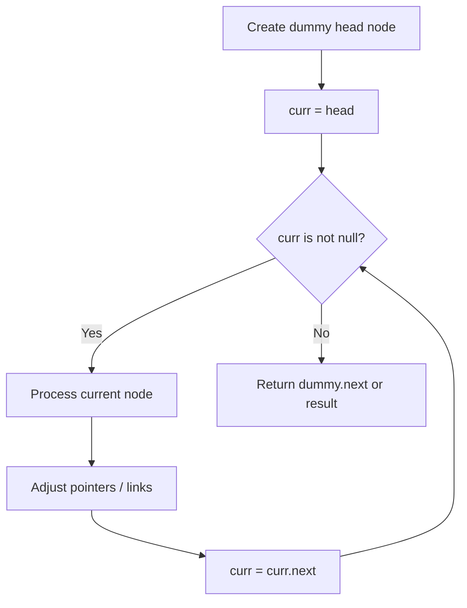
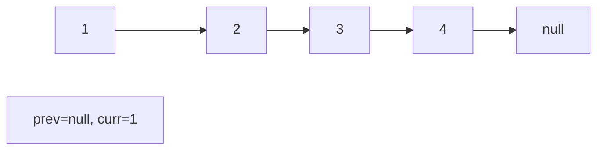
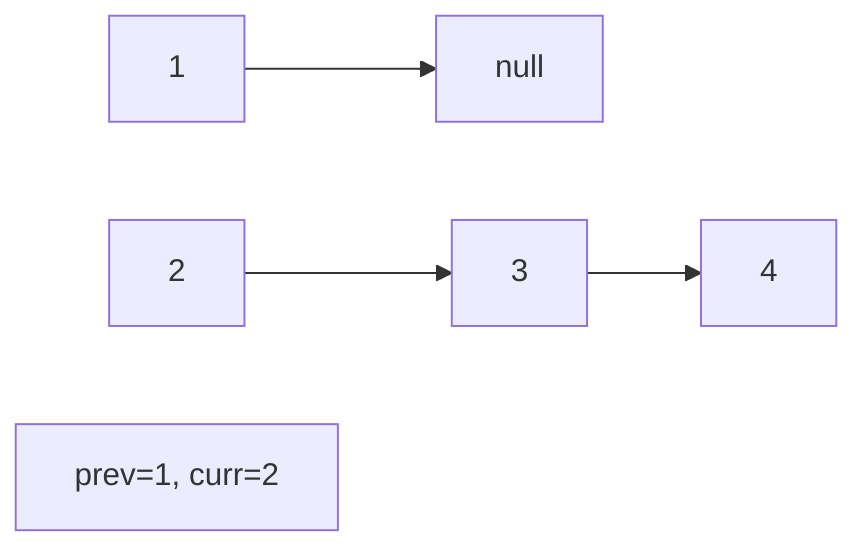
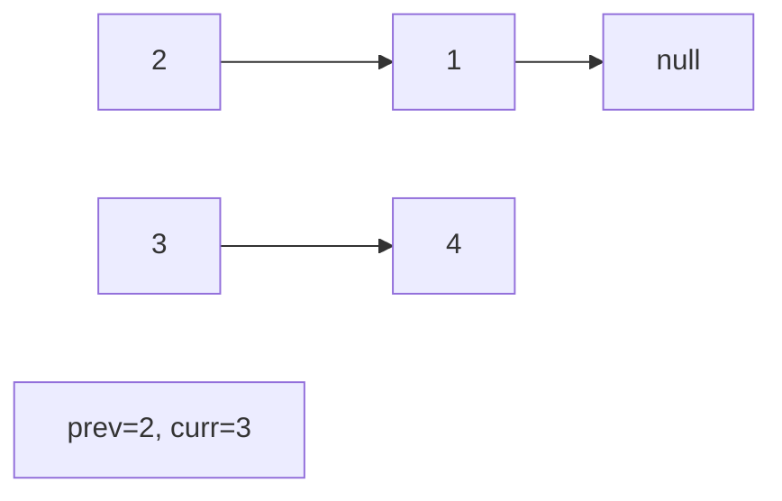
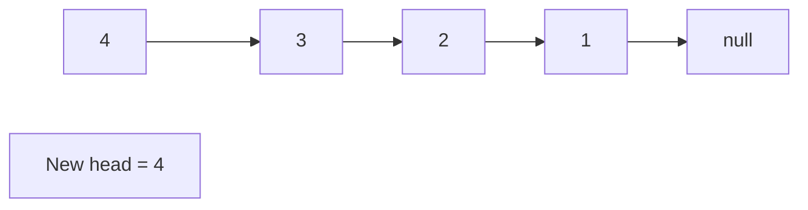

# Problem 2181: Merge Nodes in Between Zeros

**Difficulty:** Medium  
**Tags:** Linked List, Simulation  
**Pattern:** Linked List  
**Link:** [leetcode.com/problems/merge-nodes-in-between-zeros](https://leetcode.com/problems/merge-nodes-in-between-zeros/)

## Description

You are given the `head` of a linked list, which contains a series of integers **separated** by `0`'s. The **beginning** and **end** of the linked list will have `Node.val == 0`.

For **every **two consecutive `0`'s, **merge** all the nodes lying in between them into a single node whose value is the **sum** of all the merged nodes. The modified list should not contain any `0`'s.

Return *the* `head` *of the modified linked list*.

 

Example 1:

```

**Input:** head = [0,3,1,0,4,5,2,0]
**Output:** [4,11]
**Explanation:** 
The above figure represents the given linked list. The modified list contains
- The sum of the nodes marked in green: 3 + 1 = 4.
- The sum of the nodes marked in red: 4 + 5 + 2 = 11.

```

Example 2:

```

**Input:** head = [0,1,0,3,0,2,2,0]
**Output:** [1,3,4]
**Explanation:** 
The above figure represents the given linked list. The modified list contains
- The sum of the nodes marked in green: 1 = 1.
- The sum of the nodes marked in red: 3 = 3.
- The sum of the nodes marked in yellow: 2 + 2 = 4.

```

 

**Constraints:**

	- The number of nodes in the list is in the range `[3, 2 * 10^5]`.
	- `0 <= Node.val <= 1000`
	- There are **no** two consecutive nodes with `Node.val == 0`.
	- The **beginning** and **end** of the linked list have `Node.val == 0`.

## Approach: Linked List

Traverse or manipulate the linked list using pointer techniques. Common patterns: dummy head node for edge cases, fast/slow pointers for cycle detection or middle finding, in-place reversal, and merge operations.

## Pseudocode

```
1. Create dummy head if needed
2. Initialize pointer(s) at head
3. Traverse / modify list:
   a. Process current node
   b. Adjust next pointers as needed
   c. Move to next node
4. Return dummy.next or result
```

## Algorithm Flow



## Visual State Transitions

**Linked List Operation (Reverse):**

**Frame 1: Initial list**


**Frame 2: Reverse first link**


**Frame 3: Reverse second link**


**Frame 4: Fully reversed**



## Complexity Analysis

- **Time:** O(n)
- **Space:** O(1)

## Solution (Python3)

```python
class Solution:
    def mergeNodes(self, head: Optional[ListNode]) -> Optional[ListNode]:
        # Linked list traversal/manipulation
        dummy = ListNode(0)
        dummy.next = head
        prev, curr = dummy, head
        while curr:
            nxt = curr.next
            # Process current node
            prev = curr
            curr = nxt
        return dummy.next
```

## Solution (C++)

```cpp
#include <string>
#include <vector>
using namespace std;

class Solution {
public:
    ListNode* mergeNodes(ListNode* head) {
        // Linked list traversal/manipulation
        ListNode dummy(0);
        dummy.next = head;
        ListNode* prev = &dummy;
        ListNode* curr = head;
        while (curr) {
            ListNode* nxt = curr->next;
            // Process current node
            prev = curr;
            curr = nxt;
        }
        return dummy.next;
    }
};
```
