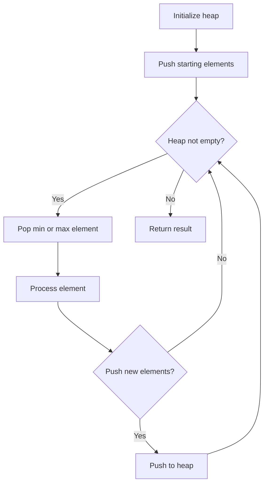
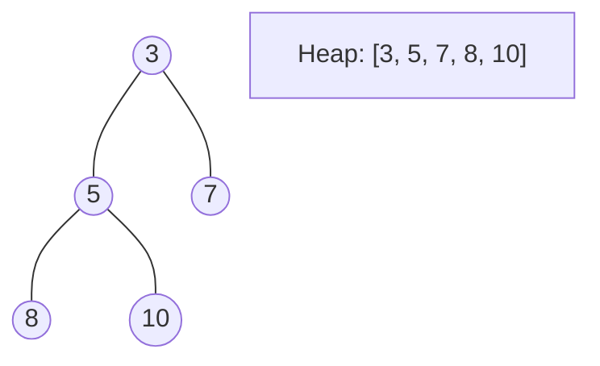
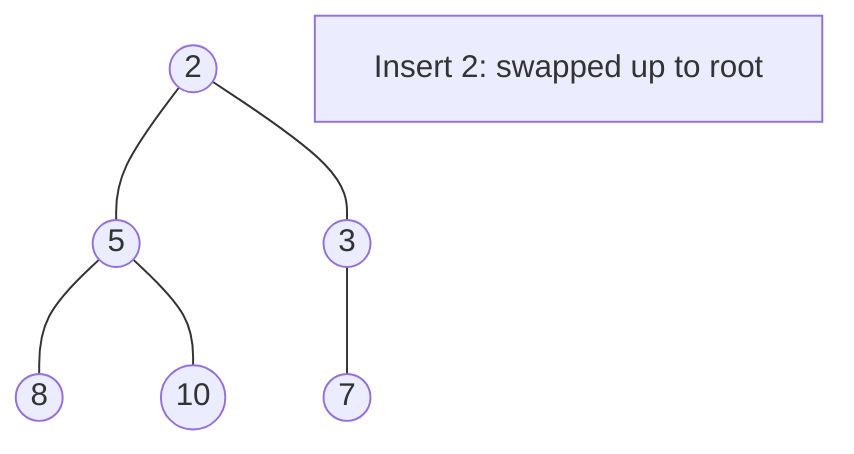
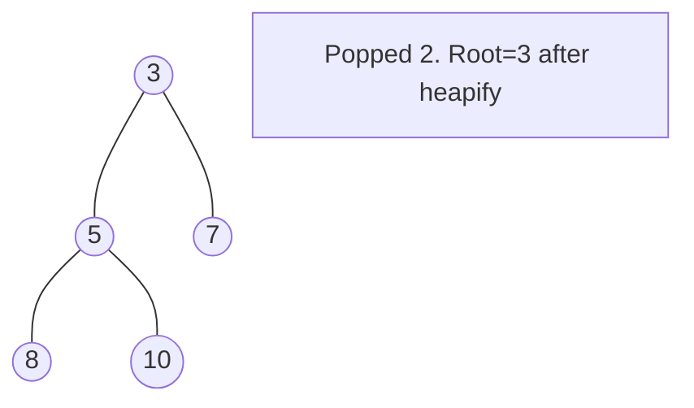

# Problem 2182: Construct String With Repeat Limit

**Difficulty:** Medium  
**Tags:** Hash Table, String, Greedy, Heap (Priority Queue), Counting  
**Pattern:** Heap / Priority Queue  
**Link:** [leetcode.com/problems/construct-string-with-repeat-limit](https://leetcode.com/problems/construct-string-with-repeat-limit/)

## Description

You are given a string `s` and an integer `repeatLimit`. Construct a new string `repeatLimitedString` using the characters of `s` such that no letter appears **more than** `repeatLimit` times **in a row**. You do **not** have to use all characters from `s`.

Return *the **lexicographically largest** *`repeatLimitedString` *possible*.

A string `a` is **lexicographically larger** than a string `b` if in the first position where `a` and `b` differ, string `a` has a letter that appears later in the alphabet than the corresponding letter in `b`. If the first `min(a.length, b.length)` characters do not differ, then the longer string is the lexicographically larger one.

 

Example 1:

```

**Input:** s = "cczazcc", repeatLimit = 3
**Output:** "zzcccac"
**Explanation:** We use all of the characters from s to construct the repeatLimitedString "zzcccac".
The letter 'a' appears at most 1 time in a row.
The letter 'c' appears at most 3 times in a row.
The letter 'z' appears at most 2 times in a row.
Hence, no letter appears more than repeatLimit times in a row and the string is a valid repeatLimitedString.
The string is the lexicographically largest repeatLimitedString possible so we return "zzcccac".
Note that the string "zzcccca" is lexicographically larger but the letter 'c' appears more than 3 times in a row, so it is not a valid repeatLimitedString.

```

Example 2:

```

**Input:** s = "aababab", repeatLimit = 2
**Output:** "bbabaa"
**Explanation:** We use only some of the characters from s to construct the repeatLimitedString "bbabaa". 
The letter 'a' appears at most 2 times in a row.
The letter 'b' appears at most 2 times in a row.
Hence, no letter appears more than repeatLimit times in a row and the string is a valid repeatLimitedString.
The string is the lexicographically largest repeatLimitedString possible so we return "bbabaa".
Note that the string "bbabaaa" is lexicographically larger but the letter 'a' appears more than 2 times in a row, so it is not a valid repeatLimitedString.

```

 

**Constraints:**

	- `1 <= repeatLimit <= s.length <= 10^5`
	- `s` consists of lowercase English letters.

## Approach: Heap / Priority Queue

Use a min-heap or max-heap to efficiently access the smallest/largest element. Push elements and pop the top to process in priority order.

## Pseudocode

```
1. Initialize heap (min or max)
2. Push initial elements onto heap
3. While heap not empty and condition:
   a. Pop top element (min or max)
   b. Process element
   c. Push new elements if needed
4. Return result
```

## Algorithm Flow



## Visual State Transitions

**Heap Operations (Min-Heap):**

**Frame 1: Initial heap**


**Frame 2: Insert 2 - bubble up**


**Frame 3: Pop minimum (2) - heapify down**



## Complexity Analysis

- **Time:** O(n log n)
- **Space:** O(n)

## Solution (Python3)

```python
class Solution:
    def repeatLimitedString(self, s: str, repeatLimit: int) -> str:
        # Heap/Priority Queue - O(n log k) time
        import heapq
        if not s:
            return ""
        # Min heap (negate for max heap)
        heap = []
        for val in s:
            heapq.heappush(heap, val)
            if len(heap) > (repeatLimit if isinstance(repeatLimit, int) else len(s)):
                heapq.heappop(heap)
        return heap[0] if heap else ""
```

## Solution (C++)

```cpp
#include <queue>
#include <string>
#include <vector>
using namespace std;

class Solution {
public:
    string repeatLimitedString(string& s, int repeatLimit) {
        // Heap/Priority Queue - O(n log k) time
        priority_queue<int, vector<int>, greater<int>> pq;
        for (int val : s) {
            pq.push(val);
            if ((int)pq.size() > repeatLimit)
                pq.pop();
        }
        return pq.empty() ? "" : pq.top();
    }
};
```
