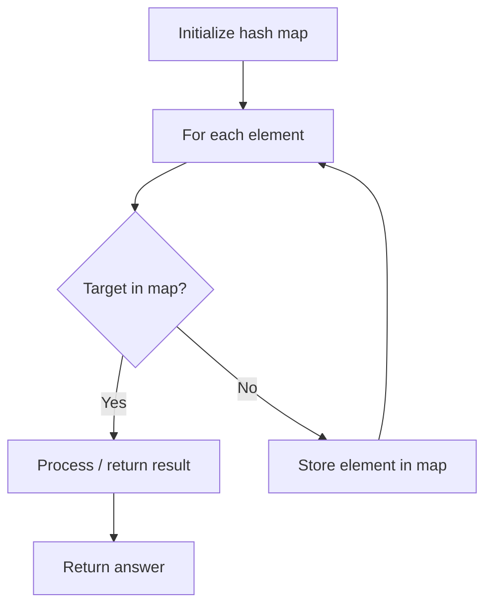

# Problem 2183: Count Array Pairs Divisible by K

**Difficulty:** Hard  
**Tags:** Array, Hash Table, Math, Counting, Number Theory  
**Pattern:** Hash Map Lookup  
**Link:** [leetcode.com/problems/count-array-pairs-divisible-by-k](https://leetcode.com/problems/count-array-pairs-divisible-by-k/)

## Description

Given a **0-indexed** integer array `nums` of length `n` and an integer `k`, return *the **number of pairs*** `(i, j)` *such that:*

	- `0 <= i < j <= n - 1` *and*
	- `nums[i] * nums[j]` *is divisible by* `k`.

 

Example 1:

```

**Input:** nums = [1,2,3,4,5], k = 2
**Output:** 7
**Explanation:** 
The 7 pairs of indices whose corresponding products are divisible by 2 are
(0, 1), (0, 3), (1, 2), (1, 3), (1, 4), (2, 3), and (3, 4).
Their products are 2, 4, 6, 8, 10, 12, and 20 respectively.
Other pairs such as (0, 2) and (2, 4) have products 3 and 15 respectively, which are not divisible by 2.    

```

Example 2:

```

**Input:** nums = [1,2,3,4], k = 5
**Output:** 0
**Explanation:** There does not exist any pair of indices whose corresponding product is divisible by 5.

```

 

**Constraints:**

	- `1 <= nums.length <= 10^5`
	- `1 <= nums[i], k <= 10^5`

## Approach: Hash Map Lookup

Use a hash map (dictionary) to store elements for O(1) lookup. Iterate through the input, checking membership or counting frequencies in the map.

## Pseudocode

```
1. Initialize hash map
2. Iterate through elements:
   a. Check if target/complement exists in map
   b. If found: process result
   c. Otherwise: store element in map
3. Return result
```

## Algorithm Flow



## Complexity Analysis

- **Time:** O(n)
- **Space:** O(n)

## Solution (Python3)

```python
class Solution:
    def countPairs(self, nums: List[int], k: int) -> int:
        # Hash map approach - O(n) time, O(n) space
        seen = {}
        for i, val in enumerate(nums):
            complement = k - val
            if complement in seen:
                return [seen[complement], i]
            seen[val] = i
        return 0
```

## Solution (C++)

```cpp
#include <string>
#include <unordered_map>
#include <vector>
using namespace std;

class Solution {
public:
    int countPairs(vector<int>& nums, int k) {
        // Hash map approach - O(n) time, O(n) space
        unordered_map<int, int> seen;
        for (int i = 0; i < nums.size(); i++) {
            int complement = k - nums[i];
            if (seen.count(complement)) {
                return {seen[complement], i};
            }
            seen[nums[i]] = i;
        }
        return 0;
    }
};
```
