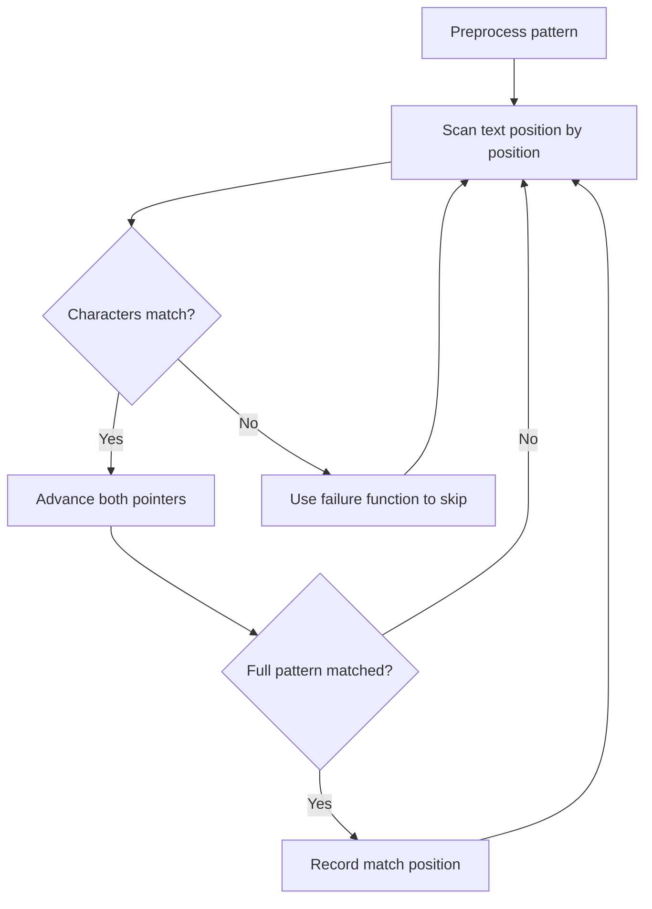

# Problem 2185: Counting Words With a Given Prefix

**Difficulty:** Easy  
**Tags:** Array, String, String Matching  
**Pattern:** String Matching  
**Link:** [leetcode.com/problems/counting-words-with-a-given-prefix](https://leetcode.com/problems/counting-words-with-a-given-prefix/)

## Description

You are given an array of strings `words` and a string `pref`.

Return *the number of strings in *`words`* that contain *`pref`* as a **prefix***.

A **prefix** of a string `s` is any leading contiguous substring of `s`.

 

Example 1:

```

**Input:** words = ["pay","**at**tention","practice","**at**tend"], `pref `= "at"
**Output:** 2
**Explanation:** The 2 strings that contain "at" as a prefix are: "**at**tention" and "**at**tend".

```

Example 2:

```

**Input:** words = ["leetcode","win","loops","success"], `pref `= "code"
**Output:** 0
**Explanation:** There are no strings that contain "code" as a prefix.

```

 

**Constraints:**

	- `1 <= words.length <= 100`
	- `1 <= words[i].length, pref.length <= 100`
	- `words[i]` and `pref` consist of lowercase English letters.

## Approach: String Matching

Find pattern occurrences in text. Use KMP, Rabin-Karp, or Z-algorithm for efficient matching beyond brute force.

## Pseudocode

```
1. Preprocess pattern (build failure function / hash)
2. Scan text with pattern:
   a. Compare characters
   b. On mismatch: use preprocessed data to skip
   c. On full match: record position
3. Return matches
```

## Algorithm Flow



## Complexity Analysis

- **Time:** O(n + m)
- **Space:** O(m)

## Solution (Python3)

```python
class Solution:
    def prefixCount(self, words: List[str], pref: str) -> int:
        # String matching (KMP/Rolling Hash) - O(n+m) time
        if not pref or not words:
            return 0
        n, m = len(words), len(pref)
        # Build failure function for KMP
        fail = [0] * m
        j = 0
        for i in range(1, m):
            while j > 0 and pref[i] != pref[j]:
                j = fail[j-1]
            if pref[i] == pref[j]:
                j += 1
            fail[i] = j
        # Search
        j = 0
        for i in range(n):
            while j > 0 and words[i] != pref[j]:
                j = fail[j-1]
            if words[i] == pref[j]:
                j += 1
            if j == m:
                return i - m + 1
        return -1
```

## Solution (C++)

```cpp
#include <string>
#include <vector>
using namespace std;

class Solution {
public:
    int prefixCount(vector<string>& words, string& pref) {
        // String matching (KMP) - O(n+m) time
        int n = words.size(), m = pref.size();
        if (m == 0) return 0;
        vector<int> fail(m, 0);
        for (int i = 1, j = 0; i < m; i++) {
            while (j > 0 && pref[i] != pref[j]) j = fail[j-1];
            if (pref[i] == pref[j]) j++;
            fail[i] = j;
        }
        for (int i = 0, j = 0; i < n; i++) {
            while (j > 0 && words[i] != pref[j]) j = fail[j-1];
            if (words[i] == pref[j]) j++;
            if (j == m) return i - m + 1;
        }
        return -1;
    }
};
```
