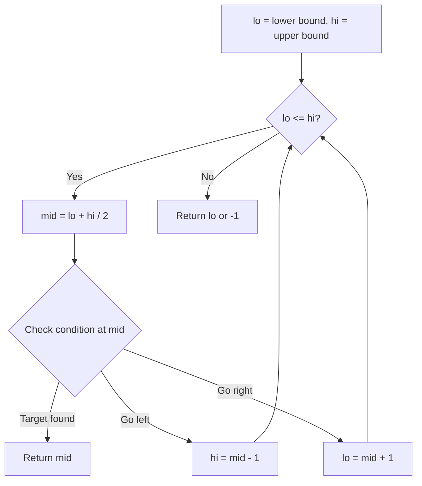
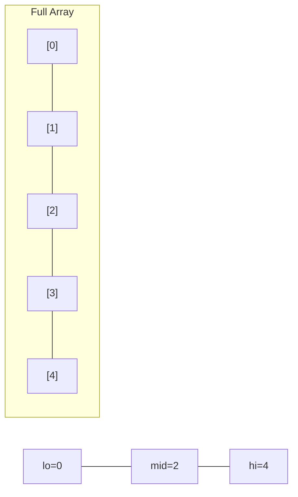
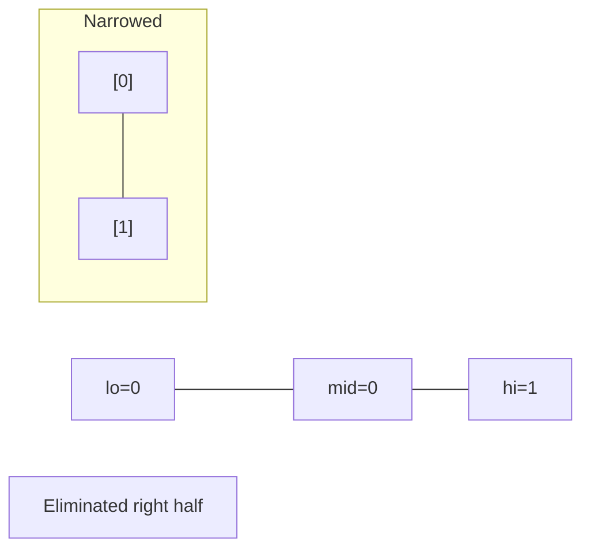
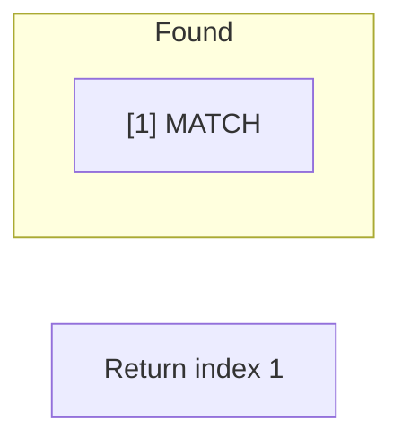

# Problem 2187: Minimum Time to Complete Trips

**Difficulty:** Medium  
**Tags:** Array, Binary Search  
**Pattern:** Binary Search  
**Link:** [leetcode.com/problems/minimum-time-to-complete-trips](https://leetcode.com/problems/minimum-time-to-complete-trips/)

## Description

You are given an array `time` where `time[i]` denotes the time taken by the `i^th` bus to complete **one trip**.

Each bus can make multiple trips **successively**; that is, the next trip can start **immediately after** completing the current trip. Also, each bus operates **independently**; that is, the trips of one bus do not influence the trips of any other bus.

You are also given an integer `totalTrips`, which denotes the number of trips all buses should make **in total**. Return *the **minimum time** required for all buses to complete **at least** *`totalTrips`* trips*.

 

Example 1:

```

**Input:** time = [1,2,3], totalTrips = 5
**Output:** 3
**Explanation:**
- At time t = 1, the number of trips completed by each bus are [1,0,0]. 
  The total number of trips completed is 1 + 0 + 0 = 1.
- At time t = 2, the number of trips completed by each bus are [2,1,0]. 
  The total number of trips completed is 2 + 1 + 0 = 3.
- At time t = 3, the number of trips completed by each bus are [3,1,1]. 
  The total number of trips completed is 3 + 1 + 1 = 5.
So the minimum time needed for all buses to complete at least 5 trips is 3.

```

Example 2:

```

**Input:** time = [2], totalTrips = 1
**Output:** 2
**Explanation:**
There is only one bus, and it will complete its first trip at t = 2.
So the minimum time needed to complete 1 trip is 2.

```

 

**Constraints:**

	- `1 <= time.length <= 10^5`
	- `1 <= time[i], totalTrips <= 10^7`

## Approach: Binary Search

Use binary search to halve the search space each iteration. Define the search range [lo, hi], compute mid, and decide which half to keep based on the problem's monotonic condition.

## Pseudocode

```
1. lo = lower_bound, hi = upper_bound
2. While lo <= hi (or lo < hi):
   a. mid = (lo + hi) // 2
   b. If condition(mid) is satisfied: record answer, search left half
   c. Else: search right half
3. Return answer
```

## Algorithm Flow



## Visual State Transitions

**Binary Search Step-by-Step:**

**Frame 1: Initial search space**


**Frame 2: Compare mid, narrow search**


**Frame 3: Found target**



## Complexity Analysis

- **Time:** O(log n)
- **Space:** O(1)

## Solution (Python3)

```python
class Solution:
    def minimumTime(self, time: List[int], totalTrips: int) -> int:
        # Binary search - O(log n) time, O(1) space
        lo, hi = 0, len(time) - 1
        while lo <= hi:
            mid = lo + (hi - lo) // 2
            if time[mid] == totalTrips:
                return mid
            elif time[mid] < totalTrips:
                lo = mid + 1
            else:
                hi = mid - 1
        return 0
```

## Solution (C++)

```cpp
#include <string>
#include <vector>
using namespace std;

class Solution {
public:
    int minimumTime(vector<int>& time, int totalTrips) {
        // Binary search - O(log n) time, O(1) space
        int lo = 0, hi = time.size() - 1;
        while (lo <= hi) {
            int mid = lo + (hi - lo) / 2;
            if (time[mid] == totalTrips) {
                return mid;
            } else if (time[mid] < totalTrips) {
                lo = mid + 1;
            } else {
                hi = mid - 1;
            }
        }
        return 0;
    }
};
```
