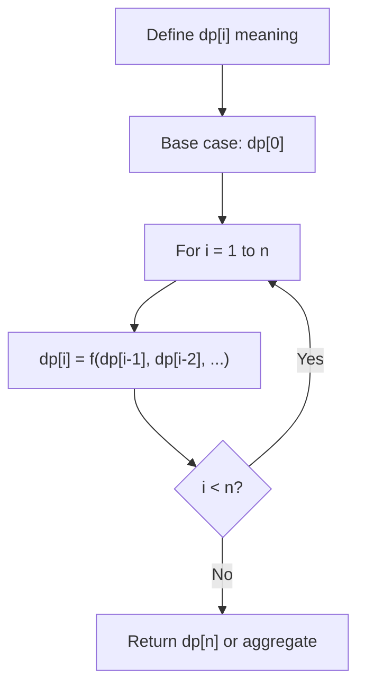
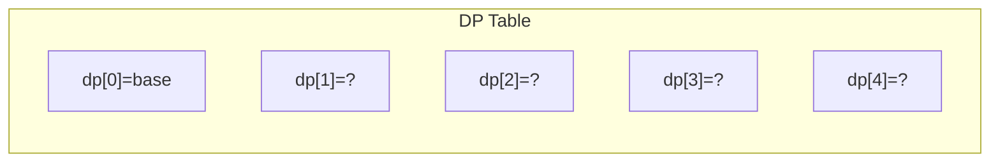
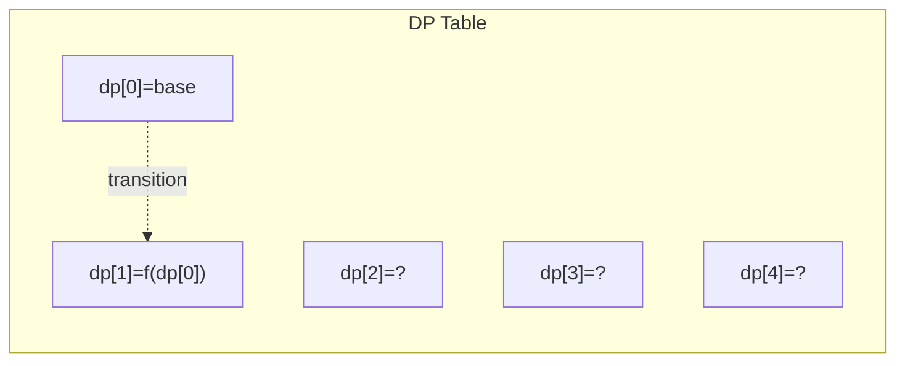
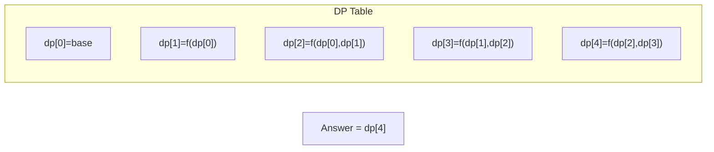

# Problem 2188: Minimum Time to Finish the Race

**Difficulty:** Hard  
**Tags:** Array, Dynamic Programming  
**Pattern:** Dynamic Programming (1D)  
**Link:** [leetcode.com/problems/minimum-time-to-finish-the-race](https://leetcode.com/problems/minimum-time-to-finish-the-race/)

## Description

You are given a **0-indexed** 2D integer array `tires` where `tires[i] = [fi, ri]` indicates that the `i^th` tire can finish its `x^th` successive lap in `fi * ri^(x-1)` seconds.

	- For example, if `fi = 3` and `ri = 2`, then the tire would finish its `1^st` lap in `3` seconds, its `2^nd` lap in `3 * 2 = 6` seconds, its `3^rd` lap in `3 * 2^2 = 12` seconds, etc.

You are also given an integer `changeTime` and an integer `numLaps`.

The race consists of `numLaps` laps and you may start the race with **any** tire. You have an **unlimited** supply of each tire and after every lap, you may **change** to any given tire (including the current tire type) if you wait `changeTime` seconds.

Return* the **minimum** time to finish the race.*

 

Example 1:

```

**Input:** tires = [[2,3],[3,4]], changeTime = 5, numLaps = 4
**Output:** 21
**Explanation:** 
Lap 1: Start with tire 0 and finish the lap in 2 seconds.
Lap 2: Continue with tire 0 and finish the lap in 2 * 3 = 6 seconds.
Lap 3: Change tires to a new tire 0 for 5 seconds and then finish the lap in another 2 seconds.
Lap 4: Continue with tire 0 and finish the lap in 2 * 3 = 6 seconds.
Total time = 2 + 6 + 5 + 2 + 6 = 21 seconds.
The minimum time to complete the race is 21 seconds.

```

Example 2:

```

**Input:** tires = [[1,10],[2,2],[3,4]], changeTime = 6, numLaps = 5
**Output:** 25
**Explanation:** 
Lap 1: Start with tire 1 and finish the lap in 2 seconds.
Lap 2: Continue with tire 1 and finish the lap in 2 * 2 = 4 seconds.
Lap 3: Change tires to a new tire 1 for 6 seconds and then finish the lap in another 2 seconds.
Lap 4: Continue with tire 1 and finish the lap in 2 * 2 = 4 seconds.
Lap 5: Change tires to tire 0 for 6 seconds then finish the lap in another 1 second.
Total time = 2 + 4 + 6 + 2 + 4 + 6 + 1 = 25 seconds.
The minimum time to complete the race is 25 seconds. 

```

 

**Constraints:**

	- `1 <= tires.length <= 10^5`
	- `tires[i].length == 2`
	- `1 <= fi, changeTime <= 10^5`
	- `2 <= ri <= 10^5`
	- `1 <= numLaps <= 1000`

## Approach: Dynamic Programming (1D)

Break the problem into overlapping subproblems. Define dp[i] as the optimal value for the subproblem ending at or considering index i. Build the solution bottom-up, using previously computed dp values.

## Pseudocode

```
1. Define dp[i] = optimal value for subproblem i
2. Base case: dp[0] = initial value
3. For i from 1 to n:
   a. dp[i] = recurrence(dp[i-1], dp[i-2], ...)
4. Return dp[n] or max/min of dp
```

## Algorithm Flow



## Visual State Transitions

**1D Dynamic Programming Table Build:**

**Frame 1: Initialize base cases**


**Frame 2: Fill dp[1] from dp[0]**


**Frame 3: Fill remaining cells**



## Complexity Analysis

- **Time:** O(n)
- **Space:** O(n)

## Solution (Python3)

```python
class Solution:
    def minimumFinishTime(self, tires: List[List[int]], changeTime: int, numLaps: int) -> int:
        # Dynamic programming (1D) - O(n) time, O(n) space
        if not tires:
            return 0
        n = len(tires) if isinstance(tires, list) else tires
        dp = [0] * (n + 1)
        dp[0] = 1  # base case
        for i in range(1, n + 1):
            dp[i] = dp[i-1]  # transition (customize per problem)
            if i >= 2:
                dp[i] += dp[i-2]
        return dp[n]
```

## Solution (C++)

```cpp
#include <string>
#include <vector>
using namespace std;

class Solution {
public:
    int minimumFinishTime(vector<vector<int>>& tires, int changeTime, int numLaps) {
        // Dynamic programming (1D) - O(n) time, O(n) space
        int n = tires;
        if (n <= 0) return 0;
        vector<int> dp(n + 1, 0);
        dp[0] = 1;
        for (int i = 1; i <= n; i++) {
            dp[i] = dp[i-1];
            if (i >= 2) dp[i] += dp[i-2];
        }
        return dp[n];
    }
};
```
