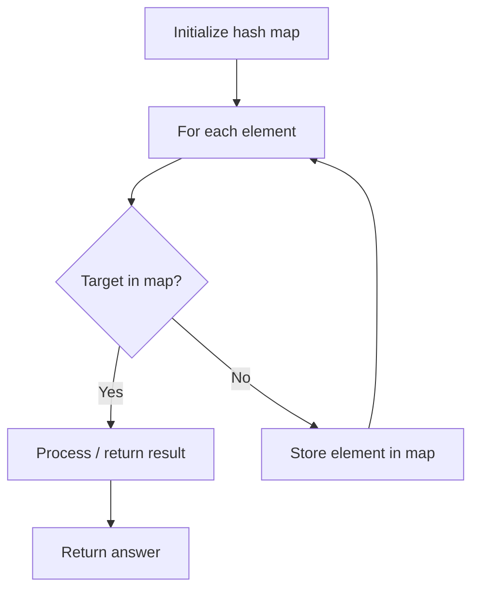

# Problem 2190: Most Frequent Number Following Key In an Array

**Difficulty:** Easy  
**Tags:** Array, Hash Table, Counting  
**Pattern:** Hash Map Lookup  
**Link:** [leetcode.com/problems/most-frequent-number-following-key-in-an-array](https://leetcode.com/problems/most-frequent-number-following-key-in-an-array/)

## Description

You are given a **0-indexed** integer array `nums`.** **You are also given an integer `key`, which is present in `nums`.

For every unique integer `target` in `nums`, **count** the number of times `target` immediately follows an occurrence of `key` in `nums`. In other words, count the number of indices `i` such that:

	- `0 <= i <= nums.length - 2`,
	- `nums[i] == key` and,
	- `nums[i + 1] == target`.

Return *the *`target`* with the **maximum** count*. The test cases will be generated such that the `target` with maximum count is unique.

 

Example 1:

```

**Input:** nums = [1,100,200,1,100], key = 1
**Output:** 100
**Explanation:** For target = 100, there are 2 occurrences at indices 1 and 4 which follow an occurrence of key.
No other integers follow an occurrence of key, so we return 100.

```

Example 2:

```

**Input:** nums = [2,2,2,2,3], key = 2
**Output:** 2
**Explanation:** For target = 2, there are 3 occurrences at indices 1, 2, and 3 which follow an occurrence of key.
For target = 3, there is only one occurrence at index 4 which follows an occurrence of key.
target = 2 has the maximum number of occurrences following an occurrence of key, so we return 2.

```

 

**Constraints:**

	- `2 <= nums.length <= 1000`
	- `1 <= nums[i] <= 1000`
	- The test cases will be generated such that the answer is unique.

## Approach: Hash Map Lookup

Use a hash map (dictionary) to store elements for O(1) lookup. Iterate through the input, checking membership or counting frequencies in the map.

## Pseudocode

```
1. Initialize hash map
2. Iterate through elements:
   a. Check if target/complement exists in map
   b. If found: process result
   c. Otherwise: store element in map
3. Return result
```

## Algorithm Flow



## Complexity Analysis

- **Time:** O(n)
- **Space:** O(n)

## Solution (Python3)

```python
class Solution:
    def mostFrequent(self, nums: List[int], key: int) -> int:
        # Hash map approach - O(n) time, O(n) space
        seen = {}
        for i, val in enumerate(nums):
            complement = key - val
            if complement in seen:
                return [seen[complement], i]
            seen[val] = i
        return 0
```

## Solution (C++)

```cpp
#include <string>
#include <unordered_map>
#include <vector>
using namespace std;

class Solution {
public:
    int mostFrequent(vector<int>& nums, int key) {
        // Hash map approach - O(n) time, O(n) space
        unordered_map<int, int> seen;
        for (int i = 0; i < nums.size(); i++) {
            int complement = key - nums[i];
            if (seen.count(complement)) {
                return {seen[complement], i};
            }
            seen[nums[i]] = i;
        }
        return 0;
    }
};
```
