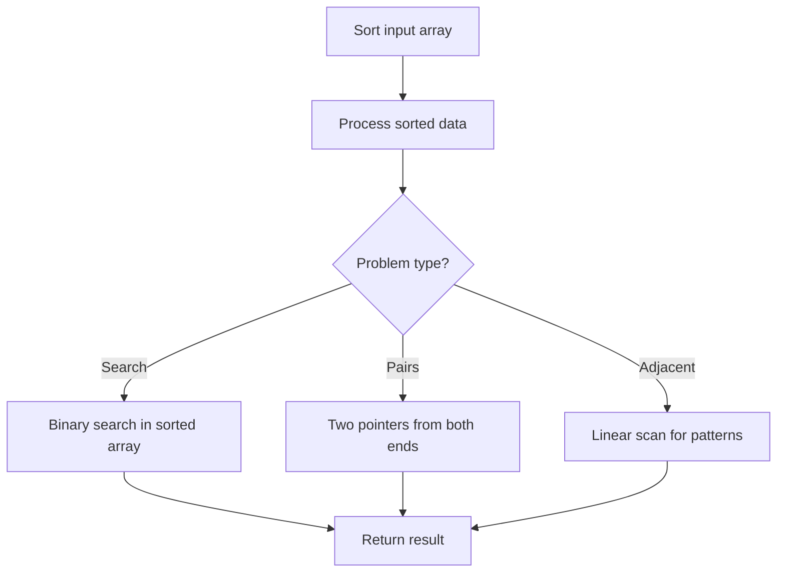

# Problem 2191: Sort the Jumbled Numbers

**Difficulty:** Medium  
**Tags:** Array, Sorting  
**Pattern:** Sorting  
**Link:** [leetcode.com/problems/sort-the-jumbled-numbers](https://leetcode.com/problems/sort-the-jumbled-numbers/)

## Description

You are given a **0-indexed** integer array `mapping` which represents the mapping rule of a shuffled decimal system. `mapping[i] = j` means digit `i` should be mapped to digit `j` in this system.

The **mapped value** of an integer is the new integer obtained by replacing each occurrence of digit `i` in the integer with `mapping[i]` for all `0 <= i <= 9`.

You are also given another integer array `nums`. Return *the array *`nums`* sorted in **non-decreasing** order based on the **mapped values** of its elements.*

**Notes:**

	- Elements with the same mapped values should appear in the **same relative order** as in the input.
	- The elements of `nums` should only be sorted based on their mapped values and **not be replaced** by them.

 

Example 1:

```

**Input:** mapping = [8,9,4,0,2,1,3,5,7,6], nums = [991,338,38]
**Output:** [338,38,991]
**Explanation:** 
Map the number 991 as follows:
1. mapping[9] = 6, so all occurrences of the digit 9 will become 6.
2. mapping[1] = 9, so all occurrences of the digit 1 will become 9.
Therefore, the mapped value of 991 is 669.
338 maps to 007, or 7 after removing the leading zeros.
38 maps to 07, which is also 7 after removing leading zeros.
Since 338 and 38 share the same mapped value, they should remain in the same relative order, so 338 comes before 38.
Thus, the sorted array is [338,38,991].

```

Example 2:

```

**Input:** mapping = [0,1,2,3,4,5,6,7,8,9], nums = [789,456,123]
**Output:** [123,456,789]
**Explanation:** 789 maps to 789, 456 maps to 456, and 123 maps to 123. Thus, the sorted array is [123,456,789].

```

 

**Constraints:**

	- `mapping.length == 10`
	- `0 <= mapping[i] <= 9`
	- All the values of `mapping[i]` are **unique**.
	- `1 <= nums.length <= 3 * 10^4`
	- `0 <= nums[i] < 10^9`

## Approach: Sorting

Sort the data to enable efficient processing. After sorting, use techniques like binary search, two pointers, or linear scan to solve the problem.

## Pseudocode

```
1. Sort the input array
2. Process sorted data:
   - Use binary search for lookups
   - Use two pointers for pair finding
   - Scan for adjacent patterns
3. Return result
```

## Algorithm Flow



## Complexity Analysis

- **Time:** O(n log n)
- **Space:** O(n)

## Solution (Python3)

```python
class Solution:
    def sortJumbled(self, mapping: List[int], nums: List[int]) -> List[int]:
        # Sort-based approach - O(n log n) time
        mapping.sort(key=lambda x: x[0] if isinstance(x, (list, tuple)) else x)
        result = [mapping[0]]
        for i in range(1, len(mapping)):
            curr = mapping[i]
            if isinstance(curr, (list, tuple)) and isinstance(result[-1], (list, tuple)):
                if curr[0] <= result[-1][1]:
                    result[-1] = [result[-1][0], max(result[-1][1], curr[1])]
                else:
                    result.append(curr)
            else:
                result.append(curr)
        return result
```

## Solution (C++)

```cpp
#include <algorithm>
#include <string>
#include <vector>
using namespace std;

class Solution {
public:
    vector<int> sortJumbled(vector<int>& mapping, vector<int>& nums) {
        // Sort-based approach - O(n log n) time
        sort(mapping.begin(), mapping.end());
        vector<vector<int>> result;
        result.push_back(mapping[0]);
        for (int i = 1; i < (int)mapping.size(); i++) {
            if (mapping[i][0] <= result.back()[1]) {
                result.back()[1] = max(result.back()[1], mapping[i][1]);
            } else {
                result.push_back(mapping[i]);
            }
        }
        return result;
    }
};
```
