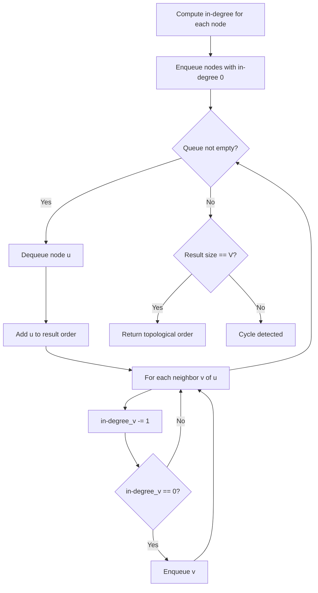
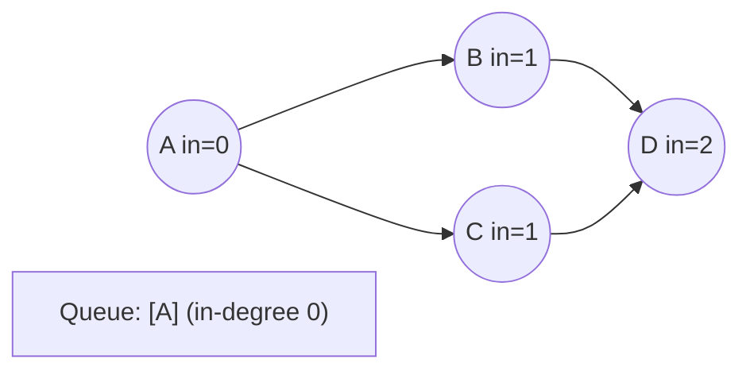
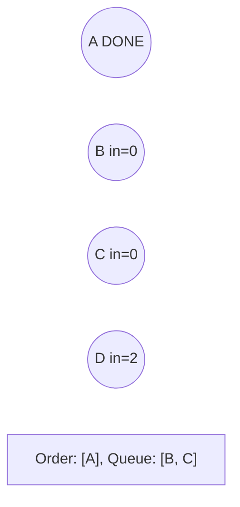
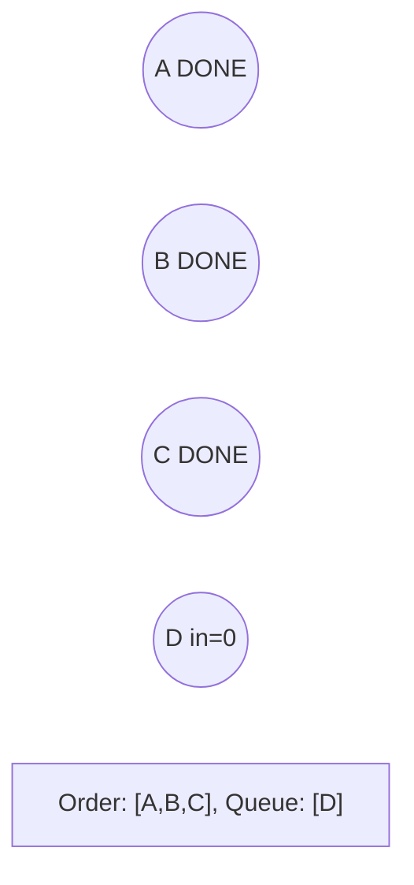
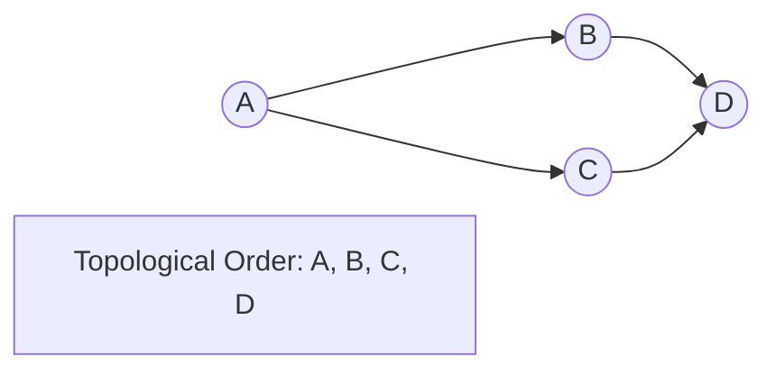

# Problem 2192: All Ancestors of a Node in a Directed Acyclic Graph

**Difficulty:** Medium  
**Tags:** Depth-First Search, Breadth-First Search, Graph Theory, Topological Sort  
**Pattern:** Topological Sort  
**Link:** [leetcode.com/problems/all-ancestors-of-a-node-in-a-directed-acyclic-graph](https://leetcode.com/problems/all-ancestors-of-a-node-in-a-directed-acyclic-graph/)

## Description

You are given a positive integer `n` representing the number of nodes of a **Directed Acyclic Graph** (DAG). The nodes are numbered from `0` to `n - 1` (**inclusive**).

You are also given a 2D integer array `edges`, where `edges[i] = [fromi, toi]` denotes that there is a **unidirectional** edge from `fromi` to `toi` in the graph.

Return *a list* `answer`*, where *`answer[i]`* is the **list of ancestors** of the* `i^th` *node, sorted in **ascending order***.

A node `u` is an **ancestor** of another node `v` if `u` can reach `v` via a set of edges.

 

Example 1:

```

**Input:** n = 8, edgeList = [[0,3],[0,4],[1,3],[2,4],[2,7],[3,5],[3,6],[3,7],[4,6]]
**Output:** [[],[],[],[0,1],[0,2],[0,1,3],[0,1,2,3,4],[0,1,2,3]]
**Explanation:**
The above diagram represents the input graph.
- Nodes 0, 1, and 2 do not have any ancestors.
- Node 3 has two ancestors 0 and 1.
- Node 4 has two ancestors 0 and 2.
- Node 5 has three ancestors 0, 1, and 3.
- Node 6 has five ancestors 0, 1, 2, 3, and 4.
- Node 7 has four ancestors 0, 1, 2, and 3.

```

Example 2:

```

**Input:** n = 5, edgeList = [[0,1],[0,2],[0,3],[0,4],[1,2],[1,3],[1,4],[2,3],[2,4],[3,4]]
**Output:** [[],[0],[0,1],[0,1,2],[0,1,2,3]]
**Explanation:**
The above diagram represents the input graph.
- Node 0 does not have any ancestor.
- Node 1 has one ancestor 0.
- Node 2 has two ancestors 0 and 1.
- Node 3 has three ancestors 0, 1, and 2.
- Node 4 has four ancestors 0, 1, 2, and 3.

```

 

**Constraints:**

	- `1 <= n <= 1000`
	- `0 <= edges.length <= min(2000, n * (n - 1) / 2)`
	- `edges[i].length == 2`
	- `0 <= fromi, toi <= n - 1`
	- `fromi != toi`
	- There are no duplicate edges.
	- The graph is **directed** and **acyclic**.

## Approach: Topological Sort

Order nodes in a DAG so every edge u->v has u before v. Use Kahn's algorithm (BFS with in-degree tracking) or DFS-based ordering.

## Pseudocode

```
1. Compute in-degree for every node
2. Enqueue all nodes with in-degree 0
3. While queue not empty:
   a. Dequeue node u, add to result order
   b. For each neighbor v of u:
      - Decrease in-degree of v
      - If in-degree becomes 0: enqueue v
4. If result size != V: cycle exists
5. Return topological order
```

## Algorithm Flow



## Visual State Transitions

**Topological Sort (Kahn's Algorithm):**

**Frame 1: Compute in-degrees**


**Frame 2: Process A, reduce neighbors**


**Frame 3: Process B and C**


**Frame 4: Complete**



## Complexity Analysis

- **Time:** O(V + E)
- **Space:** O(V + E)

## Solution (Python3)

```python
class Solution:
    def getAncestors(self, n: int, edges: List[List[int]]) -> List[List[int]]:
        # Topological sort (Kahn's algorithm) - O(V+E)
        from collections import deque, defaultdict
        graph = defaultdict(list)
        n = n if isinstance(n, int) else len(n)
        indegree = [0] * n
        # Build graph from prerequisites
        prereqs = edges if isinstance(edges, list) else n
        for edge in prereqs:
            if isinstance(edge, (list, tuple)) and len(edge) >= 2:
                graph[edge[1]].append(edge[0])
                indegree[edge[0]] += 1
        queue = deque([i for i in range(n) if indegree[i] == 0])
        order = []
        while queue:
            node = queue.popleft()
            order.append(node)
            for neighbor in graph[node]:
                indegree[neighbor] -= 1
                if indegree[neighbor] == 0:
                    queue.append(neighbor)
        return len(order) == n if isinstance([], bool) else order
```

## Solution (C++)

```cpp
#include <queue>
#include <string>
#include <vector>
using namespace std;

class Solution {
public:
    vector<vector<int>> getAncestors(int n, vector<vector<int>>& edges) {
        // Topological sort (Kahn's) - O(V+E)
        int n = n;
        vector<vector<int>> graph(n);
        vector<int> indegree(n, 0);
        for (auto& edge : edges) {
            graph[edge[1]].push_back(edge[0]);
            indegree[edge[0]]++;
        }
        queue<int> q;
        for (int i = 0; i < n; i++)
            if (indegree[i] == 0) q.push(i);
        vector<int> order;
        while (!q.empty()) {
            int node = q.front(); q.pop();
            order.push_back(node);
            for (int neighbor : graph[node]) {
                if (--indegree[neighbor] == 0) q.push(neighbor);
            }
        }
        return order.size() == n;
    }
};
```
