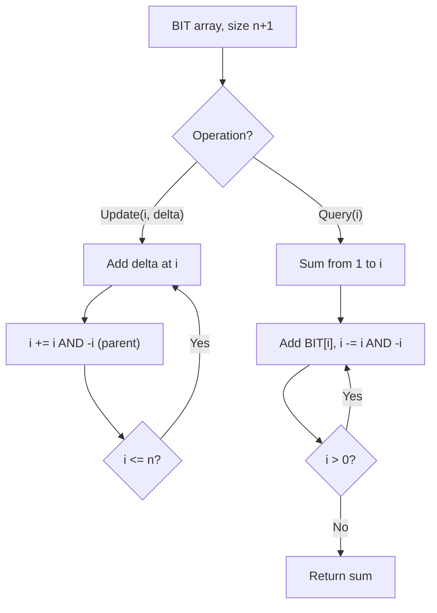

# Problem 2193: Minimum Number of Moves to Make Palindrome

**Difficulty:** Hard  
**Tags:** Two Pointers, String, Greedy, Binary Indexed Tree  
**Pattern:** Binary Indexed Tree / Fenwick Tree  
**Link:** [leetcode.com/problems/minimum-number-of-moves-to-make-palindrome](https://leetcode.com/problems/minimum-number-of-moves-to-make-palindrome/)

## Description

You are given a string `s` consisting only of lowercase English letters.

In one **move**, you can select any two **adjacent** characters of `s` and swap them.

Return *the **minimum number of moves** needed to make* `s` *a palindrome*.

**Note** that the input will be generated such that `s` can always be converted to a palindrome.

 

Example 1:

```

**Input:** s = "aabb"
**Output:** 2
**Explanation:**
We can obtain two palindromes from s, "abba" and "baab". 
- We can obtain "abba" from s in 2 moves: "a**ab**b" -> "ab**ab**" -> "abba".
- We can obtain "baab" from s in 2 moves: "a**ab**b" -> "**ab**ab" -> "baab".
Thus, the minimum number of moves needed to make s a palindrome is 2.

```

Example 2:

```

**Input:** s = "letelt"
**Output:** 2
**Explanation:**
One of the palindromes we can obtain from s in 2 moves is "lettel".
One of the ways we can obtain it is "lete**lt**" -> "let**et**l" -> "lettel".
Other palindromes such as "tleelt" can also be obtained in 2 moves.
It can be shown that it is not possible to obtain a palindrome in less than 2 moves.

```

 

**Constraints:**

	- `1 <= s.length <= 2000`
	- `s` consists only of lowercase English letters.
	- `s` can be converted to a palindrome using a finite number of moves.

## Approach: Binary Indexed Tree / Fenwick Tree

Efficient prefix sum queries and point updates using a BIT. Each index stores a partial sum determined by the lowest set bit.

## Pseudocode

```
1. Initialize BIT array of size n+1
2. Update(i, delta): add delta to index i, propagate (i += i & -i)
3. Query(i): sum from 1 to i, traverse (i -= i & -i)
4. Range sum(l, r) = query(r) - query(l-1)
```

## Algorithm Flow



## Complexity Analysis

- **Time:** O(n log n) build, O(log n) query/update
- **Space:** O(n)

## Solution (Python3)

```python
class Solution:
    def minMovesToMakePalindrome(self, s: str) -> int:
        # Binary Indexed Tree (Fenwick) - O(log n) update/query
        n = len(s)
        bit = [0] * (n + 1)
        
        def update(i, delta):
            i += 1
            while i <= n:
                bit[i] += delta
                i += i & (-i)
        
        def query(i):
            i += 1
            s = 0
            while i > 0:
                s += bit[i]
                i -= i & (-i)
            return s
        
        for i, val in enumerate(s):
            update(i, val)
        return 0
```

## Solution (C++)

```cpp
#include <string>
#include <vector>
using namespace std;

class Solution {
public:
    int minMovesToMakePalindrome(string& s) {
        // Binary Indexed Tree (Fenwick) - O(log n) update/query
        int n = s.size();
        vector<int> bit(n + 1, 0);
        auto update = [&](int i, int delta) {
            for (i++; i <= n; i += i & (-i))
                bit[i] += delta;
        };
        auto query = [&](int i) -> int {
            int s = 0;
            for (i++; i > 0; i -= i & (-i))
                s += bit[i];
            return s;
        };
        for (int i = 0; i < n; i++) update(i, s[i]);
        return 0;
    }
};
```
