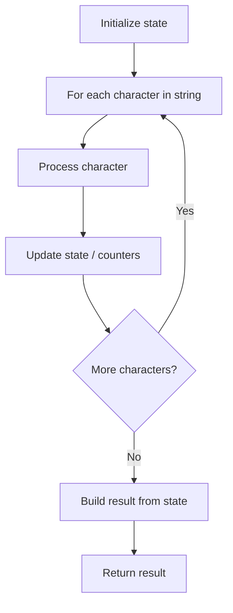

# Problem 2194: Cells in a Range on an Excel Sheet

**Difficulty:** Easy  
**Tags:** String  
**Pattern:** String Processing  
**Link:** [leetcode.com/problems/cells-in-a-range-on-an-excel-sheet](https://leetcode.com/problems/cells-in-a-range-on-an-excel-sheet/)

## Description

A cell `(r, c)` of an excel sheet is represented as a string `"<col><row>"` where:

	- `<col>` denotes the column number `c` of the cell. It is represented by **alphabetical letters**.

	
		For example, the `1^st` column is denoted by `'A'`, the `2^nd` by `'B'`, the `3^rd` by `'C'`, and so on.
	
	
	- `<row>` is the row number `r` of the cell. The `r^th` row is represented by the **integer** `r`.

You are given a string `s` in the format `"<col1><row1>:<col2><row2>"`, where `<col1>` represents the column `c1`, `<row1>` represents the row `r1`, `<col2>` represents the column `c2`, and `<row2>` represents the row `r2`, such that `r1 <= r2` and `c1 <= c2`.

Return *the **list of cells*** `(x, y)` *such that* `r1 <= x <= r2` *and* `c1 <= y <= c2`. The cells should be represented as **strings** in the format mentioned above and be sorted in **non-decreasing** order first by columns and then by rows.

 

Example 1:

```

**Input:** s = "K1:L2"
**Output:** ["K1","K2","L1","L2"]
**Explanation:**
The above diagram shows the cells which should be present in the list.
The red arrows denote the order in which the cells should be presented.

```

Example 2:

```

**Input:** s = "A1:F1"
**Output:** ["A1","B1","C1","D1","E1","F1"]
**Explanation:**
The above diagram shows the cells which should be present in the list.
The red arrow denotes the order in which the cells should be presented.

```

 

**Constraints:**

	- `s.length == 5`
	- `'A' <= s[0] <= s[3] <= 'Z'`
	- `'1' <= s[1] <= s[4] <= '9'`
	- `s` consists of uppercase English letters, digits and `':'`.

## Approach: String Processing

Process the string character by character. Common techniques: two pointers, sliding window, hash map for frequencies, stack for matching.

## Pseudocode

```
1. Initialize result / tracking state
2. Iterate through string characters:
   a. Process character based on rules
   b. Update state (counters, pointers, stack)
3. Build and return result
```

## Algorithm Flow



## Complexity Analysis

- **Time:** O(n)
- **Space:** O(n)

## Solution (Python3)

```python
class Solution:
    def cellsInRange(self, s: str) -> List[str]:
        # String processing approach - O(n) time
        result = []
        for ch in s:
            if ch.isalnum():
                result.append(ch.lower())
        # Check palindrome or process
        processed = ''.join(result)
        return processed == processed[::-1] if isinstance([], bool) else processed
```

## Solution (C++)

```cpp
#include <algorithm>
#include <cctype>
#include <string>
#include <vector>
using namespace std;

class Solution {
public:
    vector<string> cellsInRange(string& s) {
        // String processing approach - O(n) time
        string processed;
        for (char ch : s) {
            if (isalnum(ch)) {
                processed += tolower(ch);
            }
        }
        string rev = processed;
        reverse(rev.begin(), rev.end());
        return processed == rev;
    }
};
```
