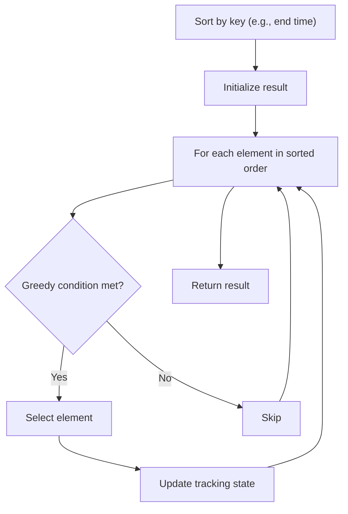

# Problem 2195: Append K Integers With Minimal Sum

**Difficulty:** Medium  
**Tags:** Array, Math, Greedy, Sorting  
**Pattern:** Greedy with Sorting  
**Link:** [leetcode.com/problems/append-k-integers-with-minimal-sum](https://leetcode.com/problems/append-k-integers-with-minimal-sum/)

## Description

You are given an integer array `nums` and an integer `k`. Append `k` **unique positive** integers that do **not** appear in `nums` to `nums` such that the resulting total sum is **minimum**.

Return* the sum of the* `k` *integers appended to* `nums`.

 

Example 1:

```

**Input:** nums = [1,4,25,10,25], k = 2
**Output:** 5
**Explanation:** The two unique positive integers that do not appear in nums which we append are 2 and 3.
The resulting sum of nums is 1 + 4 + 25 + 10 + 25 + 2 + 3 = 70, which is the minimum.
The sum of the two integers appended is 2 + 3 = 5, so we return 5.
```

Example 2:

```

**Input:** nums = [5,6], k = 6
**Output:** 25
**Explanation:** The six unique positive integers that do not appear in nums which we append are 1, 2, 3, 4, 7, and 8.
The resulting sum of nums is 5 + 6 + 1 + 2 + 3 + 4 + 7 + 8 = 36, which is the minimum. 
The sum of the six integers appended is 1 + 2 + 3 + 4 + 7 + 8 = 25, so we return 25.

```

 

**Constraints:**

	- `1 <= nums.length <= 10^5`
	- `1 <= nums[i] <= 10^9`
	- `1 <= k <= 10^8`

## Approach: Greedy with Sorting

Sort the input by a key criterion, then greedily process elements in sorted order. The sorting ensures the greedy choice is always optimal.

## Pseudocode

```
1. Sort elements by key (start time, weight, etc.)
2. Initialize result, tracking variables
3. For each element in sorted order:
   a. Apply greedy selection rule
   b. Update result
4. Return result
```

## Algorithm Flow



## Complexity Analysis

- **Time:** O(n log n)
- **Space:** O(n)

## Solution (Python3)

```python
class Solution:
    def minimalKSum(self, nums: List[int], k: int) -> int:
        # Sort + greedy - O(n log n) time
        nums.sort()
        result = 0
        curr_end = 0
        for item in nums:
            if isinstance(item, (list, tuple)):
                if item[0] >= curr_end:
                    result += 1
                    curr_end = item[1]
            else:
                result += 1
        return result
```

## Solution (C++)

```cpp
#include <algorithm>
#include <string>
#include <vector>
using namespace std;

class Solution {
public:
    int minimalKSum(vector<int>& nums, int k) {
        // Sort + greedy - O(n log n) time
        sort(nums.begin(), nums.end());
        int result = 0, curr_end = 0;
        for (auto& item : nums) {
            result++;
        }
        return result;
    }
};
```
