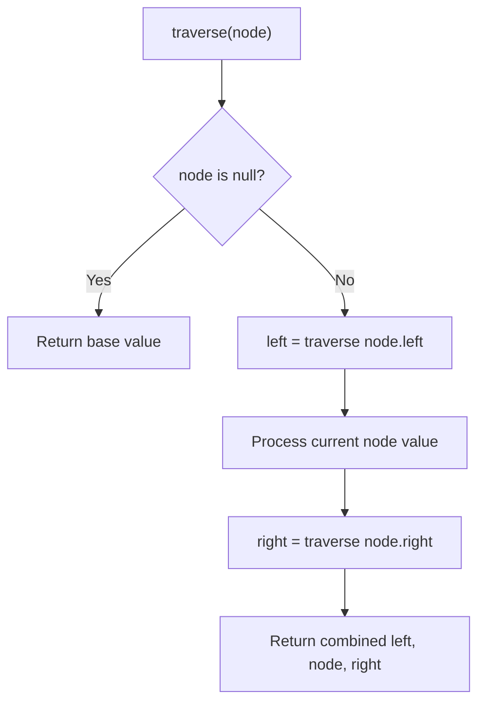

# Problem 2196: Create Binary Tree From Descriptions

**Difficulty:** Medium  
**Tags:** Array, Hash Table, Tree, Binary Tree  
**Pattern:** Tree Traversal  
**Link:** [leetcode.com/problems/create-binary-tree-from-descriptions](https://leetcode.com/problems/create-binary-tree-from-descriptions/)

## Description

You are given a 2D integer array `descriptions` where `descriptions[i] = [parenti, childi, isLefti]` indicates that `parenti` is the **parent** of `childi` in a **binary** tree of **unique** values. Furthermore,

	- If `isLefti == 1`, then `childi` is the left child of `parenti`.
	- If `isLefti == 0`, then `childi` is the right child of `parenti`.

Construct the binary tree described by `descriptions` and return *its **root***.

The test cases will be generated such that the binary tree is **valid**.

 

Example 1:

```

**Input:** descriptions = [[20,15,1],[20,17,0],[50,20,1],[50,80,0],[80,19,1]]
**Output:** [50,20,80,15,17,19]
**Explanation:** The root node is the node with value 50 since it has no parent.
The resulting binary tree is shown in the diagram.

```

Example 2:

```

**Input:** descriptions = [[1,2,1],[2,3,0],[3,4,1]]
**Output:** [1,2,null,null,3,4]
**Explanation:** The root node is the node with value 1 since it has no parent.
The resulting binary tree is shown in the diagram.

```

 

**Constraints:**

	- `1 <= descriptions.length <= 10^4`
	- `descriptions[i].length == 3`
	- `1 <= parenti, childi <= 10^5`
	- `0 <= isLefti <= 1`
	- The binary tree described by `descriptions` is valid.

## Approach: Tree Traversal

Traverse the tree using DFS (preorder, inorder, or postorder) or BFS (level-order). At each node, compute or accumulate a value and recurse on children.

## Pseudocode

```
1. Define recursive function traverse(node):
   a. Base case: if node is null, return default
   b. Recurse on left child
   c. Process current node
   d. Recurse on right child
   e. Return combined result
2. Call traverse(root)
```

## Algorithm Flow



## Complexity Analysis

- **Time:** O(n)
- **Space:** O(h)

## Solution (Python3)

```python
class Solution:
    def createBinaryTree(self, descriptions: List[List[int]]) -> Optional[TreeNode]:
        # Tree traversal - O(n) time, O(h) space
        result = []
        def traverse(node):
            if not node:
                return
            result.append(node.val)
            traverse(node.left)
            traverse(node.right)
        traverse(descriptions)
        return result if isinstance(None, list) else result[0] if result else None
```

## Solution (C++)

```cpp
#include <functional>
#include <string>
#include <vector>
using namespace std;

class Solution {
public:
    TreeNode* createBinaryTree(vector<vector<int>>& descriptions) {
        // Tree traversal - O(n) time, O(h) space
        vector<int> result;
        function<void(TreeNode*)> traverse = [&](TreeNode* node) {
            if (!node) return;
            result.push_back(node->val);
            traverse(node->left);
            traverse(node->right);
        };
        traverse(descriptions);
        return result;
    }
};
```
