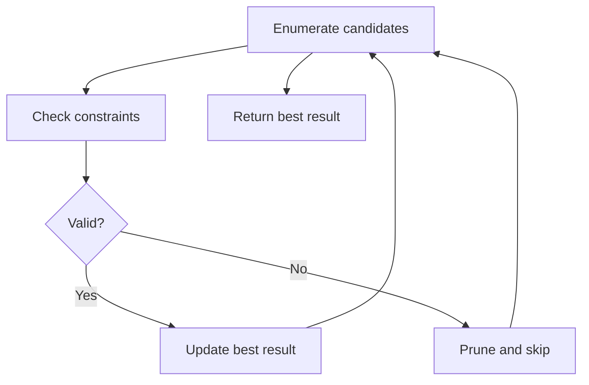

# Problem 2198: Number of Single Divisor Triplets

**Difficulty:** Medium  
**Tags:** Array, Counting, Enumeration  
**Pattern:** Enumeration  
**Link:** [leetcode.com/problems/number-of-single-divisor-triplets](https://leetcode.com/problems/number-of-single-divisor-triplets/)

## Description

*(Premium problem -- description requires LeetCode subscription)*

## Approach: Enumeration

Enumerate all possible candidates or subsets and check each one. Apply pruning to skip invalid branches early.

## Pseudocode

```
1. For each candidate / subset:
   a. Check if it satisfies constraints
   b. If valid: update best result
   c. Prune impossible branches
2. Return best result
```

## Algorithm Flow



## Complexity Analysis

- **Time:** O(n^2) or O(2^n)
- **Space:** O(n)

## Solution (Python3)

```python
class Solution:
    pass
```

## Solution (C++)

```cpp
class Solution {
public:
    // Design problem stub
};
```
