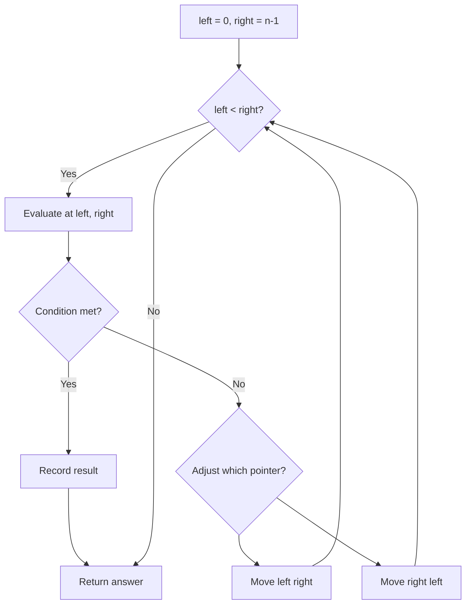
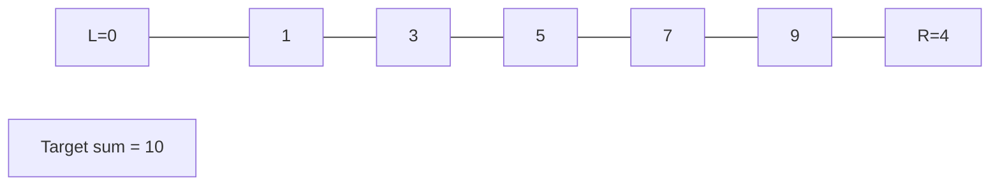
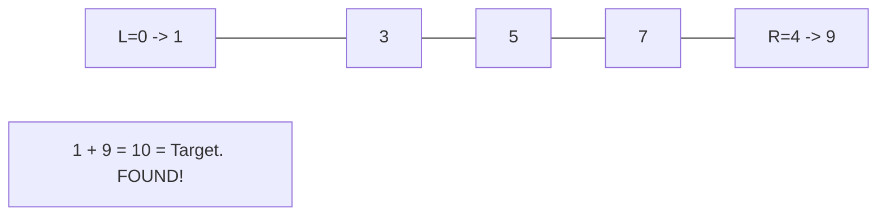

# Problem 2200: Find All K-Distant Indices in an Array

**Difficulty:** Easy  
**Tags:** Array, Two Pointers  
**Pattern:** Two Pointers  
**Link:** [leetcode.com/problems/find-all-k-distant-indices-in-an-array](https://leetcode.com/problems/find-all-k-distant-indices-in-an-array/)

## Description

You are given a **0-indexed** integer array `nums` and two integers `key` and `k`. A **k-distant index** is an index `i` of `nums` for which there exists at least one index `j` such that `|i - j| <= k` and `nums[j] == key`.

Return *a list of all k-distant indices sorted in **increasing order***.

 

Example 1:

```

**Input:** nums = [3,4,9,1,3,9,5], key = 9, k = 1
**Output:** [1,2,3,4,5,6]
**Explanation:** Here, `nums[2] == key` and nums[5] == key.
- For index 0, |0 - 2| > k and |0 - 5| > k, so there is no j where `|0 - j| <= k` and nums[j] == key. Thus, 0 is not a k-distant index.
- For index 1, |1 - 2| <= k and nums[2] == key, so 1 is a k-distant index.
- For index 2, |2 - 2| <= k and nums[2] == key, so 2 is a k-distant index.
- For index 3, |3 - 2| <= k and nums[2] == key, so 3 is a k-distant index.
- For index 4, |4 - 5| <= k and nums[5] == key, so 4 is a k-distant index.
- For index 5, |5 - 5| <= k and nums[5] == key, so 5 is a k-distant index.
- For index 6, |6 - 5| <= k and nums[5] == key, so 6 is a k-distant index.
Thus, we return [1,2,3,4,5,6] which is sorted in increasing order. 

```

Example 2:

```

**Input:** nums = [2,2,2,2,2], key = 2, k = 2
**Output:** [0,1,2,3,4]
**Explanation:** For all indices i in nums, there exists some index j such that |i - j| <= k and nums[j] == key, so every index is a k-distant index. 
Hence, we return [0,1,2,3,4].

```

 

**Constraints:**

	- `1 <= nums.length <= 1000`
	- `1 <= nums[i] <= 1000`
	- `key` is an integer from the array `nums`.
	- `1 <= k <= nums.length`

## Approach: Two Pointers

Use two pointers moving through the data structure. Depending on the problem, pointers may move toward each other (converging), in the same direction (fast/slow), or independently.

## Pseudocode

```
1. Initialize left = 0, right = n-1 (or two independent pointers)
2. While pointers haven't crossed:
   a. Evaluate condition at pointer positions
   b. Move left pointer right or right pointer left
3. Return result
```

## Algorithm Flow



## Visual State Transitions

**Two Pointer Convergence:**

**Frame 1: Initialize pointers**


**Frame 2: Sum = 1+9 = 10, found!**



## Complexity Analysis

- **Time:** O(n)
- **Space:** O(1)

## Solution (Python3)

```python
class Solution:
    def findKDistantIndices(self, nums: List[int], key: int, k: int) -> List[int]:
        # Two pointer approach - O(n) time, O(1) space
        left, right = 0, len(nums) - 1
        while left < right:
            curr = nums[left] + nums[right]
            if curr == key:
                return [left, right]
            elif curr < key:
                left += 1
            else:
                right -= 1
        return []
```

## Solution (C++)

```cpp
#include <string>
#include <vector>
using namespace std;

class Solution {
public:
    vector<int> findKDistantIndices(vector<int>& nums, int key, int k) {
        // Two pointer approach - O(n) time, O(1) space
        int left = 0, right = nums.size() - 1;
        while (left < right) {
            int curr = nums[left] + nums[right];
            if (curr == key) {
                return {left, right};
            } else if (curr < key) {
                left++;
            } else {
                right--;
            }
        }
        return {};
    }
};
```
