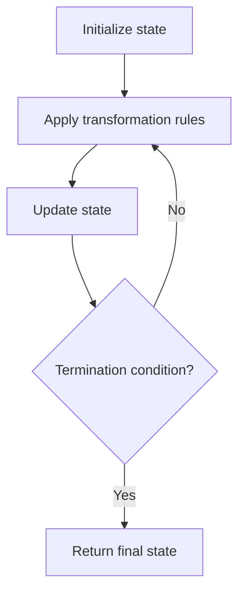

# Problem 2201: Count Artifacts That Can Be Extracted

**Difficulty:** Medium  
**Tags:** Array, Hash Table, Simulation  
**Pattern:** Simulation  
**Link:** [leetcode.com/problems/count-artifacts-that-can-be-extracted](https://leetcode.com/problems/count-artifacts-that-can-be-extracted/)

## Description

There is an `n x n` **0-indexed** grid with some artifacts buried in it. You are given the integer `n` and a **0-indexed **2D integer array `artifacts` describing the positions of the rectangular artifacts where `artifacts[i] = [r1i, c1i, r2i, c2i]` denotes that the `i^th` artifact is buried in the subgrid where:

	- `(r1i, c1i)` is the coordinate of the **top-left** cell of the `i^th` artifact and
	- `(r2i, c2i)` is the coordinate of the **bottom-right** cell of the `i^th` artifact.

You will excavate some cells of the grid and remove all the mud from them. If the cell has a part of an artifact buried underneath, it will be uncovered. If all the parts of an artifact are uncovered, you can extract it.

Given a **0-indexed** 2D integer array `dig` where `dig[i] = [ri, ci]` indicates that you will excavate the cell `(ri, ci)`, return *the number of artifacts that you can extract*.

The test cases are generated such that:

	- No two artifacts overlap.
	- Each artifact only covers at most `4` cells.
	- The entries of `dig` are unique.

 

Example 1:

```

**Input:** n = 2, artifacts = [[0,0,0,0],[0,1,1,1]], dig = [[0,0],[0,1]]
**Output:** 1
**Explanation:** 
The different colors represent different artifacts. Excavated cells are labeled with a 'D' in the grid.
There is 1 artifact that can be extracted, namely the red artifact.
The blue artifact has one part in cell (1,1) which remains uncovered, so we cannot extract it.
Thus, we return 1.

```

Example 2:

```

**Input:** n = 2, artifacts = [[0,0,0,0],[0,1,1,1]], dig = [[0,0],[0,1],[1,1]]
**Output:** 2
**Explanation:** Both the red and blue artifacts have all parts uncovered (labeled with a 'D') and can be extracted, so we return 2. 

```

 

**Constraints:**

	- `1 <= n <= 1000`
	- `1 <= artifacts.length, dig.length <= min(n^2, 10^5)`
	- `artifacts[i].length == 4`
	- `dig[i].length == 2`
	- `0 <= r1i, c1i, r2i, c2i, ri, ci <= n - 1`
	- `r1i <= r2i`
	- `c1i <= c2i`
	- No two artifacts will overlap.
	- The number of cells covered by an artifact is **at most** `4`.
	- The entries of `dig` are unique.

## Approach: Simulation

Simulate the process described in the problem step by step. Follow the rules exactly, tracking state at each step.

## Pseudocode

```
1. Initialize state (grid, pointers, counters)
2. For each step / iteration:
   a. Apply the transformation rules
   b. Update state
   c. Check termination condition
3. Return final state or result
```

## Algorithm Flow



## Complexity Analysis

- **Time:** O(n) or O(n * k)
- **Space:** O(n)

## Solution (Python3)

```python
class Solution:
    def digArtifacts(self, n: int, artifacts: List[List[int]], dig: List[List[int]]) -> int:
        # Simulation approach - follow the rules step by step
        result = 0
        for i in range(len(n) if isinstance(n, list) else n):
            # Simulate each step
            pass
        return result
```

## Solution (C++)

```cpp
#include <string>
#include <vector>
using namespace std;

class Solution {
public:
    int digArtifacts(int n, vector<vector<int>>& artifacts, vector<vector<int>>& dig) {
        // Simulation approach
        int n = n.size();
        for (int i = 0; i < n; i++) {
            // Simulate each step
        }
        return 0;
    }
};
```
