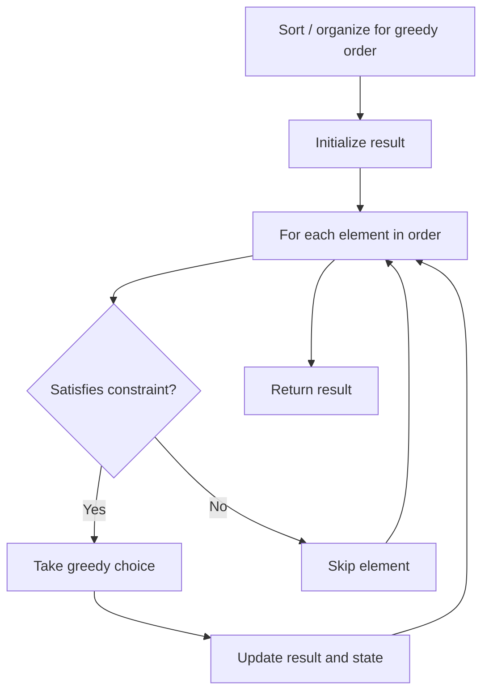

# Problem 2202: Maximize the Topmost Element After K Moves

**Difficulty:** Medium  
**Tags:** Array, Greedy  
**Pattern:** Greedy  
**Link:** [leetcode.com/problems/maximize-the-topmost-element-after-k-moves](https://leetcode.com/problems/maximize-the-topmost-element-after-k-moves/)

## Description

You are given a **0-indexed** integer array `nums` representing the contents of a **pile**, where `nums[0]` is the topmost element of the pile.

In one move, you can perform **either** of the following:

	- If the pile is not empty, **remove** the topmost element of the pile.
	- If there are one or more removed elements, **add** any one of them back onto the pile. This element becomes the new topmost element.

You are also given an integer `k`, which denotes the total number of moves to be made.

Return *the **maximum value** of the topmost element of the pile possible after **exactly*** `k` *moves*. In case it is not possible to obtain a non-empty pile after `k` moves, return `-1`.

 

Example 1:

```

**Input:** nums = [5,2,2,4,0,6], k = 4
**Output:** 5
**Explanation:**
One of the ways we can end with 5 at the top of the pile after 4 moves is as follows:
- Step 1: Remove the topmost element = 5. The pile becomes [2,2,4,0,6].
- Step 2: Remove the topmost element = 2. The pile becomes [2,4,0,6].
- Step 3: Remove the topmost element = 2. The pile becomes [4,0,6].
- Step 4: Add 5 back onto the pile. The pile becomes [5,4,0,6].
Note that this is not the only way to end with 5 at the top of the pile. It can be shown that 5 is the largest answer possible after 4 moves.

```

Example 2:

```

**Input:** nums = [2], k = 1
**Output:** -1
**Explanation:** 
In the first move, our only option is to pop the topmost element of the pile.
Since it is not possible to obtain a non-empty pile after one move, we return -1.

```

 

**Constraints:**

	- `1 <= nums.length <= 10^5`
	- `0 <= nums[i], k <= 10^9`

## Approach: Greedy

Make the locally optimal choice at each step, trusting it leads to a global optimum. Greedy works when the problem has the greedy-choice property and optimal substructure.

## Pseudocode

```
1. Sort or organize data for greedy ordering
2. Initialize result
3. For each element in greedy order:
   a. If element satisfies constraint:
      - Take the greedy choice
      - Update result and state
4. Return result
```

## Algorithm Flow



## Complexity Analysis

- **Time:** O(n log n)
- **Space:** O(1)

## Solution (Python3)

```python
class Solution:
    def maximumTop(self, nums: List[int], k: int) -> int:
        # Greedy approach - O(n) time
        result = 0
        curr_max = 0
        for i in range(len(nums)):
            if isinstance(nums[i], int):
                curr_max = max(curr_max, nums[i])
                result = max(result, curr_max)
            else:
                result += 1
        return result
```

## Solution (C++)

```cpp
#include <algorithm>
#include <string>
#include <vector>
using namespace std;

class Solution {
public:
    int maximumTop(vector<int>& nums, int k) {
        // Greedy approach - O(n) time
        int result = 0, curr_max = 0;
        for (int i = 0; i < (int)nums.size(); i++) {
            curr_max = max(curr_max, nums[i]);
            result = max(result, curr_max);
        }
        return result;
    }
};
```
