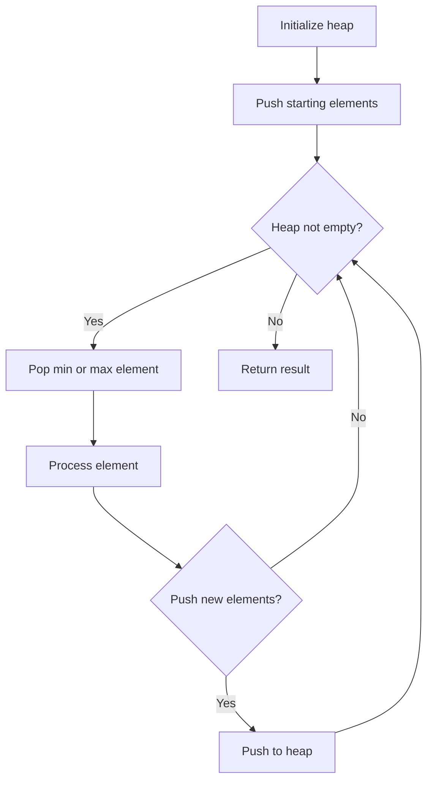
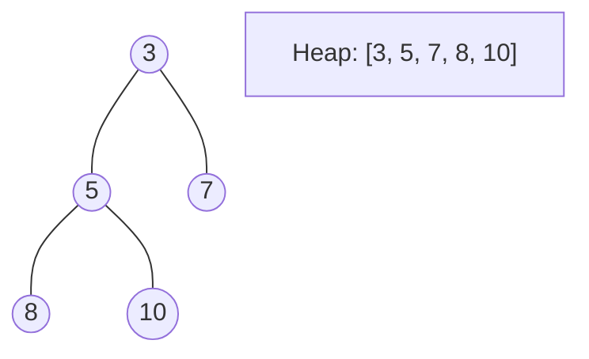
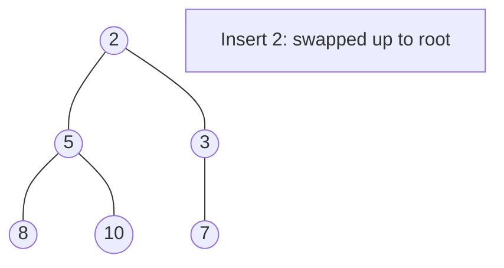
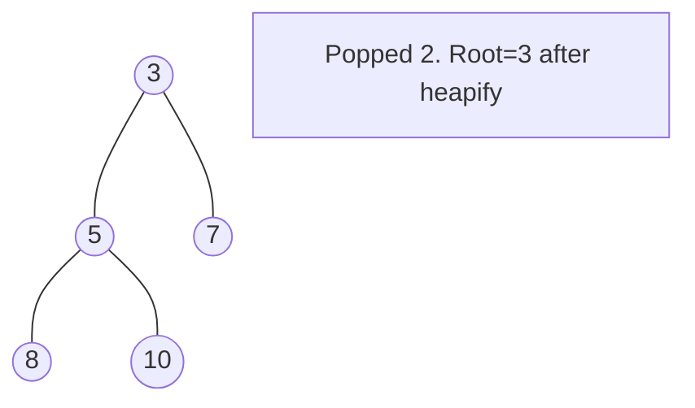

# Problem 2203: Minimum Weighted Subgraph With the Required Paths

**Difficulty:** Hard  
**Tags:** Graph Theory, Heap (Priority Queue), Shortest Path  
**Pattern:** Heap / Priority Queue  
**Link:** [leetcode.com/problems/minimum-weighted-subgraph-with-the-required-paths](https://leetcode.com/problems/minimum-weighted-subgraph-with-the-required-paths/)

## Description

You are given an integer `n` denoting the number of nodes of a **weighted directed** graph. The nodes are numbered from `0` to `n - 1`.

You are also given a 2D integer array `edges` where `edges[i] = [fromi, toi, weighti]` denotes that there exists a **directed** edge from `fromi` to `toi` with weight `weighti`.

Lastly, you are given three **distinct** integers `src1`, `src2`, and `dest` denoting three distinct nodes of the graph.

Return *the **minimum weight** of a subgraph of the graph such that it is **possible** to reach* `dest` *from both* `src1` *and* `src2` *via a set of edges of this subgraph*. In case such a subgraph does not exist, return `-1`.

A **subgraph** is a graph whose vertices and edges are subsets of the original graph. The **weight** of a subgraph is the sum of weights of its constituent edges.

 

Example 1:

```

**Input:** n = 6, edges = [[0,2,2],[0,5,6],[1,0,3],[1,4,5],[2,1,1],[2,3,3],[2,3,4],[3,4,2],[4,5,1]], src1 = 0, src2 = 1, dest = 5
**Output:** 9
**Explanation:**
The above figure represents the input graph.
The blue edges represent one of the subgraphs that yield the optimal answer.
Note that the subgraph [[1,0,3],[0,5,6]] also yields the optimal answer. It is not possible to get a subgraph with less weight satisfying all the constraints.

```

Example 2:

```

**Input:** n = 3, edges = [[0,1,1],[2,1,1]], src1 = 0, src2 = 1, dest = 2
**Output:** -1
**Explanation:**
The above figure represents the input graph.
It can be seen that there does not exist any path from node 1 to node 2, hence there are no subgraphs satisfying all the constraints.

```

 

**Constraints:**

	- `3 <= n <= 10^5`
	- `0 <= edges.length <= 10^5`
	- `edges[i].length == 3`
	- `0 <= fromi, toi, src1, src2, dest <= n - 1`
	- `fromi != toi`
	- `src1`, `src2`, and `dest` are pairwise distinct.
	- `1 <= weight[i] <= 10^5`

## Approach: Heap / Priority Queue

Use a min-heap or max-heap to efficiently access the smallest/largest element. Push elements and pop the top to process in priority order.

## Pseudocode

```
1. Initialize heap (min or max)
2. Push initial elements onto heap
3. While heap not empty and condition:
   a. Pop top element (min or max)
   b. Process element
   c. Push new elements if needed
4. Return result
```

## Algorithm Flow



## Visual State Transitions

**Heap Operations (Min-Heap):**

**Frame 1: Initial heap**


**Frame 2: Insert 2 - bubble up**


**Frame 3: Pop minimum (2) - heapify down**



## Complexity Analysis

- **Time:** O(n log n)
- **Space:** O(n)

## Solution (Python3)

```python
class Solution:
    def minimumWeight(self, n: int, edges: List[List[int]], src1: int, src2: int, dest: int) -> int:
        # Heap/Priority Queue - O(n log k) time
        import heapq
        if not n:
            return 0
        # Min heap (negate for max heap)
        heap = []
        for val in n:
            heapq.heappush(heap, val)
            if len(heap) > (edges if isinstance(edges, int) else len(n)):
                heapq.heappop(heap)
        return heap[0] if heap else 0
```

## Solution (C++)

```cpp
#include <queue>
#include <string>
#include <vector>
using namespace std;

class Solution {
public:
    int minimumWeight(int n, vector<vector<int>>& edges, int src1, int src2, int dest) {
        // Heap/Priority Queue - O(n log k) time
        priority_queue<int, vector<int>, greater<int>> pq;
        for (int val : n) {
            pq.push(val);
            if ((int)pq.size() > edges)
                pq.pop();
        }
        return pq.empty() ? 0 : pq.top();
    }
};
```
