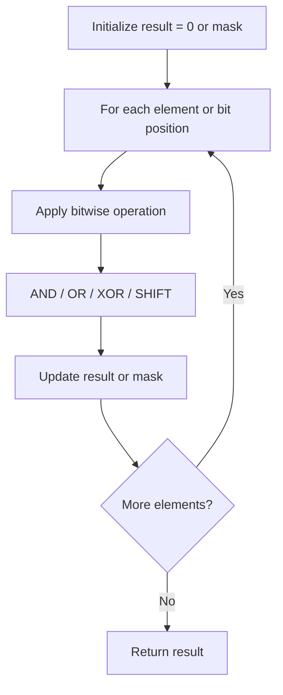

# Problem 2206: Divide Array Into Equal Pairs

**Difficulty:** Easy  
**Tags:** Array, Hash Table, Bit Manipulation, Counting  
**Pattern:** Bit Manipulation  
**Link:** [leetcode.com/problems/divide-array-into-equal-pairs](https://leetcode.com/problems/divide-array-into-equal-pairs/)

## Description

You are given an integer array `nums` consisting of `2 * n` integers.

You need to divide `nums` into `n` pairs such that:

	- Each element belongs to **exactly one** pair.
	- The elements present in a pair are **equal**.

Return `true` *if nums can be divided into* `n` *pairs, otherwise return* `false`.

 

Example 1:

```

**Input:** nums = [3,2,3,2,2,2]
**Output:** true
**Explanation:** 
There are 6 elements in nums, so they should be divided into 6 / 2 = 3 pairs.
If nums is divided into the pairs (2, 2), (3, 3), and (2, 2), it will satisfy all the conditions.

```

Example 2:

```

**Input:** nums = [1,2,3,4]
**Output:** false
**Explanation:** 
There is no way to divide nums into 4 / 2 = 2 pairs such that the pairs satisfy every condition.

```

 

**Constraints:**

	- `nums.length == 2 * n`
	- `1 <= n <= 500`
	- `1 <= nums[i] <= 500`

## Approach: Bit Manipulation

Operate on individual bits using bitwise operators (AND, OR, XOR, shift). Common tricks: x & (x-1) removes lowest set bit, x ^ x = 0, XOR all elements to find unique.

## Pseudocode

```
1. Apply bitwise operations:
   - XOR all elements to cancel paired bits
   - Use bitmask to track state
   - Shift and mask to extract/set individual bits
2. Return result
```

## Algorithm Flow



## Complexity Analysis

- **Time:** O(n) or O(log n)
- **Space:** O(1)

## Solution (Python3)

```python
class Solution:
    def divideArray(self, nums: List[int]) -> bool:
        # Bit manipulation - O(n) time, O(1) space
        result = 0
        for val in nums:
            result ^= val
        return result
```

## Solution (C++)

```cpp
#include <string>
#include <vector>
using namespace std;

class Solution {
public:
    bool divideArray(vector<int>& nums) {
        // Bit manipulation - O(n) time, O(1) space
        int result = 0;
        for (int val : nums) {
            result ^= val;
        }
        return result;
    }
};
```
