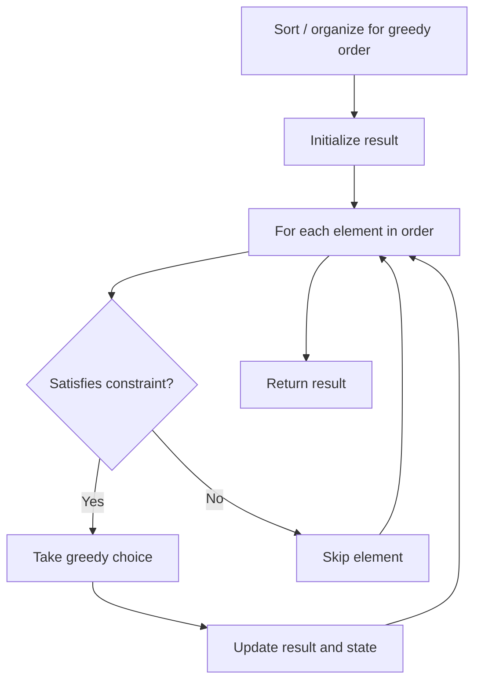

# Problem 2207: Maximize Number of Subsequences in a String

**Difficulty:** Medium  
**Tags:** String, Greedy, Prefix Sum  
**Pattern:** Greedy  
**Link:** [leetcode.com/problems/maximize-number-of-subsequences-in-a-string](https://leetcode.com/problems/maximize-number-of-subsequences-in-a-string/)

## Description

You are given a **0-indexed** string `text` and another **0-indexed** string `pattern` of length `2`, both of which consist of only lowercase English letters.

You can add **either** `pattern[0]` **or** `pattern[1]` anywhere in `text` **exactly once**. Note that the character can be added even at the beginning or at the end of `text`.

Return *the **maximum** number of times* `pattern` *can occur as a **subsequence** of the modified *`text`.

A **subsequence** is a string that can be derived from another string by deleting some or no characters without changing the order of the remaining characters.

 

Example 1:

```

**Input:** text = "abdcdbc", pattern = "ac"
**Output:** 4
**Explanation:**
If we add pattern[0] = 'a' in between text[1] and text[2], we get "ab**a**dcdbc". Now, the number of times "ac" occurs as a subsequence is 4.
Some other strings which have 4 subsequences "ac" after adding a character to text are "**a**abdcdbc" and "abd**a**cdbc".
However, strings such as "abdc**a**dbc", "abd**c**cdbc", and "abdcdbc**c**", although obtainable, have only 3 subsequences "ac" and are thus suboptimal.
It can be shown that it is not possible to get more than 4 subsequences "ac" by adding only one character.

```

Example 2:

```

**Input:** text = "aabb", pattern = "ab"
**Output:** 6
**Explanation:**
Some of the strings which can be obtained from text and have 6 subsequences "ab" are "**a**aabb", "aa**a**bb", and "aab**b**b".

```

 

**Constraints:**

	- `1 <= text.length <= 10^5`
	- `pattern.length == 2`
	- `text` and `pattern` consist only of lowercase English letters.

## Approach: Greedy

Make the locally optimal choice at each step, trusting it leads to a global optimum. Greedy works when the problem has the greedy-choice property and optimal substructure.

## Pseudocode

```
1. Sort or organize data for greedy ordering
2. Initialize result
3. For each element in greedy order:
   a. If element satisfies constraint:
      - Take the greedy choice
      - Update result and state
4. Return result
```

## Algorithm Flow



## Complexity Analysis

- **Time:** O(n log n)
- **Space:** O(1)

## Solution (Python3)

```python
class Solution:
    def maximumSubsequenceCount(self, text: str, pattern: str) -> int:
        # Greedy approach - O(n) time
        result = 0
        curr_max = 0
        for i in range(len(text)):
            if isinstance(text[i], int):
                curr_max = max(curr_max, text[i])
                result = max(result, curr_max)
            else:
                result += 1
        return result
```

## Solution (C++)

```cpp
#include <algorithm>
#include <string>
#include <vector>
using namespace std;

class Solution {
public:
    int maximumSubsequenceCount(string& text, string& pattern) {
        // Greedy approach - O(n) time
        int result = 0, curr_max = 0;
        for (int i = 0; i < (int)text.size(); i++) {
            curr_max = max(curr_max, text[i]);
            result = max(result, curr_max);
        }
        return result;
    }
};
```
