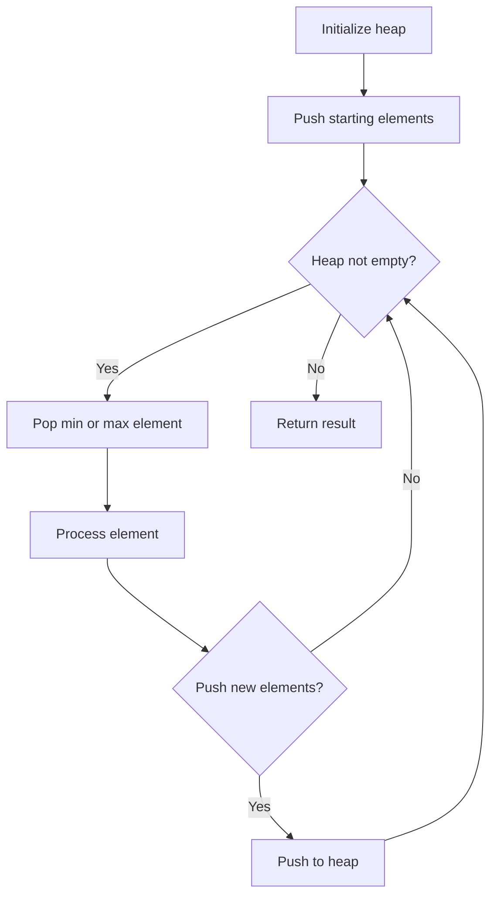
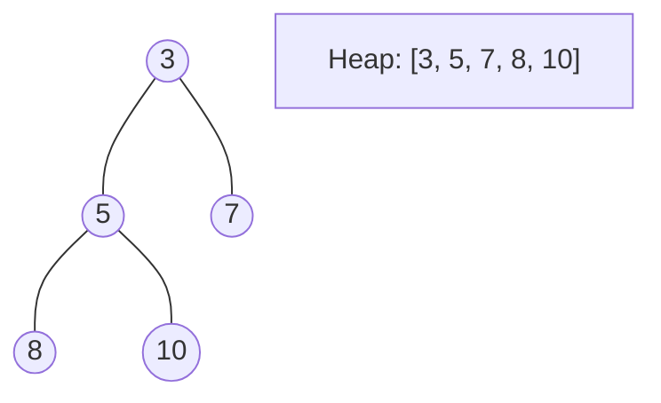
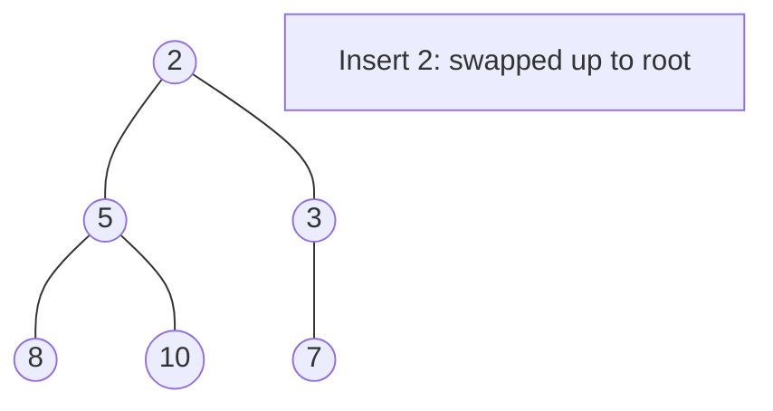
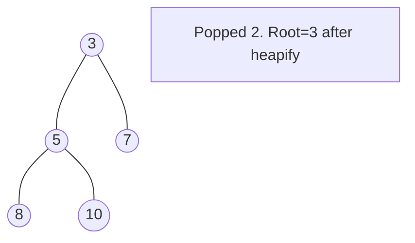

# Problem 2208: Minimum Operations to Halve Array Sum

**Difficulty:** Medium  
**Tags:** Array, Greedy, Heap (Priority Queue)  
**Pattern:** Heap / Priority Queue  
**Link:** [leetcode.com/problems/minimum-operations-to-halve-array-sum](https://leetcode.com/problems/minimum-operations-to-halve-array-sum/)

## Description

You are given an array `nums` of positive integers. In one operation, you can choose **any** number from `nums` and reduce it to **exactly** half the number. (Note that you may choose this reduced number in future operations.)

Return* the **minimum** number of operations to reduce the sum of *`nums`* by **at least** half.*

 

Example 1:

```

**Input:** nums = [5,19,8,1]
**Output:** 3
**Explanation:** The initial sum of nums is equal to 5 + 19 + 8 + 1 = 33.
The following is one of the ways to reduce the sum by at least half:
Pick the number 19 and reduce it to 9.5.
Pick the number 9.5 and reduce it to 4.75.
Pick the number 8 and reduce it to 4.
The final array is [5, 4.75, 4, 1] with a total sum of 5 + 4.75 + 4 + 1 = 14.75. 
The sum of nums has been reduced by 33 - 14.75 = 18.25, which is at least half of the initial sum, 18.25 >= 33/2 = 16.5.
Overall, 3 operations were used so we return 3.
It can be shown that we cannot reduce the sum by at least half in less than 3 operations.

```

Example 2:

```

**Input:** nums = [3,8,20]
**Output:** 3
**Explanation:** The initial sum of nums is equal to 3 + 8 + 20 = 31.
The following is one of the ways to reduce the sum by at least half:
Pick the number 20 and reduce it to 10.
Pick the number 10 and reduce it to 5.
Pick the number 3 and reduce it to 1.5.
The final array is [1.5, 8, 5] with a total sum of 1.5 + 8 + 5 = 14.5. 
The sum of nums has been reduced by 31 - 14.5 = 16.5, which is at least half of the initial sum, 16.5 >= 31/2 = 15.5.
Overall, 3 operations were used so we return 3.
It can be shown that we cannot reduce the sum by at least half in less than 3 operations.

```

 

**Constraints:**

	- `1 <= nums.length <= 10^5`
	- `1 <= nums[i] <= 10^7`

## Approach: Heap / Priority Queue

Use a min-heap or max-heap to efficiently access the smallest/largest element. Push elements and pop the top to process in priority order.

## Pseudocode

```
1. Initialize heap (min or max)
2. Push initial elements onto heap
3. While heap not empty and condition:
   a. Pop top element (min or max)
   b. Process element
   c. Push new elements if needed
4. Return result
```

## Algorithm Flow



## Visual State Transitions

**Heap Operations (Min-Heap):**

**Frame 1: Initial heap**


**Frame 2: Insert 2 - bubble up**


**Frame 3: Pop minimum (2) - heapify down**



## Complexity Analysis

- **Time:** O(n log n)
- **Space:** O(n)

## Solution (Python3)

```python
class Solution:
    def halveArray(self, nums: List[int]) -> int:
        # Heap/Priority Queue - O(n log k) time
        import heapq
        if not nums:
            return 0
        # Min heap (negate for max heap)
        heap = []
        for val in nums:
            heapq.heappush(heap, val)
            if len(heap) > (nums if isinstance(nums, int) else len(nums)):
                heapq.heappop(heap)
        return heap[0] if heap else 0
```

## Solution (C++)

```cpp
#include <queue>
#include <string>
#include <vector>
using namespace std;

class Solution {
public:
    int halveArray(vector<int>& nums) {
        // Heap/Priority Queue - O(n log k) time
        priority_queue<int, vector<int>, greater<int>> pq;
        for (int val : nums) {
            pq.push(val);
            if ((int)pq.size() > nums)
                pq.pop();
        }
        return pq.empty() ? 0 : pq.top();
    }
};
```
