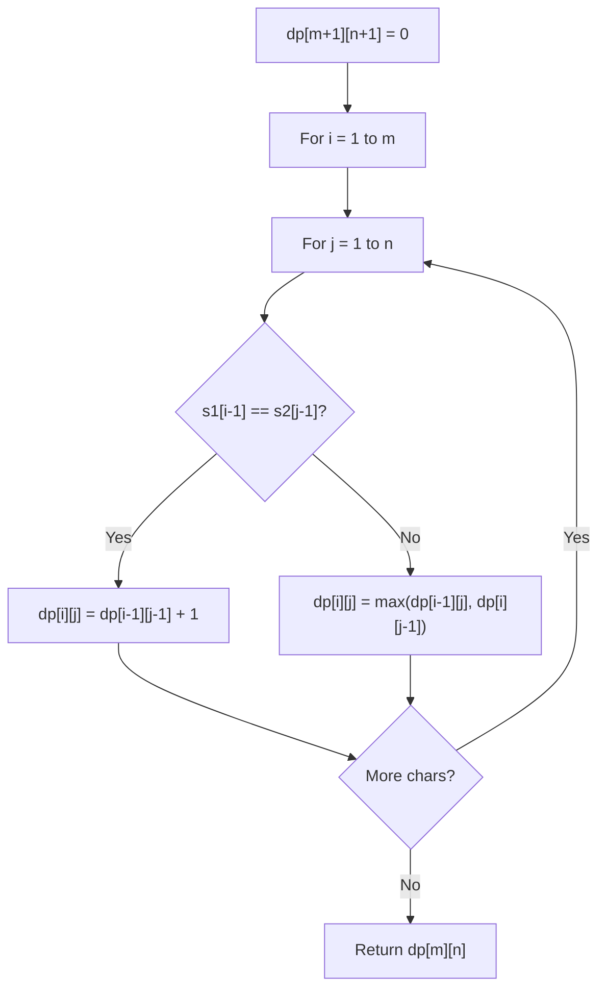

# Problem 2209: Minimum White Tiles After Covering With Carpets

**Difficulty:** Hard  
**Tags:** String, Dynamic Programming, Prefix Sum  
**Pattern:** Dynamic Programming (String)  
**Link:** [leetcode.com/problems/minimum-white-tiles-after-covering-with-carpets](https://leetcode.com/problems/minimum-white-tiles-after-covering-with-carpets/)

## Description

You are given a **0-indexed binary** string `floor`, which represents the colors of tiles on a floor:

	- `floor[i] = '0'` denotes that the `i^th` tile of the floor is colored **black**.
	- On the other hand, `floor[i] = '1'` denotes that the `i^th` tile of the floor is colored **white**.

You are also given `numCarpets` and `carpetLen`. You have `numCarpets` **black** carpets, each of length `carpetLen` tiles. Cover the tiles with the given carpets such that the number of **white** tiles still visible is **minimum**. Carpets may overlap one another.

Return *the **minimum** number of white tiles still visible.*

 

Example 1:

```

**Input:** floor = "10110101", numCarpets = 2, carpetLen = 2
**Output:** 2
**Explanation:** 
The figure above shows one way of covering the tiles with the carpets such that only 2 white tiles are visible.
No other way of covering the tiles with the carpets can leave less than 2 white tiles visible.

```

Example 2:

```

**Input:** floor = "11111", numCarpets = 2, carpetLen = 3
**Output:** 0
**Explanation:** 
The figure above shows one way of covering the tiles with the carpets such that no white tiles are visible.
Note that the carpets are able to overlap one another.

```

 

**Constraints:**

	- `1 <= carpetLen <= floor.length <= 1000`
	- `floor[i]` is either `'0'` or `'1'`.
	- `1 <= numCarpets <= 1000`

## Approach: Dynamic Programming (String)

Compare or match two strings using a 2D DP table. dp[i][j] represents the answer for substrings s1[0..i-1] and s2[0..j-1]. Common patterns: LCS, edit distance, regex matching.

## Pseudocode

```
1. Create dp[m+1][n+1]
2. Initialize base cases
3. For i from 1 to m:
   For j from 1 to n:
     If s1[i-1] == s2[j-1]: dp[i][j] = dp[i-1][j-1] + 1
     Else: dp[i][j] = best of (dp[i-1][j], dp[i][j-1], dp[i-1][j-1])
4. Return dp[m][n]
```

## Algorithm Flow



## Complexity Analysis

- **Time:** O(m * n)
- **Space:** O(m * n)

## Solution (Python3)

```python
class Solution:
    def minimumWhiteTiles(self, floor: str, numCarpets: int, carpetLen: int) -> int:
        # String DP - O(m*n) time and space
        m, n = len(floor), len(numCarpets)
        dp = [[0] * (n + 1) for _ in range(m + 1)]
        for i in range(1, m + 1):
            for j in range(1, n + 1):
                if floor[i-1] == numCarpets[j-1]:
                    dp[i][j] = dp[i-1][j-1] + 1
                else:
                    dp[i][j] = max(dp[i-1][j], dp[i][j-1])
        return dp[m][n]
```

## Solution (C++)

```cpp
#include <algorithm>
#include <string>
#include <vector>
using namespace std;

class Solution {
public:
    int minimumWhiteTiles(string& floor, int numCarpets, int carpetLen) {
        // String DP - O(m*n) time and space
        int m = floor.size(), n = numCarpets.size();
        vector<vector<int>> dp(m + 1, vector<int>(n + 1, 0));
        for (int i = 1; i <= m; i++) {
            for (int j = 1; j <= n; j++) {
                if (floor[i-1] == numCarpets[j-1])
                    dp[i][j] = dp[i-1][j-1] + 1;
                else
                    dp[i][j] = max(dp[i-1][j], dp[i][j-1]);
            }
        }
        return dp[m][n];
    }
};
```
