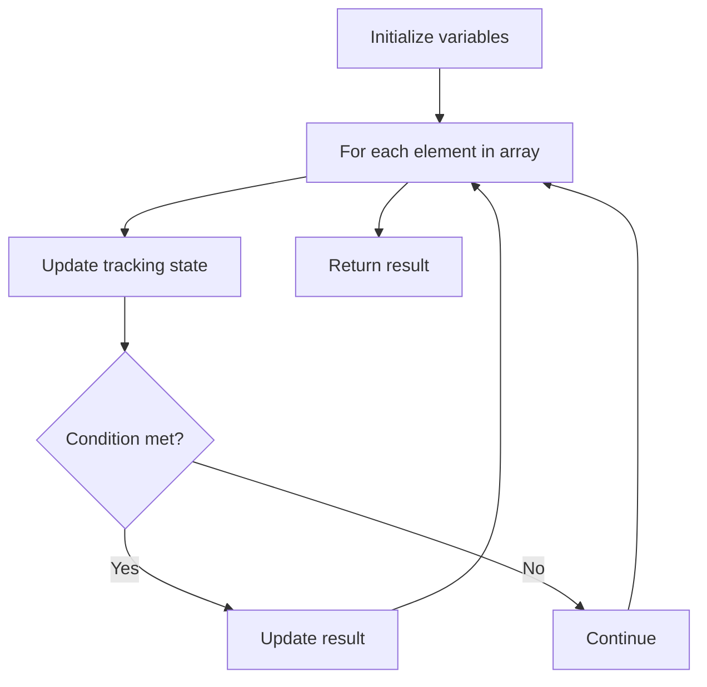

# Problem 2210: Count Hills and Valleys in an Array

**Difficulty:** Easy  
**Tags:** Array  
**Pattern:** Array Processing  
**Link:** [leetcode.com/problems/count-hills-and-valleys-in-an-array](https://leetcode.com/problems/count-hills-and-valleys-in-an-array/)

## Description

You are given a **0-indexed** integer array `nums`. An index `i` is part of a **hill** in `nums` if the closest non-equal neighbors of `i` are smaller than `nums[i]`. Similarly, an index `i` is part of a **valley** in `nums` if the closest non-equal neighbors of `i` are larger than `nums[i]`. Adjacent indices `i` and `j` are part of the **same** hill or valley if `nums[i] == nums[j]`.

Note that for an index to be part of a hill or valley, it must have a non-equal neighbor on **both** the left and right of the index.

Return *the number of hills and valleys in *`nums`.

 

Example 1:

```

**Input:** nums = [2,4,1,1,6,5]
**Output:** 3
**Explanation:**
At index 0: There is no non-equal neighbor of 2 on the left, so index 0 is neither a hill nor a valley.
At index 1: The closest non-equal neighbors of 4 are 2 and 1. Since 4 > 2 and 4 > 1, index 1 is a hill. 
At index 2: The closest non-equal neighbors of 1 are 4 and 6. Since 1 < 4 and 1 < 6, index 2 is a valley.
At index 3: The closest non-equal neighbors of 1 are 4 and 6. Since 1 < 4 and 1 < 6, index 3 is a valley, but note that it is part of the same valley as index 2.
At index 4: The closest non-equal neighbors of 6 are 1 and 5. Since 6 > 1 and 6 > 5, index 4 is a hill.
At index 5: There is no non-equal neighbor of 5 on the right, so index 5 is neither a hill nor a valley. 
There are 3 hills and valleys so we return 3.

```

Example 2:

```

**Input:** nums = [6,6,5,5,4,1]
**Output:** 0
**Explanation:**
At index 0: There is no non-equal neighbor of 6 on the left, so index 0 is neither a hill nor a valley.
At index 1: There is no non-equal neighbor of 6 on the left, so index 1 is neither a hill nor a valley.
At index 2: The closest non-equal neighbors of 5 are 6 and 4. Since 5 < 6 and 5 > 4, index 2 is neither a hill nor a valley.
At index 3: The closest non-equal neighbors of 5 are 6 and 4. Since 5 < 6 and 5 > 4, index 3 is neither a hill nor a valley.
At index 4: The closest non-equal neighbors of 4 are 5 and 1. Since 4 < 5 and 4 > 1, index 4 is neither a hill nor a valley.
At index 5: There is no non-equal neighbor of 1 on the right, so index 5 is neither a hill nor a valley.
There are 0 hills and valleys so we return 0.

```

 

**Constraints:**

	- `3 <= nums.length <= 100`
	- `1 <= nums[i] <= 100`

## Approach: Array Processing

Process the array with a linear scan, tracking state variables. Look for patterns: running maximum/minimum, counting, or transformations.

## Pseudocode

```
1. Initialize tracking variables
2. Iterate through array:
   a. Update tracking state
   b. Check conditions
   c. Update result
3. Return result
```

## Algorithm Flow



## Complexity Analysis

- **Time:** O(n)
- **Space:** O(1)

## Solution (Python3)

```python
class Solution:
    def countHillValley(self, nums: List[int]) -> int:
        # Array processing - O(n) time
        result = 0
        for i in range(len(nums)):
            # Process element
            pass
        return result
```

## Solution (C++)

```cpp
#include <string>
#include <vector>
using namespace std;

class Solution {
public:
    int countHillValley(vector<int>& nums) {
        // Array processing - O(n) time
        for (int i = 0; i < (int)nums.size(); i++) {
            // Process element
        }
        return 0;
    }
};
```
