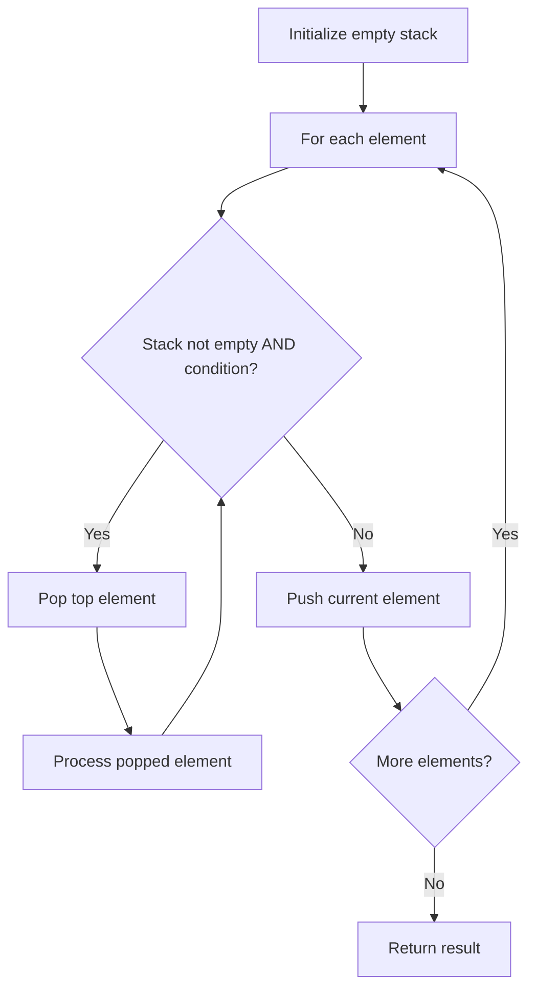

# Problem 2211: Count Collisions on a Road

**Difficulty:** Medium  
**Tags:** String, Stack, Simulation  
**Pattern:** Stack  
**Link:** [leetcode.com/problems/count-collisions-on-a-road](https://leetcode.com/problems/count-collisions-on-a-road/)

## Description

There are `n` cars on an infinitely long road. The cars are numbered from `0` to `n - 1` from left to right and each car is present at a **unique** point.

You are given a **0-indexed** string `directions` of length `n`. `directions[i]` can be either `'L'`, `'R'`, or `'S'` denoting whether the `i^th` car is moving towards the **left**, towards the **right**, or **staying** at its current point respectively. Each moving car has the **same speed**.

The number of collisions can be calculated as follows:

	- When two cars moving in **opposite** directions collide with each other, the number of collisions increases by `2`.
	- When a moving car collides with a stationary car, the number of collisions increases by `1`.

After a collision, the cars involved can no longer move and will stay at the point where they collided. Other than that, cars cannot change their state or direction of motion.

Return *the **total number of collisions** that will happen on the road*.

 

Example 1:

```

**Input:** directions = "RLRSLL"
**Output:** 5
**Explanation:**
The collisions that will happen on the road are:
- Cars 0 and 1 will collide with each other. Since they are moving in opposite directions, the number of collisions becomes 0 + 2 = 2.
- Cars 2 and 3 will collide with each other. Since car 3 is stationary, the number of collisions becomes 2 + 1 = 3.
- Cars 3 and 4 will collide with each other. Since car 3 is stationary, the number of collisions becomes 3 + 1 = 4.
- Cars 4 and 5 will collide with each other. After car 4 collides with car 3, it will stay at the point of collision and get hit by car 5. The number of collisions becomes 4 + 1 = 5.
Thus, the total number of collisions that will happen on the road is 5. 

```

Example 2:

```

**Input:** directions = "LLRR"
**Output:** 0
**Explanation:**
No cars will collide with each other. Thus, the total number of collisions that will happen on the road is 0.
```

 

**Constraints:**

	- `1 <= directions.length <= 10^5`
	- `directions[i]` is either `'L'`, `'R'`, or `'S'`.

## Approach: Stack

Use a stack (LIFO) to process elements. Push elements when they might be needed later; pop when a matching or resolving condition is found. Common uses: parentheses matching, expression evaluation, next greater element.

## Pseudocode

```
1. Initialize empty stack
2. For each element:
   a. While stack is not empty and condition met:
      - Pop and process top element
   b. Push current element onto stack
3. Process remaining elements in stack if needed
4. Return result
```

## Algorithm Flow



## Complexity Analysis

- **Time:** O(n)
- **Space:** O(n)

## Solution (Python3)

```python
class Solution:
    def countCollisions(self, directions: str) -> int:
        # Stack-based approach - O(n) time
        stack = []
        for ch in directions:
            if stack and self._matches(stack[-1], ch):
                stack.pop()
            else:
                stack.append(ch)
        return len(stack) == 0 if isinstance(0, bool) else stack

    def _matches(self, a, b):
        pairs = {'(': ')', '[': ']', '{': '}'}
        return pairs.get(a) == b
```

## Solution (C++)

```cpp
#include <stack>
#include <string>
#include <unordered_map>
#include <vector>
using namespace std;

class Solution {
public:
    int countCollisions(string& directions) {
        // Stack-based approach - O(n) time
        stack<char> st;
        unordered_map<char, char> pairs = {{'(', ')'}, {'[', ']'}, {'{', '}'}};
        for (char ch : directions) {
            if (!st.empty() && pairs.count(st.top()) && pairs[st.top()] == ch) {
                st.pop();
            } else {
                st.push(ch);
            }
        }
        return st.empty();
    }
};
```
