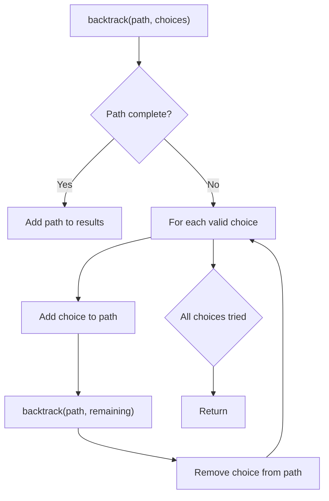
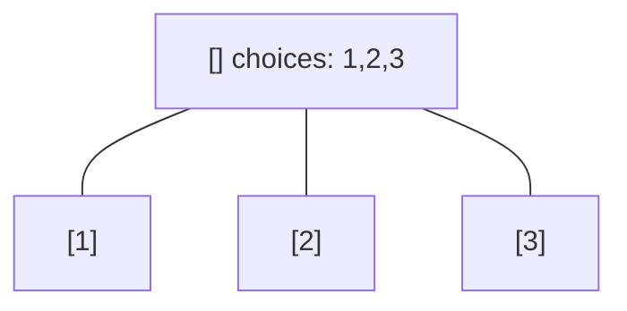
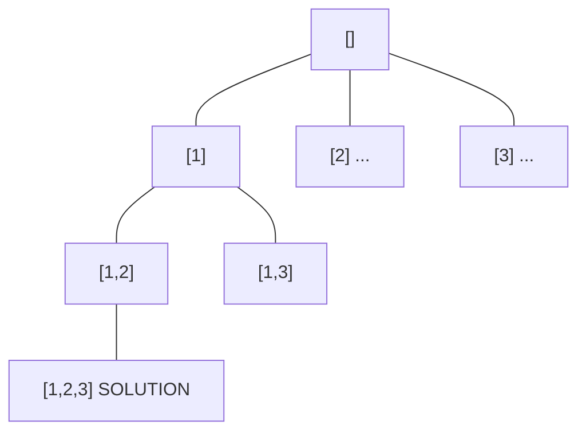
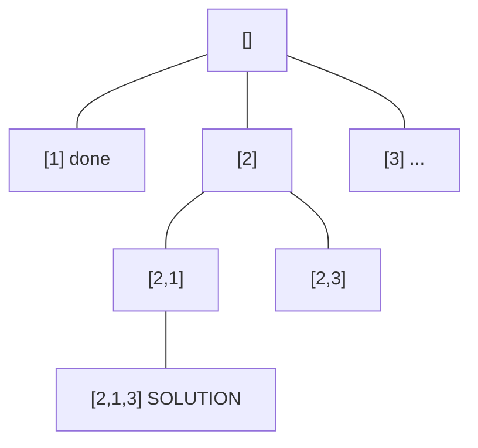
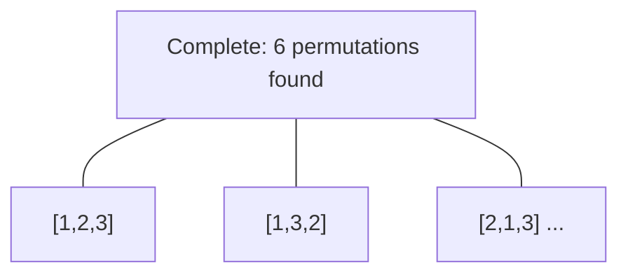

# Problem 2212: Maximum Points in an Archery Competition

**Difficulty:** Medium  
**Tags:** Array, Backtracking, Bit Manipulation, Enumeration  
**Pattern:** Backtracking  
**Link:** [leetcode.com/problems/maximum-points-in-an-archery-competition](https://leetcode.com/problems/maximum-points-in-an-archery-competition/)

## Description

Alice and Bob are opponents in an archery competition. The competition has set the following rules:

	- Alice first shoots `numArrows` arrows and then Bob shoots `numArrows` arrows.
	- The points are then calculated as follows:
	
		The target has integer scoring sections ranging from `0` to `11` **inclusive**.
		- For **each** section of the target with score `k` (in between `0` to `11`), say Alice and Bob have shot `ak` and `bk` arrows on that section respectively. If `ak >= bk`, then Alice takes `k` points. If `ak < bk`, then Bob takes `k` points.
		- However, if `ak == bk == 0`, then **nobody** takes `k` points.
	
	

	- 
	For example, if Alice and Bob both shot `2` arrows on the section with score `11`, then Alice takes `11` points. On the other hand, if Alice shot `0` arrows on the section with score `11` and Bob shot `2` arrows on that same section, then Bob takes `11` points.

	

You are given the integer `numArrows` and an integer array `aliceArrows` of size `12`, which represents the number of arrows Alice shot on each scoring section from `0` to `11`. Now, Bob wants to **maximize** the total number of points he can obtain.

Return *the array *`bobArrows`* which represents the number of arrows Bob shot on **each** scoring section from *`0`* to *`11`. The sum of the values in `bobArrows` should equal `numArrows`.

If there are multiple ways for Bob to earn the maximum total points, return **any** one of them.

 

Example 1:

```

**Input:** numArrows = 9, aliceArrows = [1,1,0,1,0,0,2,1,0,1,2,0]
**Output:** [0,0,0,0,1,1,0,0,1,2,3,1]
**Explanation:** The table above shows how the competition is scored. 
Bob earns a total point of 4 + 5 + 8 + 9 + 10 + 11 = 47.
It can be shown that Bob cannot obtain a score higher than 47 points.

```

Example 2:

```

**Input:** numArrows = 3, aliceArrows = [0,0,1,0,0,0,0,0,0,0,0,2]
**Output:** [0,0,0,0,0,0,0,0,1,1,1,0]
**Explanation:** The table above shows how the competition is scored.
Bob earns a total point of 8 + 9 + 10 = 27.
It can be shown that Bob cannot obtain a score higher than 27 points.

```

 

**Constraints:**

	- `1 <= numArrows <= 10^5`
	- `aliceArrows.length == bobArrows.length == 12`
	- `0 <= aliceArrows[i], bobArrows[i] <= numArrows`
	- `sum(aliceArrows[i]) == numArrows`

## Approach: Backtracking

Explore all possible solutions by building candidates incrementally. At each step, make a choice and recurse. If the choice leads to a dead end, undo the choice (backtrack) and try the next option.

## Pseudocode

```
1. Define backtrack(path, choices):
   a. If path is a complete solution: add to results
   b. For each choice in choices:
      - If choice is valid:
        * Add choice to path
        * backtrack(path, remaining_choices)
        * Remove choice from path (backtrack)
2. Call backtrack([], all_choices)
```

## Algorithm Flow



## Visual State Transitions

**Backtracking Decision Tree:**

**Frame 1: Root - start with empty path**


**Frame 2: Explore branch [1]**


**Frame 3: Backtrack, explore [2]**


**Frame 4: All solutions found**



## Complexity Analysis

- **Time:** O(k^n) or O(n!)
- **Space:** O(n)

## Solution (Python3)

```python
class Solution:
    def maximumBobPoints(self, numArrows: int, aliceArrows: List[int]) -> List[int]:
        # Backtracking - O(2^n) or O(n!) time
        result = []
        
        def backtrack(path, start):
            result.append(path[:])
            for i in range(start, len(numArrows)):
                path.append(numArrows[i])
                backtrack(path, i + 1)
                path.pop()
        
        backtrack([], 0)
        return result
```

## Solution (C++)

```cpp
#include <functional>
#include <string>
#include <vector>
using namespace std;

class Solution {
public:
    vector<int> maximumBobPoints(int numArrows, vector<int>& aliceArrows) {
        // Backtracking - O(2^n) or O(n!) time
        vector<vector<int>> result;
        vector<int> path;
        function<void(int)> backtrack = [&](int start) {
            result.push_back(path);
            for (int i = start; i < (int)numArrows.size(); i++) {
                path.push_back(numArrows[i]);
                backtrack(i + 1);
                path.pop_back();
            }
        };
        backtrack(0);
        return result;
    }
};
```
