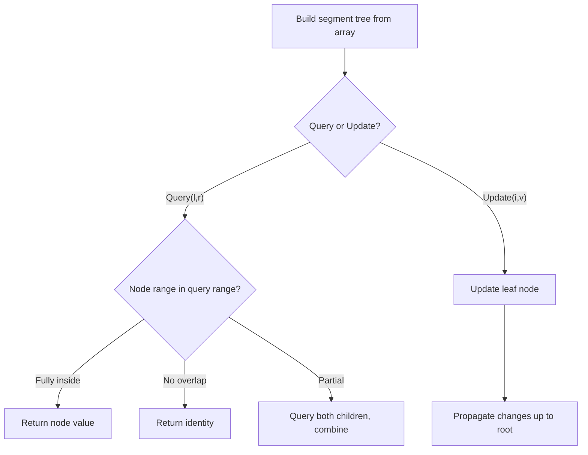

# Problem 2213: Longest Substring of One Repeating Character

**Difficulty:** Hard  
**Tags:** Array, String, Segment Tree, Ordered Set  
**Pattern:** Segment Tree  
**Link:** [leetcode.com/problems/longest-substring-of-one-repeating-character](https://leetcode.com/problems/longest-substring-of-one-repeating-character/)

## Description

You are given a **0-indexed** string `s`. You are also given a **0-indexed** string `queryCharacters` of length `k` and a **0-indexed** array of integer **indices** `queryIndices` of length `k`, both of which are used to describe `k` queries.

The `i^th` query updates the character in `s` at index `queryIndices[i]` to the character `queryCharacters[i]`.

Return *an array* `lengths` *of length *`k`* where* `lengths[i]` *is the **length** of the **longest substring** of *`s`* consisting of **only one repeating** character **after** the* `i^th` *query** is performed.*

 

Example 1:

```

**Input:** s = "babacc", queryCharacters = "bcb", queryIndices = [1,3,3]
**Output:** [3,3,4]
**Explanation:** 
- 1st query updates s = "b**b**bacc". The longest substring consisting of one repeating character is "bbb" with length 3.
- 2nd query updates s = "bbb**c**cc". 
  The longest substring consisting of one repeating character can be "bbb" or "ccc" with length 3.
- 3rd query updates s = "bbb**b**cc". The longest substring consisting of one repeating character is "bbbb" with length 4.
Thus, we return [3,3,4].

```

Example 2:

```

**Input:** s = "abyzz", queryCharacters = "aa", queryIndices = [2,1]
**Output:** [2,3]
**Explanation:**
- 1st query updates s = "ab**a**zz". The longest substring consisting of one repeating character is "zz" with length 2.
- 2nd query updates s = "a**a**azz". The longest substring consisting of one repeating character is "aaa" with length 3.
Thus, we return [2,3].

```

 

**Constraints:**

	- `1 <= s.length <= 10^5`
	- `s` consists of lowercase English letters.
	- `k == queryCharacters.length == queryIndices.length`
	- `1 <= k <= 10^5`
	- `queryCharacters` consists of lowercase English letters.
	- `0 <= queryIndices[i] < s.length`

## Approach: Segment Tree

Build a segment tree for range queries (sum, min, max) with point or range updates. Each node covers a range; queries are answered by combining relevant segments.

## Pseudocode

```
1. Build segment tree from array (O(n))
2. Query(l, r):
   - If node range within [l,r]: return node value
   - If no overlap: return identity
   - Else: combine query(left_child) and query(right_child)
3. Update(i, val): update leaf and propagate up
```

## Algorithm Flow



## Complexity Analysis

- **Time:** O(n log n) build, O(log n) query/update
- **Space:** O(n)

## Solution (Python3)

```python
class Solution:
    def longestRepeating(self, s: str, queryCharacters: str, queryIndices: List[int]) -> List[int]:
        # Segment tree for range queries - O(n log n) build, O(log n) query
        n = len(s)
        tree = [0] * (4 * n)
        
        def build(node, start, end):
            if start == end:
                tree[node] = s[start]
                return
            mid = (start + end) // 2
            build(2*node, start, mid)
            build(2*node+1, mid+1, end)
            tree[node] = tree[2*node] + tree[2*node+1]
        
        def query(node, start, end, l, r):
            if r < start or end < l:
                return 0
            if l <= start and end <= r:
                return tree[node]
            mid = (start + end) // 2
            return query(2*node, start, mid, l, r) + query(2*node+1, mid+1, end, l, r)
        
        build(1, 0, n-1)
        return []
```

## Solution (C++)

```cpp
#include <functional>
#include <string>
#include <vector>
using namespace std;

class Solution {
public:
    vector<int> longestRepeating(string& s, string& queryCharacters, vector<int>& queryIndices) {
        // Segment tree for range queries
        int n = s.size();
        vector<int> tree(4 * n, 0);
        function<void(int, int, int)> build = [&](int node, int s, int e) {
            if (s == e) { tree[node] = s[s]; return; }
            int mid = (s + e) / 2;
            build(2*node, s, mid);
            build(2*node+1, mid+1, e);
            tree[node] = tree[2*node] + tree[2*node+1];
        };
        function<int(int, int, int, int, int)> query = [&](int node, int s, int e, int l, int r) -> int {
            if (r < s || e < l) return 0;
            if (l <= s && e <= r) return tree[node];
            int mid = (s + e) / 2;
            return query(2*node, s, mid, l, r) + query(2*node+1, mid+1, e, l, r);
        };
        build(1, 0, n-1);
        return {};
    }
};
```
