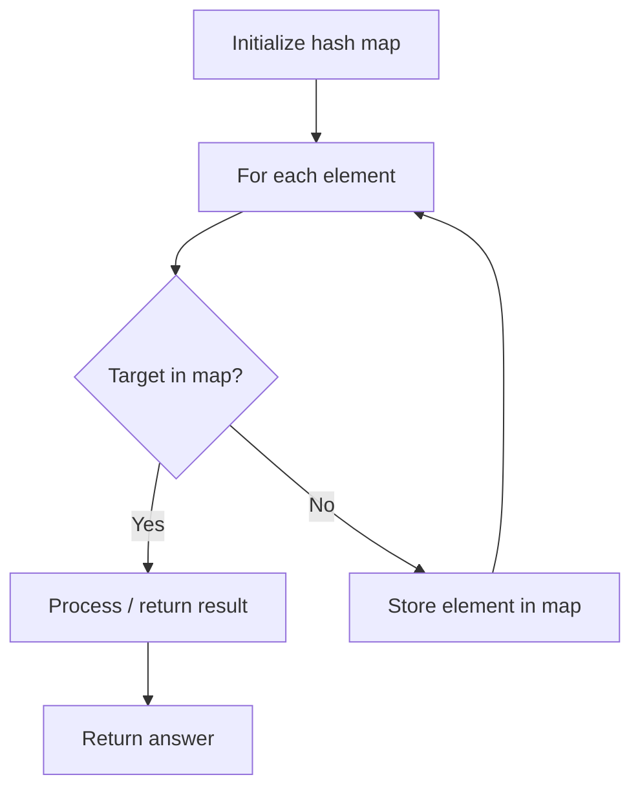

# Problem 2215: Find the Difference of Two Arrays

**Difficulty:** Easy  
**Tags:** Array, Hash Table  
**Pattern:** Hash Set  
**Link:** [leetcode.com/problems/find-the-difference-of-two-arrays](https://leetcode.com/problems/find-the-difference-of-two-arrays/)

## Description

Given two **0-indexed** integer arrays `nums1` and `nums2`, return *a list* `answer` *of size* `2` *where:*

	- `answer[0]` *is a list of all **distinct** integers in* `nums1` *which are **not** present in* `nums2`*.*
	- `answer[1]` *is a list of all **distinct** integers in* `nums2` *which are **not** present in* `nums1`.

**Note** that the integers in the lists may be returned in **any** order.

 

Example 1:

```

**Input:** nums1 = [1,2,3], nums2 = [2,4,6]
**Output:** [[1,3],[4,6]]
Explanation:
For nums1, nums1[1] = 2 is present at index 0 of nums2, whereas nums1[0] = 1 and nums1[2] = 3 are not present in nums2. Therefore, answer[0] = [1,3].
For nums2, nums2[0] = 2 is present at index 1 of nums1, whereas nums2[1] = 4 and nums2[2] = 6 are not present in nums1. Therefore, answer[1] = [4,6].
```

Example 2:

```

**Input:** nums1 = [1,2,3,3], nums2 = [1,1,2,2]
**Output:** [[3],[]]
Explanation:
For nums1, nums1[2] and nums1[3] are not present in nums2. Since nums1[2] == nums1[3], their value is only included once and answer[0] = [3].
Every integer in nums2 is present in nums1. Therefore, answer[1] = [].

```

 

**Constraints:**

	- `1 <= nums1.length, nums2.length <= 1000`
	- `-1000 <= nums1[i], nums2[i] <= 1000`

## Approach: Hash Set

Set difference: elements in one set but not the other.

## Pseudocode

```
1. Initialize hash map
2. Iterate through elements:
   a. Check if target/complement exists in map
   b. If found: process result
   c. Otherwise: store element in map
3. Return result
```

## Algorithm Flow



## Complexity Analysis

- **Time:** O(n+m)
- **Space:** O(n+m)

## Solution (Python3)

```python
class Solution:
    def findDifference(self, nums1, nums2):
        s1, s2 = set(nums1), set(nums2)
        return [list(s1 - s2), list(s2 - s1)]
```

## Solution (C++)

```cpp
#include <string>
#include <unordered_map>
#include <vector>
using namespace std;

class Solution {
public:
    vector<vector<int>> findDifference(vector<int>& nums1, vector<int>& nums2) {
        // Hash map approach - O(n) time, O(n) space
        unordered_map<int, int> seen;
        for (int i = 0; i < nums1.size(); i++) {
            int complement = nums2 - nums1[i];
            if (seen.count(complement)) {
                return {seen[complement], i};
            }
            seen[nums1[i]] = i;
        }
        return {};
    }
};
```
