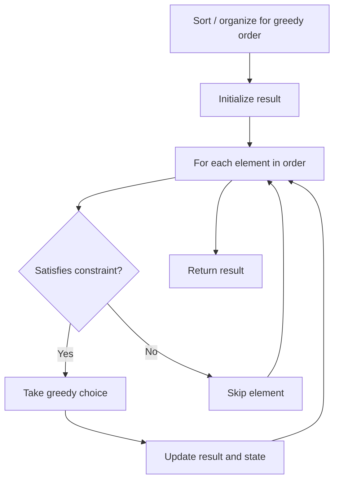

# Problem 2216: Minimum Deletions to Make Array Beautiful

**Difficulty:** Medium  
**Tags:** Array, Stack, Greedy  
**Pattern:** Greedy  
**Link:** [leetcode.com/problems/minimum-deletions-to-make-array-beautiful](https://leetcode.com/problems/minimum-deletions-to-make-array-beautiful/)

## Description

You are given a **0-indexed** integer array `nums`. The array `nums` is **beautiful** if:

	- `nums.length` is even.
	- `nums[i] != nums[i + 1]` for all `i % 2 == 0`.

Note that an empty array is considered beautiful.

You can delete any number of elements from `nums`. When you delete an element, all the elements to the right of the deleted element will be **shifted one unit to the left** to fill the gap created and all the elements to the left of the deleted element will remain **unchanged**.

Return *the **minimum** number of elements to delete from *`nums`* to make it **beautiful.*

 

Example 1:

```

**Input:** nums = [1,1,2,3,5]
**Output:** 1
**Explanation:** You can delete either `nums[0]` or `nums[1]` to make `nums` = [1,2,3,5] which is beautiful. It can be proven you need at least 1 deletion to make `nums` beautiful.

```

Example 2:

```

**Input:** nums = [1,1,2,2,3,3]
**Output:** 2
**Explanation:** You can delete `nums[0]` and `nums[5]` to make nums = [1,2,2,3] which is beautiful. It can be proven you need at least 2 deletions to make nums beautiful.

```

 

**Constraints:**

	- `1 <= nums.length <= 10^5`
	- `0 <= nums[i] <= 10^5`

## Approach: Greedy

Make the locally optimal choice at each step, trusting it leads to a global optimum. Greedy works when the problem has the greedy-choice property and optimal substructure.

## Pseudocode

```
1. Sort or organize data for greedy ordering
2. Initialize result
3. For each element in greedy order:
   a. If element satisfies constraint:
      - Take the greedy choice
      - Update result and state
4. Return result
```

## Algorithm Flow



## Complexity Analysis

- **Time:** O(n log n)
- **Space:** O(1)

## Solution (Python3)

```python
class Solution:
    def minDeletion(self, nums: List[int]) -> int:
        # Greedy approach - O(n) time
        result = 0
        curr_max = 0
        for i in range(len(nums)):
            if isinstance(nums[i], int):
                curr_max = max(curr_max, nums[i])
                result = max(result, curr_max)
            else:
                result += 1
        return result
```

## Solution (C++)

```cpp
#include <algorithm>
#include <string>
#include <vector>
using namespace std;

class Solution {
public:
    int minDeletion(vector<int>& nums) {
        // Greedy approach - O(n) time
        int result = 0, curr_max = 0;
        for (int i = 0; i < (int)nums.size(); i++) {
            curr_max = max(curr_max, nums[i]);
            result = max(result, curr_max);
        }
        return result;
    }
};
```
