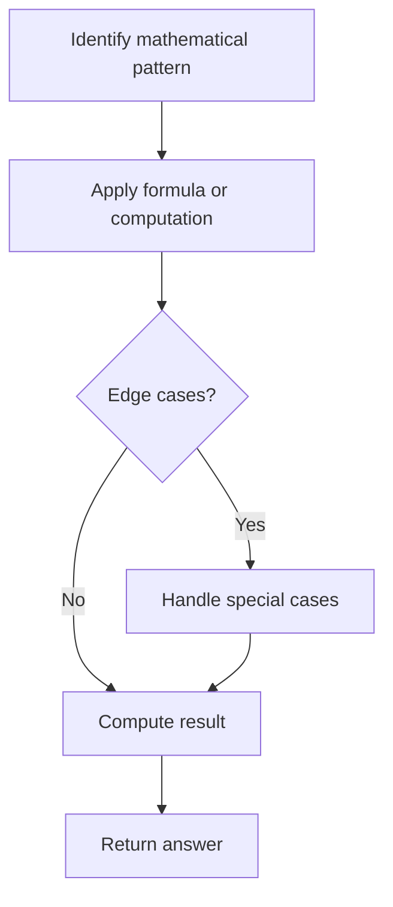

# Problem 2217: Find Palindrome With Fixed Length

**Difficulty:** Medium  
**Tags:** Array, Math  
**Pattern:** Math  
**Link:** [leetcode.com/problems/find-palindrome-with-fixed-length](https://leetcode.com/problems/find-palindrome-with-fixed-length/)

## Description

Given an integer array `queries` and a **positive** integer `intLength`, return *an array* `answer` *where* `answer[i]` *is either the *`queries[i]^th` *smallest **positive palindrome** of length* `intLength` *or* `-1`* if no such palindrome exists*.

A **palindrome** is a number that reads the same backwards and forwards. Palindromes cannot have leading zeros.

 

Example 1:

```

**Input:** queries = [1,2,3,4,5,90], intLength = 3
**Output:** [101,111,121,131,141,999]
**Explanation:**
The first few palindromes of length 3 are:
101, 111, 121, 131, 141, 151, 161, 171, 181, 191, 202, ...
The 90th palindrome of length 3 is 999.

```

Example 2:

```

**Input:** queries = [2,4,6], intLength = 4
**Output:** [1111,1331,1551]
**Explanation:**
The first six palindromes of length 4 are:
1001, 1111, 1221, 1331, 1441, and 1551.

```

 

**Constraints:**

	- `1 <= queries.length <= 5 * 10^4`
	- `1 <= queries[i] <= 10^9`
	- `1 <= intLength <= 15`

## Approach: Math

Apply mathematical properties, formulas, or number-theoretic concepts. Look for patterns, modular arithmetic, or closed-form solutions.

## Pseudocode

```
1. Identify the mathematical pattern or formula
2. Apply computation:
   - Modular arithmetic for large numbers
   - GCD/LCM for divisibility
   - Sieve for primes
3. Handle edge cases
4. Return result
```

## Algorithm Flow



## Complexity Analysis

- **Time:** O(n) or O(sqrt(n))
- **Space:** O(1)

## Solution (Python3)

```python
class Solution:
    def kthPalindrome(self, queries: List[int], intLength: int) -> List[int]:
        # Mathematical approach
        result = 0
        x = queries
        while x != 0:
            result = result * 10 + x % 10
            x //= 10 if isinstance(x, int) else 1
        return result
```

## Solution (C++)

```cpp
#include <string>
#include <vector>
using namespace std;

class Solution {
public:
    vector<int> kthPalindrome(vector<int>& queries, int intLength) {
        // Mathematical approach
        long long result = 0;
        int x = queries;
        while (x != 0) {
            result = result * 10 + x % 10;
            x /= 10;
        }
        return (int)result;
    }
};
```
