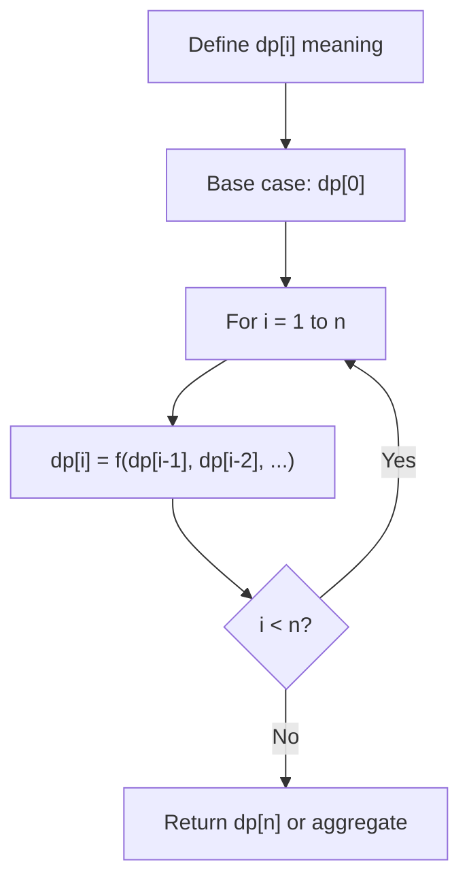
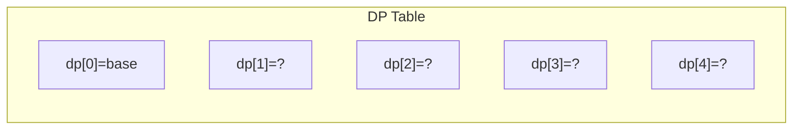
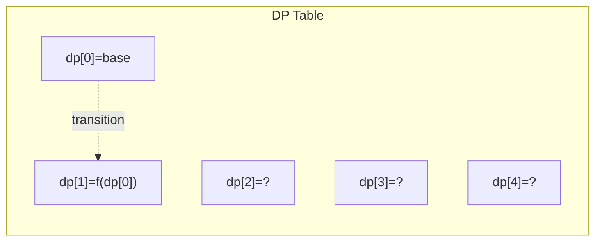
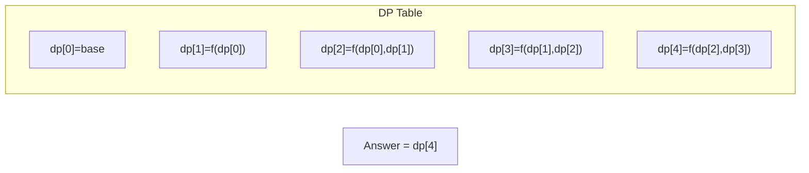

# Problem 2218: Maximum Value of K Coins From Piles

**Difficulty:** Hard  
**Tags:** Array, Dynamic Programming, Prefix Sum  
**Pattern:** Dynamic Programming (1D)  
**Link:** [leetcode.com/problems/maximum-value-of-k-coins-from-piles](https://leetcode.com/problems/maximum-value-of-k-coins-from-piles/)

## Description

There are `n` **piles** of coins on a table. Each pile consists of a **positive number** of coins of assorted denominations.

In one move, you can choose any coin on **top** of any pile, remove it, and add it to your wallet.

Given a list `piles`, where `piles[i]` is a list of integers denoting the composition of the `i^th` pile from **top to bottom**, and a positive integer `k`, return *the **maximum total value** of coins you can have in your wallet if you choose **exactly*** `k` *coins optimally*.

 

Example 1:

```

**Input:** piles = [[1,100,3],[7,8,9]], k = 2
**Output:** 101
**Explanation:**
The above diagram shows the different ways we can choose k coins.
The maximum total we can obtain is 101.

```

Example 2:

```

**Input:** piles = [[100],[100],[100],[100],[100],[100],[1,1,1,1,1,1,700]], k = 7
**Output:** 706
Explanation:
The maximum total can be obtained if we choose all coins from the last pile.

```

 

**Constraints:**

	- `n == piles.length`
	- `1 <= n <= 1000`
	- `1 <= piles[i][j] <= 10^5`
	- `1 <= k <= sum(piles[i].length) <= 2000`

## Approach: Dynamic Programming (1D)

Break the problem into overlapping subproblems. Define dp[i] as the optimal value for the subproblem ending at or considering index i. Build the solution bottom-up, using previously computed dp values.

## Pseudocode

```
1. Define dp[i] = optimal value for subproblem i
2. Base case: dp[0] = initial value
3. For i from 1 to n:
   a. dp[i] = recurrence(dp[i-1], dp[i-2], ...)
4. Return dp[n] or max/min of dp
```

## Algorithm Flow



## Visual State Transitions

**1D Dynamic Programming Table Build:**

**Frame 1: Initialize base cases**


**Frame 2: Fill dp[1] from dp[0]**


**Frame 3: Fill remaining cells**



## Complexity Analysis

- **Time:** O(n)
- **Space:** O(n)

## Solution (Python3)

```python
class Solution:
    def maxValueOfCoins(self, piles: List[List[int]], k: int) -> int:
        # Dynamic programming (1D) - O(n) time, O(n) space
        if not piles:
            return 0
        n = len(piles) if isinstance(piles, list) else piles
        dp = [0] * (n + 1)
        dp[0] = 1  # base case
        for i in range(1, n + 1):
            dp[i] = dp[i-1]  # transition (customize per problem)
            if i >= 2:
                dp[i] += dp[i-2]
        return dp[n]
```

## Solution (C++)

```cpp
#include <string>
#include <vector>
using namespace std;

class Solution {
public:
    int maxValueOfCoins(vector<vector<int>>& piles, int k) {
        // Dynamic programming (1D) - O(n) time, O(n) space
        int n = piles;
        if (n <= 0) return 0;
        vector<int> dp(n + 1, 0);
        dp[0] = 1;
        for (int i = 1; i <= n; i++) {
            dp[i] = dp[i-1];
            if (i >= 2) dp[i] += dp[i-2];
        }
        return dp[n];
    }
};
```
