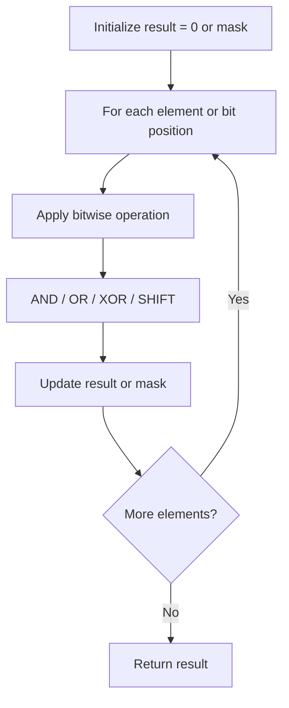

# Problem 2220: Minimum Bit Flips to Convert Number

**Difficulty:** Easy  
**Tags:** Bit Manipulation  
**Pattern:** Bit Manipulation  
**Link:** [leetcode.com/problems/minimum-bit-flips-to-convert-number](https://leetcode.com/problems/minimum-bit-flips-to-convert-number/)

## Description

A **bit flip** of a number `x` is choosing a bit in the binary representation of `x` and **flipping** it from either `0` to `1` or `1` to `0`.

	- For example, for `x = 7`, the binary representation is `111` and we may choose any bit (including any leading zeros not shown) and flip it. We can flip the first bit from the right to get `110`, flip the second bit from the right to get `101`, flip the fifth bit from the right (a leading zero) to get `10111`, etc.

Given two integers `start` and `goal`, return* the **minimum** number of **bit flips** to convert *`start`* to *`goal`.

 

Example 1:

```

**Input:** start = 10, goal = 7
**Output:** 3
**Explanation:** The binary representation of 10 and 7 are 1010 and 0111 respectively. We can convert 10 to 7 in 3 steps:
- Flip the first bit from the right: 1010 -> 1011.
- Flip the third bit from the right: 1011 -> 1111.
- Flip the fourth bit from the right: 1111 -> 0111.
It can be shown we cannot convert 10 to 7 in less than 3 steps. Hence, we return 3.
```

Example 2:

```

**Input:** start = 3, goal = 4
**Output:** 3
**Explanation:** The binary representation of 3 and 4 are 011 and 100 respectively. We can convert 3 to 4 in 3 steps:
- Flip the first bit from the right: 011 -> 010.
- Flip the second bit from the right: 010 -> 000.
- Flip the third bit from the right: 000 -> 100.
It can be shown we cannot convert 3 to 4 in less than 3 steps. Hence, we return 3.

```

 

**Constraints:**

	- `0 <= start, goal <= 10^9`

 

**Note:** This question is the same as 461: Hamming Distance.

## Approach: Bit Manipulation

Operate on individual bits using bitwise operators (AND, OR, XOR, shift). Common tricks: x & (x-1) removes lowest set bit, x ^ x = 0, XOR all elements to find unique.

## Pseudocode

```
1. Apply bitwise operations:
   - XOR all elements to cancel paired bits
   - Use bitmask to track state
   - Shift and mask to extract/set individual bits
2. Return result
```

## Algorithm Flow



## Complexity Analysis

- **Time:** O(n) or O(log n)
- **Space:** O(1)

## Solution (Python3)

```python
class Solution:
    def minBitFlips(self, start: int, goal: int) -> int:
        # Bit manipulation - O(n) time, O(1) space
        result = 0
        for val in start:
            result ^= val
        return result
```

## Solution (C++)

```cpp
#include <string>
#include <vector>
using namespace std;

class Solution {
public:
    int minBitFlips(int start, int goal) {
        // Bit manipulation - O(n) time, O(1) space
        int result = 0;
        for (int val : start) {
            result ^= val;
        }
        return result;
    }
};
```
