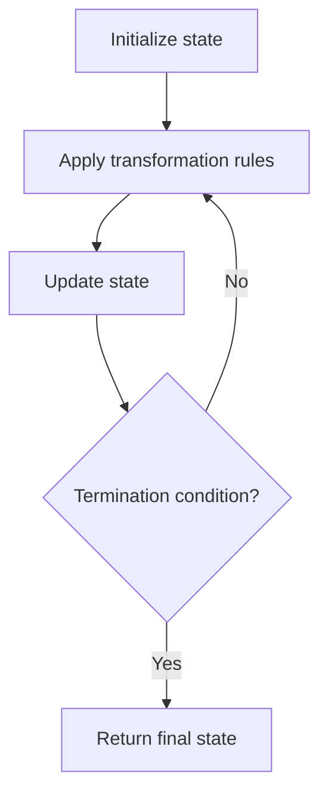

# Problem 2221: Find Triangular Sum of an Array

**Difficulty:** Medium  
**Tags:** Array, Math, Simulation, Combinatorics  
**Pattern:** Simulation  
**Link:** [leetcode.com/problems/find-triangular-sum-of-an-array](https://leetcode.com/problems/find-triangular-sum-of-an-array/)

## Description

You are given a **0-indexed** integer array `nums`, where `nums[i]` is a digit between `0` and `9` (**inclusive**).

The **triangular sum** of `nums` is the value of the only element present in `nums` after the following process terminates:

	- Let `nums` comprise of `n` elements. If `n == 1`, **end** the process. Otherwise, **create** a new **0-indexed** integer array `newNums` of length `n - 1`.
	- For each index `i`, where `0 <= i < n - 1`, **assign** the value of `newNums[i]` as `(nums[i] + nums[i+1]) % 10`, where `%` denotes modulo operator.
	- **Replace** the array `nums` with `newNums`.
	- **Repeat** the entire process starting from step 1.

Return *the triangular sum of* `nums`.

 

Example 1:

```

**Input:** nums = [1,2,3,4,5]
**Output:** 8
**Explanation:**
The above diagram depicts the process from which we obtain the triangular sum of the array.
```

Example 2:

```

**Input:** nums = [5]
**Output:** 5
**Explanation:**
Since there is only one element in nums, the triangular sum is the value of that element itself.
```

 

**Constraints:**

	- `1 <= nums.length <= 1000`
	- `0 <= nums[i] <= 9`

## Approach: Simulation

Simulate the process described in the problem step by step. Follow the rules exactly, tracking state at each step.

## Pseudocode

```
1. Initialize state (grid, pointers, counters)
2. For each step / iteration:
   a. Apply the transformation rules
   b. Update state
   c. Check termination condition
3. Return final state or result
```

## Algorithm Flow



## Complexity Analysis

- **Time:** O(n) or O(n * k)
- **Space:** O(n)

## Solution (Python3)

```python
class Solution:
    def triangularSum(self, nums: List[int]) -> int:
        # Simulation approach - follow the rules step by step
        result = 0
        for i in range(len(nums) if isinstance(nums, list) else nums):
            # Simulate each step
            pass
        return result
```

## Solution (C++)

```cpp
#include <string>
#include <vector>
using namespace std;

class Solution {
public:
    int triangularSum(vector<int>& nums) {
        // Simulation approach
        int n = nums.size();
        for (int i = 0; i < n; i++) {
            // Simulate each step
        }
        return 0;
    }
};
```
