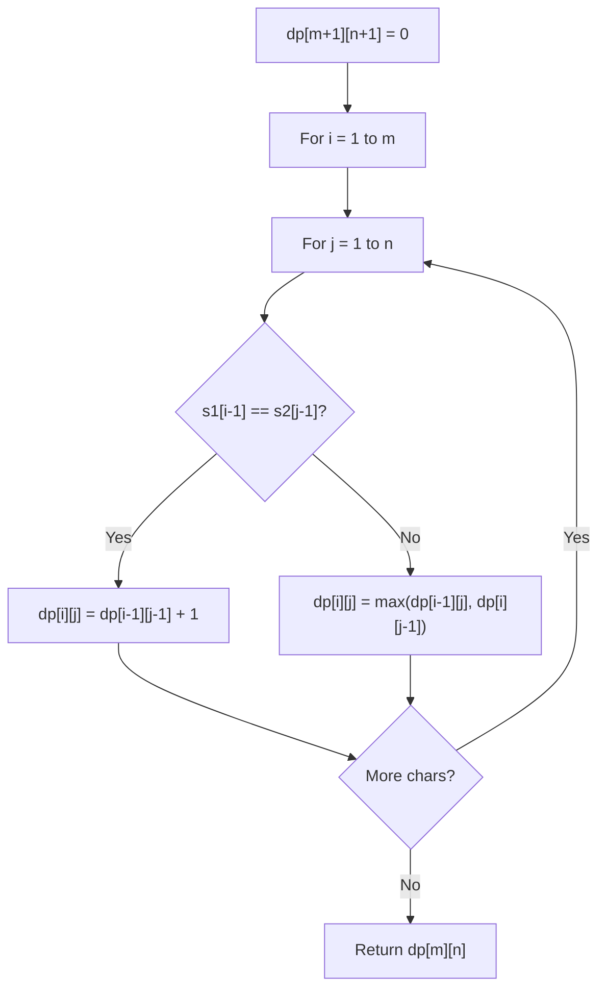

# Problem 2222: Number of Ways to Select Buildings

**Difficulty:** Medium  
**Tags:** String, Dynamic Programming, Prefix Sum  
**Pattern:** Dynamic Programming (String)  
**Link:** [leetcode.com/problems/number-of-ways-to-select-buildings](https://leetcode.com/problems/number-of-ways-to-select-buildings/)

## Description

You are given a **0-indexed** binary string `s` which represents the types of buildings along a street where:

	- `s[i] = '0'` denotes that the `i^th` building is an office and
	- `s[i] = '1'` denotes that the `i^th` building is a restaurant.

As a city official, you would like to **select** 3 buildings for random inspection. However, to ensure variety, **no two consecutive** buildings out of the **selected** buildings can be of the same type.

	- For example, given `s = "0**0**1**1**0**1**"`, we cannot select the `1^st`, `3^rd`, and `5^th` buildings as that would form `"0**11**"` which is **not** allowed due to having two consecutive buildings of the same type.

Return *the **number of valid ways** to select 3 buildings.*

 

Example 1:

```

**Input:** s = "001101"
**Output:** 6
**Explanation:** 
The following sets of indices selected are valid:
- [0,2,4] from "**0**0**1**1**0**1" forms "010"
- [0,3,4] from "**0**01**10**1" forms "010"
- [1,2,4] from "0**01**1**0**1" forms "010"
- [1,3,4] from "0**0**1**10**1" forms "010"
- [2,4,5] from "00**1**1**01**" forms "101"
- [3,4,5] from "001**101**" forms "101"
No other selection is valid. Thus, there are 6 total ways.

```

Example 2:

```

**Input:** s = "11100"
**Output:** 0
**Explanation:** It can be shown that there are no valid selections.

```

 

**Constraints:**

	- `3 <= s.length <= 10^5`
	- `s[i]` is either `'0'` or `'1'`.

## Approach: Dynamic Programming (String)

Compare or match two strings using a 2D DP table. dp[i][j] represents the answer for substrings s1[0..i-1] and s2[0..j-1]. Common patterns: LCS, edit distance, regex matching.

## Pseudocode

```
1. Create dp[m+1][n+1]
2. Initialize base cases
3. For i from 1 to m:
   For j from 1 to n:
     If s1[i-1] == s2[j-1]: dp[i][j] = dp[i-1][j-1] + 1
     Else: dp[i][j] = best of (dp[i-1][j], dp[i][j-1], dp[i-1][j-1])
4. Return dp[m][n]
```

## Algorithm Flow



## Complexity Analysis

- **Time:** O(m * n)
- **Space:** O(m * n)

## Solution (Python3)

```python
class Solution:
    def numberOfWays(self, s: str) -> int:
        # String DP - O(m*n) time and space
        m, n = len(s), len(s)
        dp = [[0] * (n + 1) for _ in range(m + 1)]
        for i in range(1, m + 1):
            for j in range(1, n + 1):
                if s[i-1] == s[j-1]:
                    dp[i][j] = dp[i-1][j-1] + 1
                else:
                    dp[i][j] = max(dp[i-1][j], dp[i][j-1])
        return dp[m][n]
```

## Solution (C++)

```cpp
#include <algorithm>
#include <string>
#include <vector>
using namespace std;

class Solution {
public:
    int numberOfWays(string& s) {
        // String DP - O(m*n) time and space
        int m = s.size(), n = s.size();
        vector<vector<int>> dp(m + 1, vector<int>(n + 1, 0));
        for (int i = 1; i <= m; i++) {
            for (int j = 1; j <= n; j++) {
                if (s[i-1] == s[j-1])
                    dp[i][j] = dp[i-1][j-1] + 1;
                else
                    dp[i][j] = max(dp[i-1][j], dp[i][j-1]);
            }
        }
        return dp[m][n];
    }
};
```
