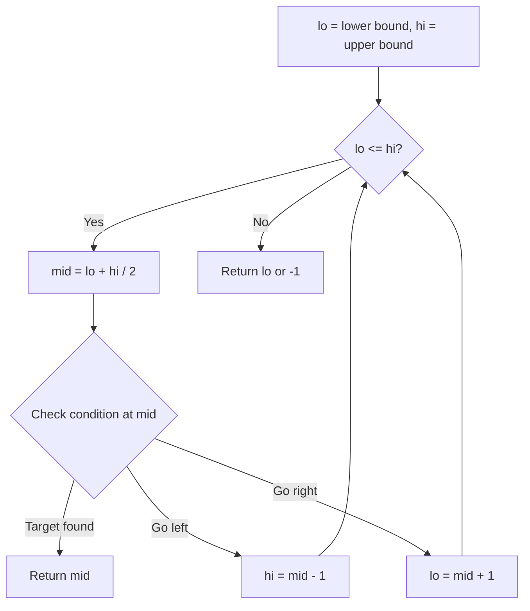
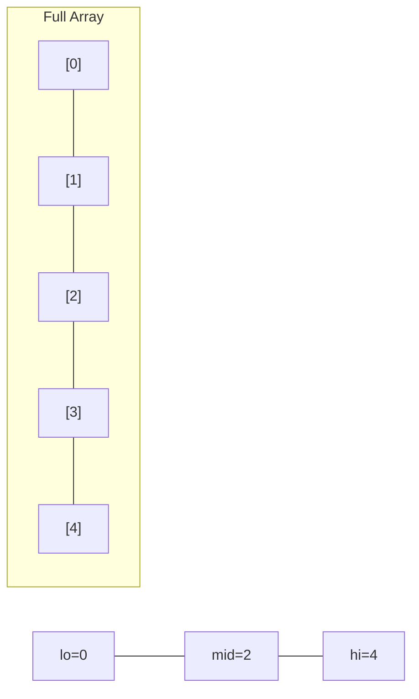
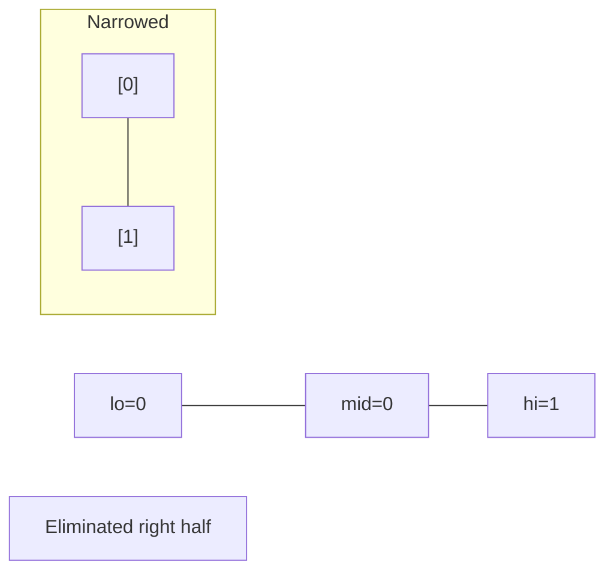
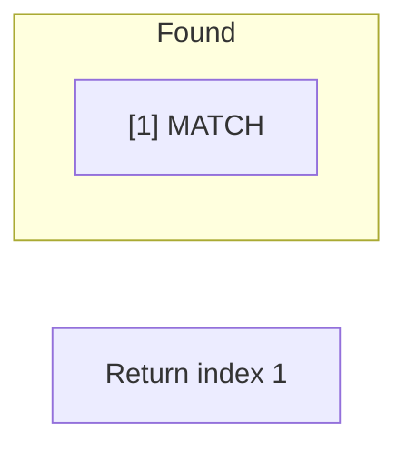

# Problem 2223: Sum of Scores of Built Strings

**Difficulty:** Hard  
**Tags:** String, Binary Search, Rolling Hash, Suffix Array, String Matching, Hash Function  
**Pattern:** Binary Search  
**Link:** [leetcode.com/problems/sum-of-scores-of-built-strings](https://leetcode.com/problems/sum-of-scores-of-built-strings/)

## Description

You are **building** a string `s` of length `n` **one** character at a time, **prepending** each new character to the **front** of the string. The strings are labeled from `1` to `n`, where the string with length `i` is labeled `si`.

	- For example, for `s = "abaca"`, `s1 == "a"`, `s2 == "ca"`, `s3 == "aca"`, etc.

The **score** of `si` is the length of the **longest common prefix** between `si` and `sn` (Note that `s == sn`).

Given the final string `s`, return* the **sum** of the **score** of every *`si`.

 

Example 1:

```

**Input:** s = "babab"
**Output:** 9
**Explanation:**
For s1 == "b", the longest common prefix is "b" which has a score of 1.
For s2 == "ab", there is no common prefix so the score is 0.
For s3 == "bab", the longest common prefix is "bab" which has a score of 3.
For s4 == "abab", there is no common prefix so the score is 0.
For s5 == "babab", the longest common prefix is "babab" which has a score of 5.
The sum of the scores is 1 + 0 + 3 + 0 + 5 = 9, so we return 9.
```

Example 2:

```

**Input:** s = "azbazbzaz"
**Output:** 14
**Explanation:** 
For s2 == "az", the longest common prefix is "az" which has a score of 2.
For s6 == "azbzaz", the longest common prefix is "azb" which has a score of 3.
For s9 == "azbazbzaz", the longest common prefix is "azbazbzaz" which has a score of 9.
For all other si, the score is 0.
The sum of the scores is 2 + 3 + 9 = 14, so we return 14.

```

 

**Constraints:**

	- `1 <= s.length <= 10^5`
	- `s` consists of lowercase English letters.

## Approach: Binary Search

Use binary search to halve the search space each iteration. Define the search range [lo, hi], compute mid, and decide which half to keep based on the problem's monotonic condition.

## Pseudocode

```
1. lo = lower_bound, hi = upper_bound
2. While lo <= hi (or lo < hi):
   a. mid = (lo + hi) // 2
   b. If condition(mid) is satisfied: record answer, search left half
   c. Else: search right half
3. Return answer
```

## Algorithm Flow



## Visual State Transitions

**Binary Search Step-by-Step:**

**Frame 1: Initial search space**


**Frame 2: Compare mid, narrow search**


**Frame 3: Found target**



## Complexity Analysis

- **Time:** O(log n)
- **Space:** O(1)

## Solution (Python3)

```python
class Solution:
    def sumScores(self, s: str) -> int:
        # Binary search - O(log n) time, O(1) space
        lo, hi = 0, len(s) - 1
        while lo <= hi:
            mid = lo + (hi - lo) // 2
            if s[mid] == s:
                return mid
            elif s[mid] < s:
                lo = mid + 1
            else:
                hi = mid - 1
        return 0
```

## Solution (C++)

```cpp
#include <string>
#include <vector>
using namespace std;

class Solution {
public:
    int sumScores(string& s) {
        // Binary search - O(log n) time, O(1) space
        int lo = 0, hi = s.size() - 1;
        while (lo <= hi) {
            int mid = lo + (hi - lo) / 2;
            if (s[mid] == s) {
                return mid;
            } else if (s[mid] < s) {
                lo = mid + 1;
            } else {
                hi = mid - 1;
            }
        }
        return 0;
    }
};
```
