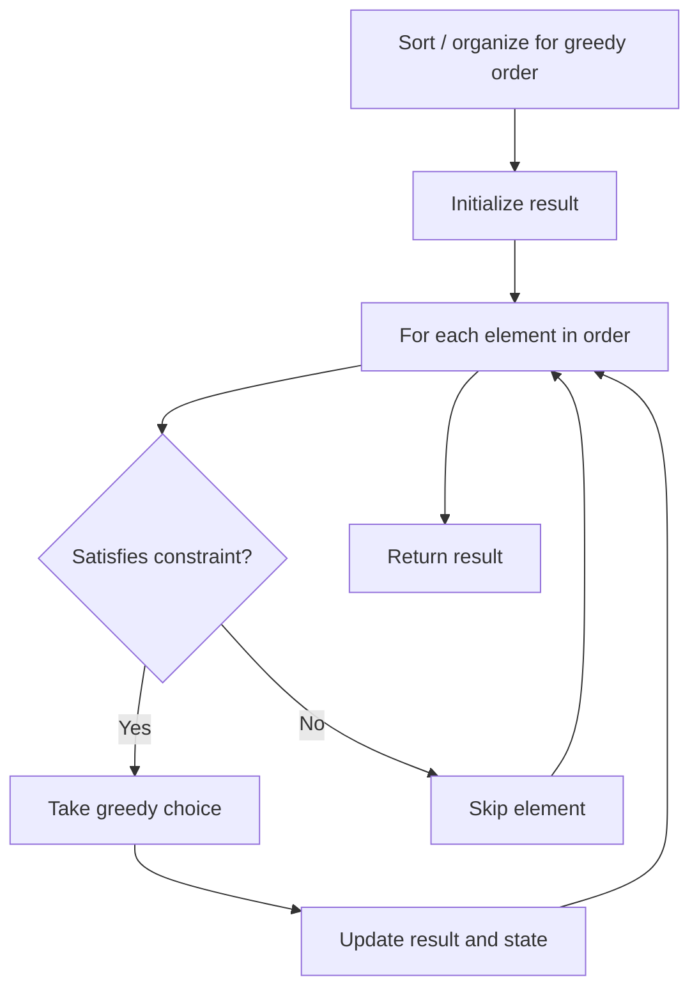

# Problem 2224: Minimum Number of Operations to Convert Time

**Difficulty:** Easy  
**Tags:** String, Greedy  
**Pattern:** Greedy  
**Link:** [leetcode.com/problems/minimum-number-of-operations-to-convert-time](https://leetcode.com/problems/minimum-number-of-operations-to-convert-time/)

## Description

You are given two strings `current` and `correct` representing two **24-hour times**.

24-hour times are formatted as `"HH:MM"`, where `HH` is between `00` and `23`, and `MM` is between `00` and `59`. The earliest 24-hour time is `00:00`, and the latest is `23:59`.

In one operation you can increase the time `current` by `1`, `5`, `15`, or `60` minutes. You can perform this operation **any** number of times.

Return *the **minimum number of operations** needed to convert *`current`* to *`correct`.

 

Example 1:

```

**Input:** current = "02:30", correct = "04:35"
**Output:** 3
Explanation:
We can convert current to correct in 3 operations as follows:
- Add 60 minutes to current. current becomes "03:30".
- Add 60 minutes to current. current becomes "04:30".
- Add 5 minutes to current. current becomes "04:35".
It can be proven that it is not possible to convert current to correct in fewer than 3 operations.
```

Example 2:

```

**Input:** current = "11:00", correct = "11:01"
**Output:** 1
**Explanation:** We only have to add one minute to current, so the minimum number of operations needed is 1.

```

 

**Constraints:**

	- `current` and `correct` are in the format `"HH:MM"`
	- `current <= correct`

## Approach: Greedy

Make the locally optimal choice at each step, trusting it leads to a global optimum. Greedy works when the problem has the greedy-choice property and optimal substructure.

## Pseudocode

```
1. Sort or organize data for greedy ordering
2. Initialize result
3. For each element in greedy order:
   a. If element satisfies constraint:
      - Take the greedy choice
      - Update result and state
4. Return result
```

## Algorithm Flow



## Complexity Analysis

- **Time:** O(n log n)
- **Space:** O(1)

## Solution (Python3)

```python
class Solution:
    def convertTime(self, current: str, correct: str) -> int:
        # Greedy approach - O(n) time
        result = 0
        curr_max = 0
        for i in range(len(current)):
            if isinstance(current[i], int):
                curr_max = max(curr_max, current[i])
                result = max(result, curr_max)
            else:
                result += 1
        return result
```

## Solution (C++)

```cpp
#include <algorithm>
#include <string>
#include <vector>
using namespace std;

class Solution {
public:
    int convertTime(string& current, string& correct) {
        // Greedy approach - O(n) time
        int result = 0, curr_max = 0;
        for (int i = 0; i < (int)current.size(); i++) {
            curr_max = max(curr_max, current[i]);
            result = max(result, curr_max);
        }
        return result;
    }
};
```
