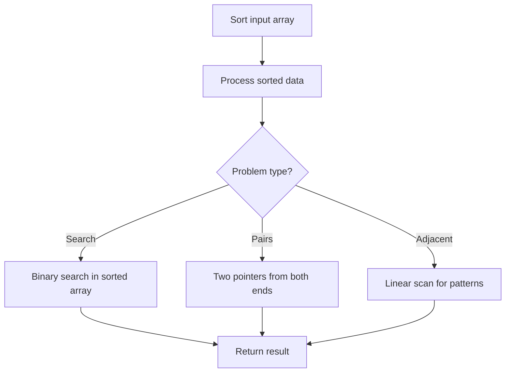

# Problem 2225: Find Players With Zero or One Losses

**Difficulty:** Medium  
**Tags:** Array, Hash Table, Sorting, Counting  
**Pattern:** Sorting  
**Link:** [leetcode.com/problems/find-players-with-zero-or-one-losses](https://leetcode.com/problems/find-players-with-zero-or-one-losses/)

## Description

You are given an integer array `matches` where `matches[i] = [winneri, loseri]` indicates that the player `winneri` defeated player `loseri` in a match.

Return *a list *`answer`* of size *`2`* where:*

	- `answer[0]` is a list of all players that have **not** lost any matches.
	- `answer[1]` is a list of all players that have lost exactly **one** match.

The values in the two lists should be returned in **increasing** order.

**Note:**

	- You should only consider the players that have played **at least one** match.
	- The testcases will be generated such that **no** two matches will have the **same** outcome.

 

Example 1:

```

**Input:** matches = [[1,3],[2,3],[3,6],[5,6],[5,7],[4,5],[4,8],[4,9],[10,4],[10,9]]
**Output:** [[1,2,10],[4,5,7,8]]
**Explanation:**
Players 1, 2, and 10 have not lost any matches.
Players 4, 5, 7, and 8 each have lost one match.
Players 3, 6, and 9 each have lost two matches.
Thus, answer[0] = [1,2,10] and answer[1] = [4,5,7,8].

```

Example 2:

```

**Input:** matches = [[2,3],[1,3],[5,4],[6,4]]
**Output:** [[1,2,5,6],[]]
**Explanation:**
Players 1, 2, 5, and 6 have not lost any matches.
Players 3 and 4 each have lost two matches.
Thus, answer[0] = [1,2,5,6] and answer[1] = [].

```

 

**Constraints:**

	- `1 <= matches.length <= 10^5`
	- `matches[i].length == 2`
	- `1 <= winneri, loseri <= 10^5`
	- `winneri != loseri`
	- All `matches[i]` are **unique**.

## Approach: Sorting

Sort the data to enable efficient processing. After sorting, use techniques like binary search, two pointers, or linear scan to solve the problem.

## Pseudocode

```
1. Sort the input array
2. Process sorted data:
   - Use binary search for lookups
   - Use two pointers for pair finding
   - Scan for adjacent patterns
3. Return result
```

## Algorithm Flow



## Complexity Analysis

- **Time:** O(n log n)
- **Space:** O(n)

## Solution (Python3)

```python
class Solution:
    def findWinners(self, matches: List[List[int]]) -> List[List[int]]:
        # Sort-based approach - O(n log n) time
        matches.sort(key=lambda x: x[0] if isinstance(x, (list, tuple)) else x)
        result = [matches[0]]
        for i in range(1, len(matches)):
            curr = matches[i]
            if isinstance(curr, (list, tuple)) and isinstance(result[-1], (list, tuple)):
                if curr[0] <= result[-1][1]:
                    result[-1] = [result[-1][0], max(result[-1][1], curr[1])]
                else:
                    result.append(curr)
            else:
                result.append(curr)
        return result
```

## Solution (C++)

```cpp
#include <algorithm>
#include <string>
#include <vector>
using namespace std;

class Solution {
public:
    vector<vector<int>> findWinners(vector<vector<int>>& matches) {
        // Sort-based approach - O(n log n) time
        sort(matches.begin(), matches.end());
        vector<vector<int>> result;
        result.push_back(matches[0]);
        for (int i = 1; i < (int)matches.size(); i++) {
            if (matches[i][0] <= result.back()[1]) {
                result.back()[1] = max(result.back()[1], matches[i][1]);
            } else {
                result.push_back(matches[i]);
            }
        }
        return result;
    }
};
```
