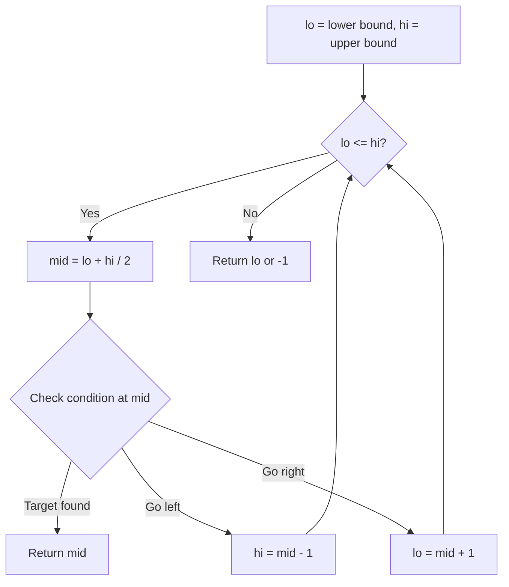
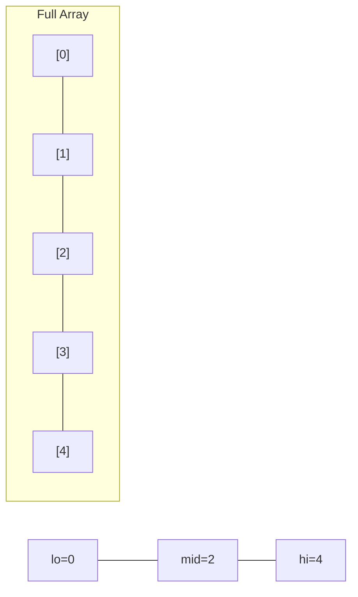
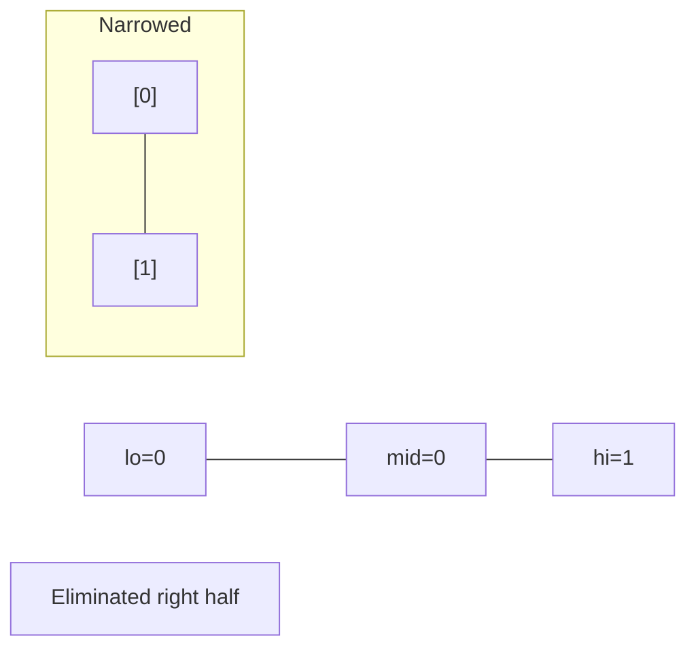
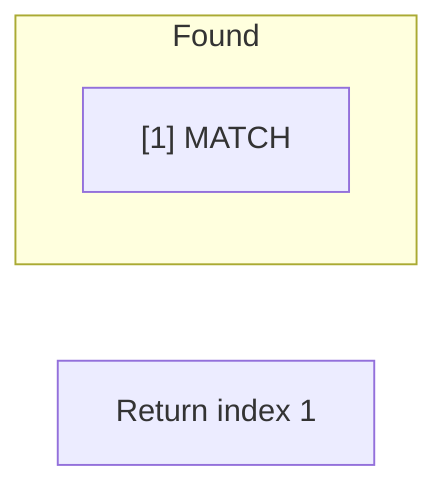

# Problem 2226: Maximum Candies Allocated to K Children

**Difficulty:** Medium  
**Tags:** Array, Binary Search  
**Pattern:** Binary Search  
**Link:** [leetcode.com/problems/maximum-candies-allocated-to-k-children](https://leetcode.com/problems/maximum-candies-allocated-to-k-children/)

## Description

You are given a **0-indexed** integer array `candies`. Each element in the array denotes a pile of candies of size `candies[i]`. You can divide each pile into any number of **sub piles**, but you **cannot** merge two piles together.

You are also given an integer `k`. You should allocate piles of candies to `k` children such that each child gets the **same** number of candies. Each child can be allocated candies from **only one** pile of candies and some piles of candies may go unused.

Return *the **maximum number of candies** each child can get.*

 

Example 1:

```

**Input:** candies = [5,8,6], k = 3
**Output:** 5
**Explanation:** We can divide candies[1] into 2 piles of size 5 and 3, and candies[2] into 2 piles of size 5 and 1. We now have five piles of candies of sizes 5, 5, 3, 5, and 1. We can allocate the 3 piles of size 5 to 3 children. It can be proven that each child cannot receive more than 5 candies.

```

Example 2:

```

**Input:** candies = [2,5], k = 11
**Output:** 0
**Explanation:** There are 11 children but only 7 candies in total, so it is impossible to ensure each child receives at least one candy. Thus, each child gets no candy and the answer is 0.

```

 

**Constraints:**

	- `1 <= candies.length <= 10^5`
	- `1 <= candies[i] <= 10^7`
	- `1 <= k <= 10^12`

## Approach: Binary Search

Use binary search to halve the search space each iteration. Define the search range [lo, hi], compute mid, and decide which half to keep based on the problem's monotonic condition.

## Pseudocode

```
1. lo = lower_bound, hi = upper_bound
2. While lo <= hi (or lo < hi):
   a. mid = (lo + hi) // 2
   b. If condition(mid) is satisfied: record answer, search left half
   c. Else: search right half
3. Return answer
```

## Algorithm Flow



## Visual State Transitions

**Binary Search Step-by-Step:**

**Frame 1: Initial search space**


**Frame 2: Compare mid, narrow search**


**Frame 3: Found target**



## Complexity Analysis

- **Time:** O(log n)
- **Space:** O(1)

## Solution (Python3)

```python
class Solution:
    def maximumCandies(self, candies: List[int], k: int) -> int:
        # Binary search - O(log n) time, O(1) space
        lo, hi = 0, len(candies) - 1
        while lo <= hi:
            mid = lo + (hi - lo) // 2
            if candies[mid] == k:
                return mid
            elif candies[mid] < k:
                lo = mid + 1
            else:
                hi = mid - 1
        return 0
```

## Solution (C++)

```cpp
#include <string>
#include <vector>
using namespace std;

class Solution {
public:
    int maximumCandies(vector<int>& candies, int k) {
        // Binary search - O(log n) time, O(1) space
        int lo = 0, hi = candies.size() - 1;
        while (lo <= hi) {
            int mid = lo + (hi - lo) / 2;
            if (candies[mid] == k) {
                return mid;
            } else if (candies[mid] < k) {
                lo = mid + 1;
            } else {
                hi = mid - 1;
            }
        }
        return 0;
    }
};
```
