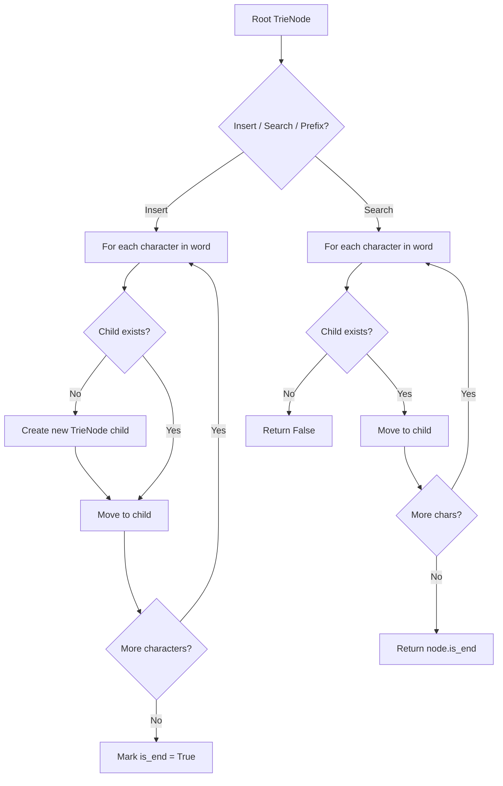
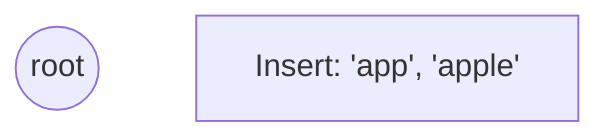
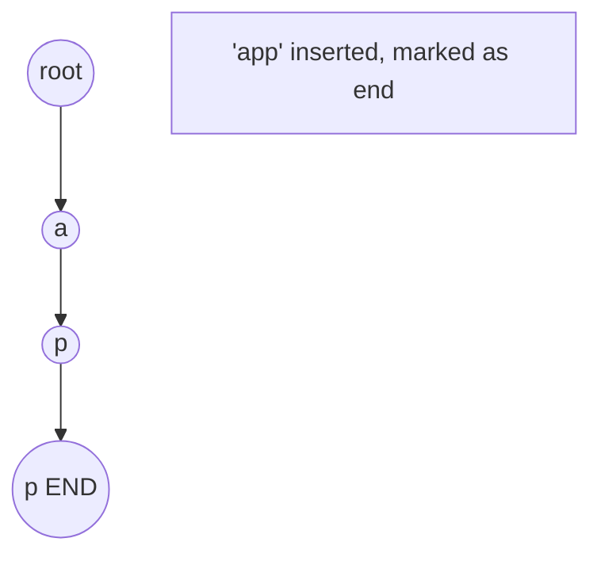
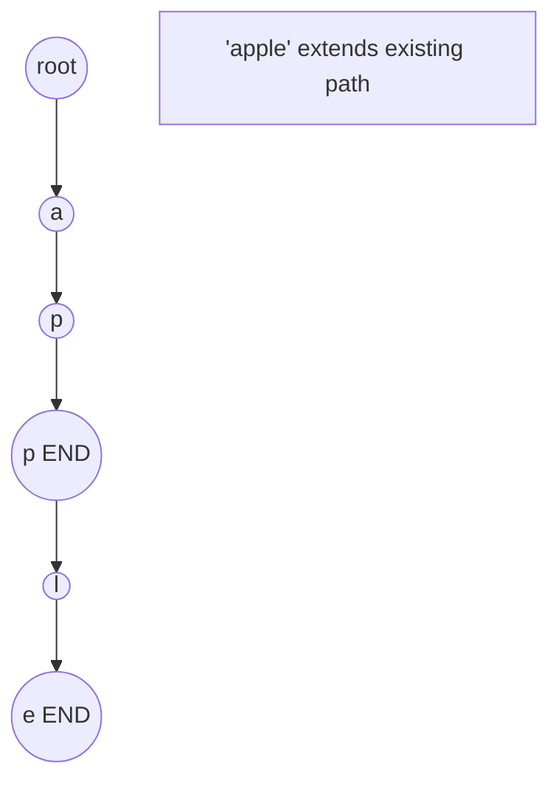
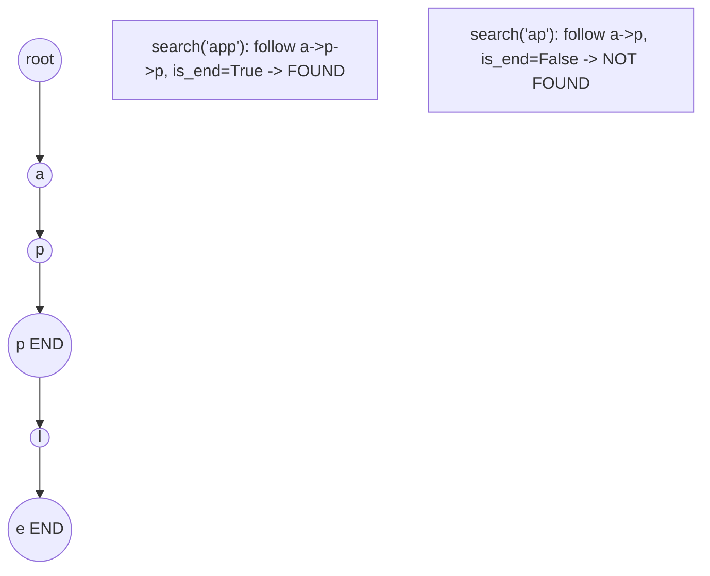

# Problem 2227: Encrypt and Decrypt Strings

**Difficulty:** Hard  
**Tags:** Array, Hash Table, String, Design, Trie  
**Pattern:** Trie / Prefix Tree  
**Link:** [leetcode.com/problems/encrypt-and-decrypt-strings](https://leetcode.com/problems/encrypt-and-decrypt-strings/)

## Description

You are given a character array `keys` containing **unique** characters and a string array `values` containing strings of length 2. You are also given another string array `dictionary` that contains all permitted original strings after decryption. You should implement a data structure that can encrypt or decrypt a **0-indexed** string.

A string is **encrypted** with the following process:

	- For each character `c` in the string, we find the index `i` satisfying `keys[i] == c` in `keys`.
	- Replace `c` with `values[i]` in the string.

Note that in case a character of the string is **not present** in `keys`, the encryption process cannot be carried out, and an empty string `""` is returned.

A string is **decrypted** with the following process:

	- For each substring `s` of length 2 occurring at an even index in the string, we find an `i` such that `values[i] == s`. If there are multiple valid `i`, we choose **any** one of them. This means a string could have multiple possible strings it can decrypt to.
	- Replace `s` with `keys[i]` in the string.

Implement the `Encrypter` class:

	- `Encrypter(char[] keys, String[] values, String[] dictionary)` Initializes the `Encrypter` class with `keys, values`, and `dictionary`.
	- `String encrypt(String word1)` Encrypts `word1` with the encryption process described above and returns the encrypted string.
	- `int decrypt(String word2)` Returns the number of possible strings `word2` could decrypt to that also appear in `dictionary`.

 

Example 1:

```

**Input**
["Encrypter", "encrypt", "decrypt"]
[[['a', 'b', 'c', 'd'], ["ei", "zf", "ei", "am"], ["abcd", "acbd", "adbc", "badc", "dacb", "cadb", "cbda", "abad"]], ["abcd"], ["eizfeiam"]]
**Output**
[null, "eizfeiam", 2]

**Explanation**
Encrypter encrypter = new Encrypter([['a', 'b', 'c', 'd'], ["ei", "zf", "ei", "am"], ["abcd", "acbd", "adbc", "badc", "dacb", "cadb", "cbda", "abad"]);
encrypter.encrypt("abcd"); // return "eizfeiam". 
                           // 'a' maps to "ei", 'b' maps to "zf", 'c' maps to "ei", and 'd' maps to "am".
encrypter.decrypt("eizfeiam"); // return 2. 
                              // "ei" can map to 'a' or 'c', "zf" maps to 'b', and "am" maps to 'd'. 
                              // Thus, the possible strings after decryption are "abad", "cbad", "abcd", and "cbcd". 
                              // 2 of those strings, "abad" and "abcd", appear in dictionary, so the answer is 2.

```

 

**Constraints:**

	- `1 <= keys.length == values.length <= 26`
	- `values[i].length == 2`
	- `1 <= dictionary.length <= 100`
	- `1 <= dictionary[i].length <= 100`
	- All `keys[i]` and `dictionary[i]` are **unique**.
	- `1 <= word1.length <= 2000`
	- `2 <= word2.length <= 200`
	- All `word1[i]` appear in `keys`.
	- `word2.length` is even.
	- `keys`, `values[i]`, `dictionary[i]`, `word1`, and `word2` only contain lowercase English letters.
	- At most `200` calls will be made to `encrypt` and `decrypt` **in total**.

## Approach: Trie / Prefix Tree

Build a trie (prefix tree) where each node represents a character. Insert words character by character, and search by following child pointers. Supports efficient prefix matching.

## Pseudocode

```
1. TrieNode: children = {}, is_end = False
2. Insert(word):
   - For each char: create child if absent, move to child
   - Mark last node as end
3. Search(word):
   - For each char: if child absent return False, move to child
   - Return node.is_end
4. StartsWith(prefix): same as search but return True at end
```

## Algorithm Flow



## Visual State Transitions

**Trie Insert and Search:**

**Frame 1: Empty trie**


**Frame 2: Insert 'app'**


**Frame 3: Insert 'apple'**


**Frame 4: Search 'app' = True, 'ap' = False**



## Complexity Analysis

- **Time:** O(L) per operation
- **Space:** O(N * L)

## Solution (Python3)

```python
class Encrypter:
    def __init__(self, keys: List[str], values: List[str], dictionary: List[str]):
        # Initialize data structure
        self.keys = keys
        self.values = values
        self.dictionary = dictionary

    def encrypt(self, word1: str) -> str:
        return ""

    def decrypt(self, word2: str) -> int:
        return 0

```

## Solution (C++)

```cpp
#include <string>
#include <vector>
using namespace std;

class Encrypter {
public:
    Encrypter(vector<string>& keys, vector<string>& values, vector<string>& dictionary) {
        // Initialize
    }

    string encrypt(string& word1) {
        return "";
    }

    int decrypt(string& word2) {
        return 0;
    }

};
```
