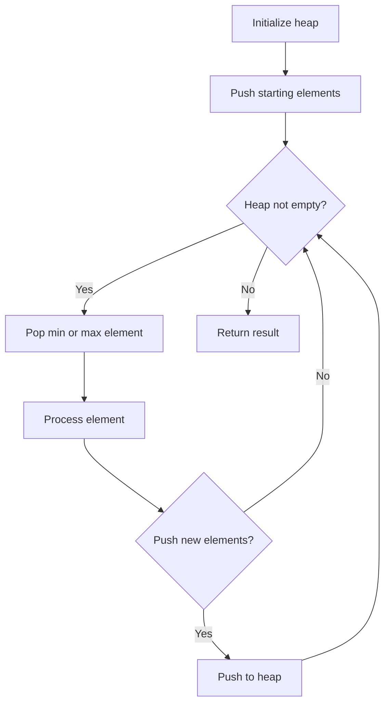
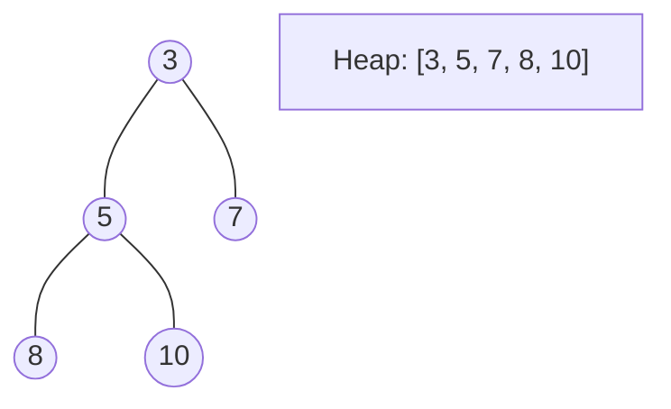
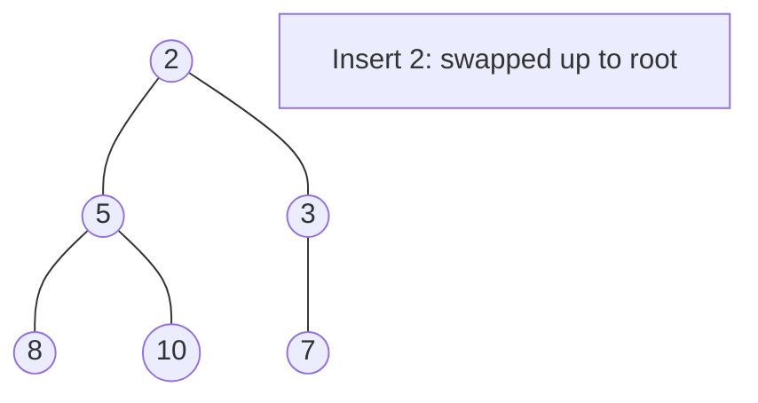
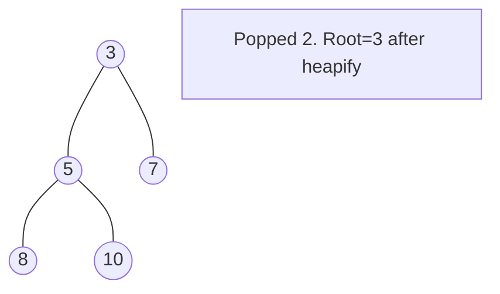

# Problem 2231: Largest Number After Digit Swaps by Parity

**Difficulty:** Easy  
**Tags:** Sorting, Heap (Priority Queue)  
**Pattern:** Heap / Priority Queue  
**Link:** [leetcode.com/problems/largest-number-after-digit-swaps-by-parity](https://leetcode.com/problems/largest-number-after-digit-swaps-by-parity/)

## Description

You are given a positive integer `num`. You may swap any two digits of `num` that have the same **parity** (i.e. both odd digits or both even digits).

Return* the **largest** possible value of *`num`* after **any** number of swaps.*

 

Example 1:

```

**Input:** num = 1234
**Output:** 3412
**Explanation:** Swap the digit 3 with the digit 1, this results in the number 3214.
Swap the digit 2 with the digit 4, this results in the number 3412.
Note that there may be other sequences of swaps but it can be shown that 3412 is the largest possible number.
Also note that we may not swap the digit 4 with the digit 1 since they are of different parities.

```

Example 2:

```

**Input:** num = 65875
**Output:** 87655
**Explanation:** Swap the digit 8 with the digit 6, this results in the number 85675.
Swap the first digit 5 with the digit 7, this results in the number 87655.
Note that there may be other sequences of swaps but it can be shown that 87655 is the largest possible number.

```

 

**Constraints:**

	- `1 <= num <= 10^9`

## Approach: Heap / Priority Queue

Use a min-heap or max-heap to efficiently access the smallest/largest element. Push elements and pop the top to process in priority order.

## Pseudocode

```
1. Initialize heap (min or max)
2. Push initial elements onto heap
3. While heap not empty and condition:
   a. Pop top element (min or max)
   b. Process element
   c. Push new elements if needed
4. Return result
```

## Algorithm Flow



## Visual State Transitions

**Heap Operations (Min-Heap):**

**Frame 1: Initial heap**


**Frame 2: Insert 2 - bubble up**


**Frame 3: Pop minimum (2) - heapify down**



## Complexity Analysis

- **Time:** O(n log n)
- **Space:** O(n)

## Solution (Python3)

```python
class Solution:
    def largestInteger(self, num: int) -> int:
        # Heap/Priority Queue - O(n log k) time
        import heapq
        if not num:
            return 0
        # Min heap (negate for max heap)
        heap = []
        for val in num:
            heapq.heappush(heap, val)
            if len(heap) > (num if isinstance(num, int) else len(num)):
                heapq.heappop(heap)
        return heap[0] if heap else 0
```

## Solution (C++)

```cpp
#include <queue>
#include <string>
#include <vector>
using namespace std;

class Solution {
public:
    int largestInteger(int num) {
        // Heap/Priority Queue - O(n log k) time
        priority_queue<int, vector<int>, greater<int>> pq;
        for (int val : num) {
            pq.push(val);
            if ((int)pq.size() > num)
                pq.pop();
        }
        return pq.empty() ? 0 : pq.top();
    }
};
```
