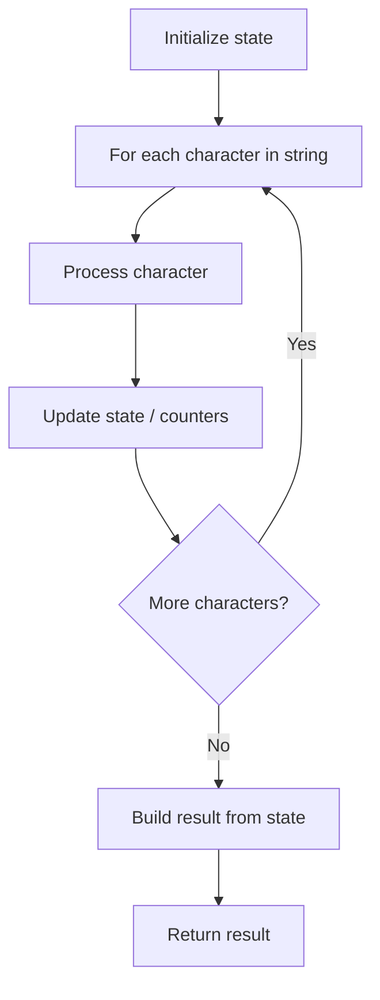

# Problem 2232: Minimize Result by Adding Parentheses to Expression

**Difficulty:** Medium  
**Tags:** String, Enumeration  
**Pattern:** String Processing  
**Link:** [leetcode.com/problems/minimize-result-by-adding-parentheses-to-expression](https://leetcode.com/problems/minimize-result-by-adding-parentheses-to-expression/)

## Description

You are given a **0-indexed** string `expression` of the form `"<num1>+<num2>"` where `<num1>` and `<num2>` represent positive integers.

Add a pair of parentheses to `expression` such that after the addition of parentheses, `expression` is a **valid** mathematical expression and evaluates to the **smallest** possible value. The left parenthesis **must** be added to the left of `'+'` and the right parenthesis **must** be added to the right of `'+'`.

Return `expression`* after adding a pair of parentheses such that *`expression`* evaluates to the **smallest** possible value.* If there are multiple answers that yield the same result, return any of them.

The input has been generated such that the original value of `expression`, and the value of `expression` after adding any pair of parentheses that meets the requirements fits within a signed 32-bit integer.

 

Example 1:

```

**Input:** expression = "247+38"
**Output:** "2(47+38)"
**Explanation:** The `expression` evaluates to 2 * (47 + 38) = 2 * 85 = 170.
Note that "2(4)7+38" is invalid because the right parenthesis must be to the right of the `'+'`.
It can be shown that 170 is the smallest possible value.

```

Example 2:

```

**Input:** expression = "12+34"
**Output:** "1(2+3)4"
**Explanation:** The expression evaluates to 1 * (2 + 3) * 4 = 1 * 5 * 4 = 20.

```

Example 3:

```

**Input:** expression = "999+999"
**Output:** "(999+999)"
**Explanation:** The `expression` evaluates to 999 + 999 = 1998.

```

 

**Constraints:**

	- `3 <= expression.length <= 10`
	- `expression` consists of digits from `'1'` to `'9'` and `'+'`.
	- `expression` starts and ends with digits.
	- `expression` contains exactly one `'+'`.
	- The original value of `expression`, and the value of `expression` after adding any pair of parentheses that meets the requirements fits within a signed 32-bit integer.

## Approach: String Processing

Process the string character by character. Common techniques: two pointers, sliding window, hash map for frequencies, stack for matching.

## Pseudocode

```
1. Initialize result / tracking state
2. Iterate through string characters:
   a. Process character based on rules
   b. Update state (counters, pointers, stack)
3. Build and return result
```

## Algorithm Flow



## Complexity Analysis

- **Time:** O(n)
- **Space:** O(n)

## Solution (Python3)

```python
class Solution:
    def minimizeResult(self, expression: str) -> str:
        # String processing approach - O(n) time
        result = []
        for ch in expression:
            if ch.isalnum():
                result.append(ch.lower())
        # Check palindrome or process
        processed = ''.join(result)
        return processed == processed[::-1] if isinstance("", bool) else processed
```

## Solution (C++)

```cpp
#include <algorithm>
#include <cctype>
#include <string>
#include <vector>
using namespace std;

class Solution {
public:
    string minimizeResult(string& expression) {
        // String processing approach - O(n) time
        string processed;
        for (char ch : expression) {
            if (isalnum(ch)) {
                processed += tolower(ch);
            }
        }
        string rev = processed;
        reverse(rev.begin(), rev.end());
        return processed == rev;
    }
};
```
