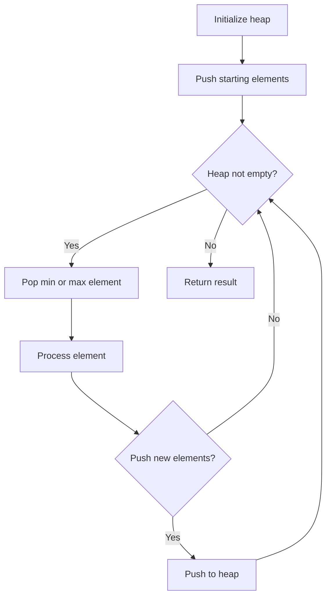
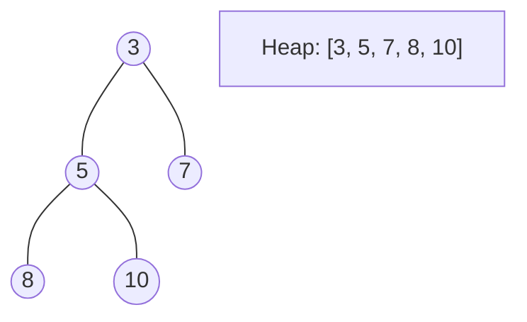
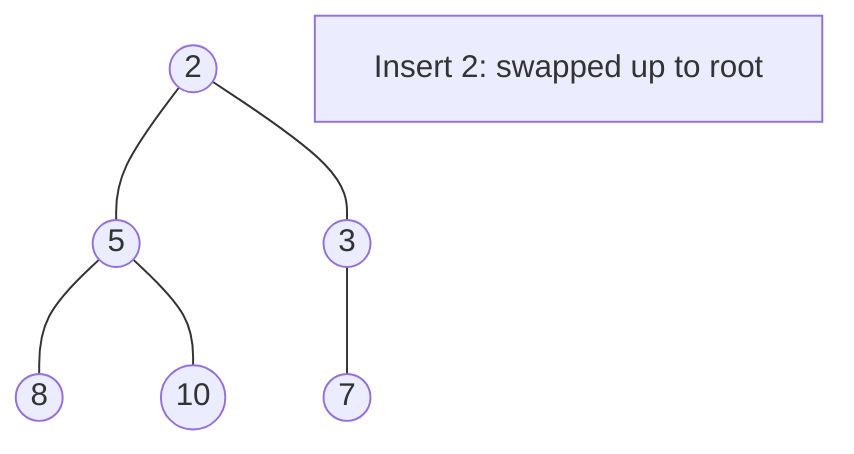
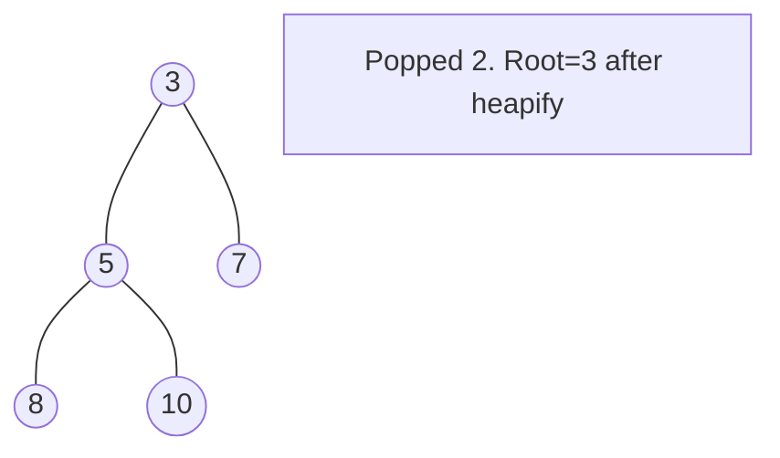

# Problem 2233: Maximum Product After K Increments

**Difficulty:** Medium  
**Tags:** Array, Greedy, Heap (Priority Queue)  
**Pattern:** Heap / Priority Queue  
**Link:** [leetcode.com/problems/maximum-product-after-k-increments](https://leetcode.com/problems/maximum-product-after-k-increments/)

## Description

You are given an array of non-negative integers `nums` and an integer `k`. In one operation, you may choose **any** element from `nums` and **increment** it by `1`.

Return* the **maximum** **product** of *`nums`* after **at most** *`k`* operations. *Since the answer may be very large, return it **modulo** `10^9 + 7`. Note that you should maximize the product before taking the modulo. 

 

Example 1:

```

**Input:** nums = [0,4], k = 5
**Output:** 20
**Explanation:** Increment the first number 5 times.
Now nums = [5, 4], with a product of 5 * 4 = 20.
It can be shown that 20 is maximum product possible, so we return 20.
Note that there may be other ways to increment nums to have the maximum product.

```

Example 2:

```

**Input:** nums = [6,3,3,2], k = 2
**Output:** 216
**Explanation:** Increment the second number 1 time and increment the fourth number 1 time.
Now nums = [6, 4, 3, 3], with a product of 6 * 4 * 3 * 3 = 216.
It can be shown that 216 is maximum product possible, so we return 216.
Note that there may be other ways to increment nums to have the maximum product.

```

 

**Constraints:**

	- `1 <= nums.length, k <= 10^5`
	- `0 <= nums[i] <= 10^6`

## Approach: Heap / Priority Queue

Use a min-heap or max-heap to efficiently access the smallest/largest element. Push elements and pop the top to process in priority order.

## Pseudocode

```
1. Initialize heap (min or max)
2. Push initial elements onto heap
3. While heap not empty and condition:
   a. Pop top element (min or max)
   b. Process element
   c. Push new elements if needed
4. Return result
```

## Algorithm Flow



## Visual State Transitions

**Heap Operations (Min-Heap):**

**Frame 1: Initial heap**


**Frame 2: Insert 2 - bubble up**


**Frame 3: Pop minimum (2) - heapify down**



## Complexity Analysis

- **Time:** O(n log n)
- **Space:** O(n)

## Solution (Python3)

```python
class Solution:
    def maximumProduct(self, nums: List[int], k: int) -> int:
        # Heap/Priority Queue - O(n log k) time
        import heapq
        if not nums:
            return 0
        # Min heap (negate for max heap)
        heap = []
        for val in nums:
            heapq.heappush(heap, val)
            if len(heap) > (k if isinstance(k, int) else len(nums)):
                heapq.heappop(heap)
        return heap[0] if heap else 0
```

## Solution (C++)

```cpp
#include <queue>
#include <string>
#include <vector>
using namespace std;

class Solution {
public:
    int maximumProduct(vector<int>& nums, int k) {
        // Heap/Priority Queue - O(n log k) time
        priority_queue<int, vector<int>, greater<int>> pq;
        for (int val : nums) {
            pq.push(val);
            if ((int)pq.size() > k)
                pq.pop();
        }
        return pq.empty() ? 0 : pq.top();
    }
};
```
