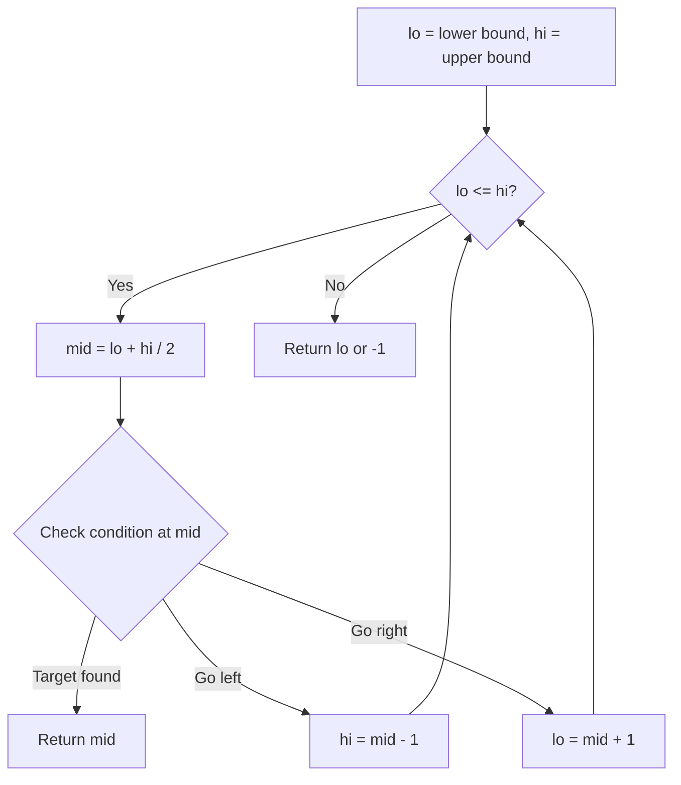
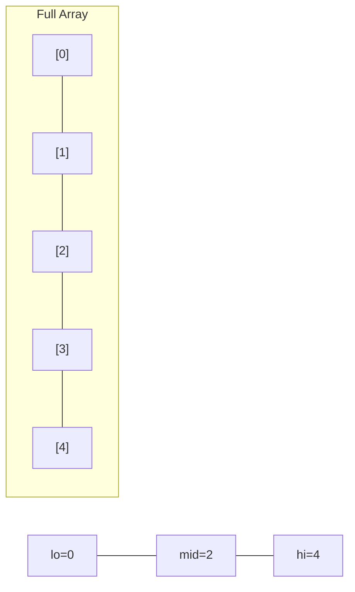
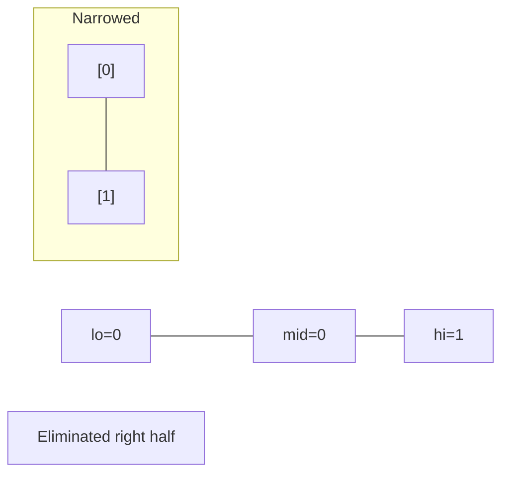
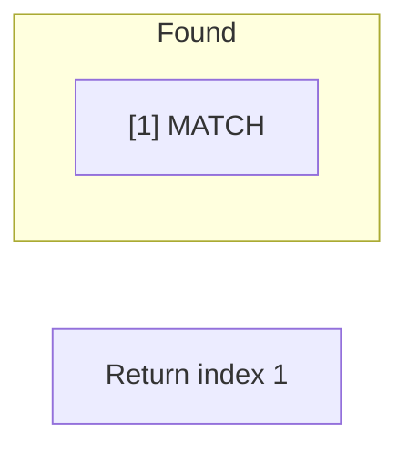

# Problem 2234: Maximum Total Beauty of the Gardens

**Difficulty:** Hard  
**Tags:** Array, Two Pointers, Binary Search, Greedy, Sorting, Enumeration, Prefix Sum  
**Pattern:** Binary Search  
**Link:** [leetcode.com/problems/maximum-total-beauty-of-the-gardens](https://leetcode.com/problems/maximum-total-beauty-of-the-gardens/)

## Description

Alice is a caretaker of `n` gardens and she wants to plant flowers to maximize the total beauty of all her gardens.

You are given a **0-indexed** integer array `flowers` of size `n`, where `flowers[i]` is the number of flowers already planted in the `i^th` garden. Flowers that are already planted **cannot** be removed. You are then given another integer `newFlowers`, which is the **maximum** number of flowers that Alice can additionally plant. You are also given the integers `target`, `full`, and `partial`.

A garden is considered **complete** if it has **at least** `target` flowers. The **total beauty** of the gardens is then determined as the **sum** of the following:

	- The number of **complete** gardens multiplied by `full`.
	- The **minimum** number of flowers in any of the **incomplete** gardens multiplied by `partial`. If there are no incomplete gardens, then this value will be `0`.

Return *the **maximum** total beauty that Alice can obtain after planting at most *`newFlowers`* flowers.*

 

Example 1:

```

**Input:** flowers = [1,3,1,1], newFlowers = 7, target = 6, full = 12, partial = 1
**Output:** 14
**Explanation:** Alice can plant
- 2 flowers in the 0th garden
- 3 flowers in the 1st garden
- 1 flower in the 2nd garden
- 1 flower in the 3rd garden
The gardens will then be [3,6,2,2]. She planted a total of 2 + 3 + 1 + 1 = 7 flowers.
There is 1 garden that is complete.
The minimum number of flowers in the incomplete gardens is 2.
Thus, the total beauty is 1 * 12 + 2 * 1 = 12 + 2 = 14.
No other way of planting flowers can obtain a total beauty higher than 14.

```

Example 2:

```

**Input:** flowers = [2,4,5,3], newFlowers = 10, target = 5, full = 2, partial = 6
**Output:** 30
**Explanation:** Alice can plant
- 3 flowers in the 0th garden
- 0 flowers in the 1st garden
- 0 flowers in the 2nd garden
- 2 flowers in the 3rd garden
The gardens will then be [5,4,5,5]. She planted a total of 3 + 0 + 0 + 2 = 5 flowers.
There are 3 gardens that are complete.
The minimum number of flowers in the incomplete gardens is 4.
Thus, the total beauty is 3 * 2 + 4 * 6 = 6 + 24 = 30.
No other way of planting flowers can obtain a total beauty higher than 30.
Note that Alice could make all the gardens complete but in this case, she would obtain a lower total beauty.

```

 

**Constraints:**

	- `1 <= flowers.length <= 10^5`
	- `1 <= flowers[i], target <= 10^5`
	- `1 <= newFlowers <= 10^10`
	- `1 <= full, partial <= 10^5`

## Approach: Binary Search

Use binary search to halve the search space each iteration. Define the search range [lo, hi], compute mid, and decide which half to keep based on the problem's monotonic condition.

## Pseudocode

```
1. lo = lower_bound, hi = upper_bound
2. While lo <= hi (or lo < hi):
   a. mid = (lo + hi) // 2
   b. If condition(mid) is satisfied: record answer, search left half
   c. Else: search right half
3. Return answer
```

## Algorithm Flow



## Visual State Transitions

**Binary Search Step-by-Step:**

**Frame 1: Initial search space**


**Frame 2: Compare mid, narrow search**


**Frame 3: Found target**



## Complexity Analysis

- **Time:** O(log n)
- **Space:** O(1)

## Solution (Python3)

```python
class Solution:
    def maximumBeauty(self, flowers: List[int], newFlowers: int, target: int, full: int, partial: int) -> int:
        # Binary search - O(log n) time, O(1) space
        lo, hi = 0, len(flowers) - 1
        while lo <= hi:
            mid = lo + (hi - lo) // 2
            if flowers[mid] == newFlowers:
                return mid
            elif flowers[mid] < newFlowers:
                lo = mid + 1
            else:
                hi = mid - 1
        return 0
```

## Solution (C++)

```cpp
#include <string>
#include <vector>
using namespace std;

class Solution {
public:
    int maximumBeauty(vector<int>& flowers, int newFlowers, int target, int full, int partial) {
        // Binary search - O(log n) time, O(1) space
        int lo = 0, hi = flowers.size() - 1;
        while (lo <= hi) {
            int mid = lo + (hi - lo) / 2;
            if (flowers[mid] == newFlowers) {
                return mid;
            } else if (flowers[mid] < newFlowers) {
                lo = mid + 1;
            } else {
                hi = mid - 1;
            }
        }
        return 0;
    }
};
```
