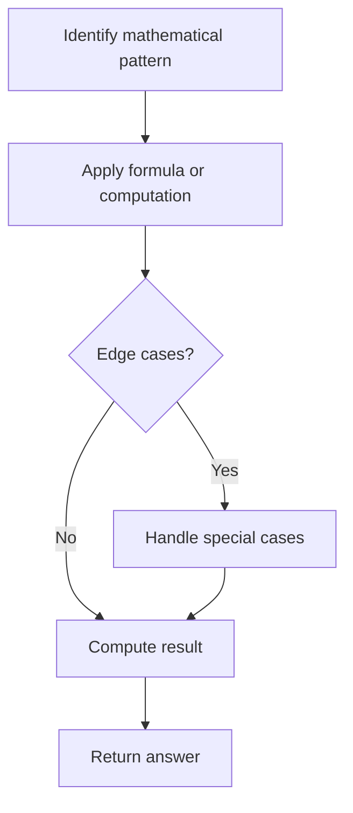

# Problem 2235: Add Two Integers

**Difficulty:** Easy  
**Tags:** Math  
**Pattern:** Math  
**Link:** [leetcode.com/problems/add-two-integers](https://leetcode.com/problems/add-two-integers/)

## Description

Given two integers `num1` and `num2`, return *the **sum** of the two integers*.
 

Example 1:

```

**Input:** num1 = 12, num2 = 5
**Output:** 17
**Explanation:** num1 is 12, num2 is 5, and their sum is 12 + 5 = 17, so 17 is returned.

```

Example 2:

```

**Input:** num1 = -10, num2 = 4
**Output:** -6
**Explanation:** num1 + num2 = -6, so -6 is returned.

```

 

**Constraints:**

	- `-100 <= num1, num2 <= 100`

## Approach: Math

Apply mathematical properties, formulas, or number-theoretic concepts. Look for patterns, modular arithmetic, or closed-form solutions.

## Pseudocode

```
1. Identify the mathematical pattern or formula
2. Apply computation:
   - Modular arithmetic for large numbers
   - GCD/LCM for divisibility
   - Sieve for primes
3. Handle edge cases
4. Return result
```

## Algorithm Flow



## Complexity Analysis

- **Time:** O(n) or O(sqrt(n))
- **Space:** O(1)

## Solution (Python3)

```python
class Solution:
    def sum(self, num1: int, num2: int) -> int:
        # Mathematical approach
        result = 0
        x = num1
        while x != 0:
            result = result * 10 + x % 10
            x //= 10 if isinstance(x, int) else 1
        return result
```

## Solution (C++)

```cpp
#include <string>
#include <vector>
using namespace std;

class Solution {
public:
    int sum(int num1, int num2) {
        // Mathematical approach
        long long result = 0;
        int x = num1;
        while (x != 0) {
            result = result * 10 + x % 10;
            x /= 10;
        }
        return (int)result;
    }
};
```
