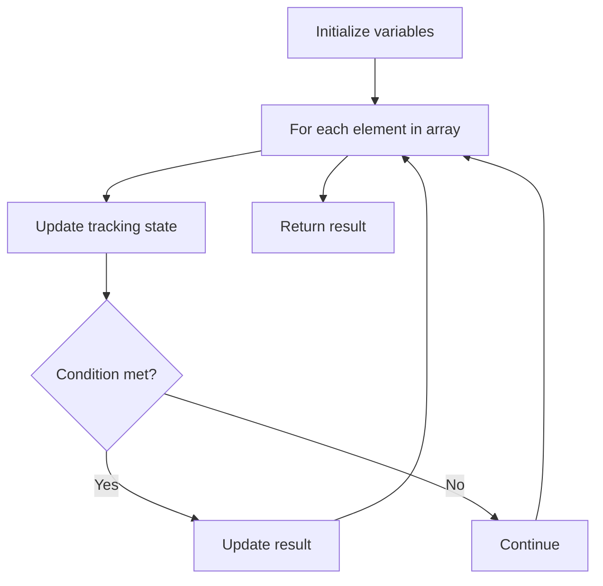

# Problem 2239: Find Closest Number to Zero

**Difficulty:** Easy  
**Tags:** Array  
**Pattern:** Array Processing  
**Link:** [leetcode.com/problems/find-closest-number-to-zero](https://leetcode.com/problems/find-closest-number-to-zero/)

## Description

Given an integer array `nums` of size `n`, return *the number with the value **closest** to *`0`* in *`nums`. If there are multiple answers, return *the number with the **largest** value*.

 

Example 1:

```

**Input:** nums = [-4,-2,1,4,8]
**Output:** 1
**Explanation:**
The distance from -4 to 0 is |-4| = 4.
The distance from -2 to 0 is |-2| = 2.
The distance from 1 to 0 is |1| = 1.
The distance from 4 to 0 is |4| = 4.
The distance from 8 to 0 is |8| = 8.
Thus, the closest number to 0 in the array is 1.

```

Example 2:

```

**Input:** nums = [2,-1,1]
**Output:** 1
**Explanation:** 1 and -1 are both the closest numbers to 0, so 1 being larger is returned.

```

 

**Constraints:**

	- `1 <= n <= 1000`
	- `-10^5 <= nums[i] <= 10^5`

## Approach: Array Processing

Process the array with a linear scan, tracking state variables. Look for patterns: running maximum/minimum, counting, or transformations.

## Pseudocode

```
1. Initialize tracking variables
2. Iterate through array:
   a. Update tracking state
   b. Check conditions
   c. Update result
3. Return result
```

## Algorithm Flow



## Complexity Analysis

- **Time:** O(n)
- **Space:** O(1)

## Solution (Python3)

```python
class Solution:
    def findClosestNumber(self, nums: List[int]) -> int:
        # Array processing - O(n) time
        result = 0
        for i in range(len(nums)):
            # Process element
            pass
        return result
```

## Solution (C++)

```cpp
#include <string>
#include <vector>
using namespace std;

class Solution {
public:
    int findClosestNumber(vector<int>& nums) {
        // Array processing - O(n) time
        for (int i = 0; i < (int)nums.size(); i++) {
            // Process element
        }
        return 0;
    }
};
```
