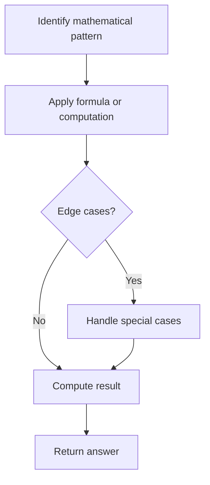

# Problem 2240: Number of Ways to Buy Pens and Pencils

**Difficulty:** Medium  
**Tags:** Math, Enumeration  
**Pattern:** Math  
**Link:** [leetcode.com/problems/number-of-ways-to-buy-pens-and-pencils](https://leetcode.com/problems/number-of-ways-to-buy-pens-and-pencils/)

## Description

You are given an integer `total` indicating the amount of money you have. You are also given two integers `cost1` and `cost2` indicating the price of a pen and pencil respectively. You can spend **part or all** of your money to buy multiple quantities (or none) of each kind of writing utensil.

Return *the **number of distinct ways** you can buy some number of pens and pencils.*

 

Example 1:

```

**Input:** total = 20, cost1 = 10, cost2 = 5
**Output:** 9
**Explanation:** The price of a pen is 10 and the price of a pencil is 5.
- If you buy 0 pens, you can buy 0, 1, 2, 3, or 4 pencils.
- If you buy 1 pen, you can buy 0, 1, or 2 pencils.
- If you buy 2 pens, you cannot buy any pencils.
The total number of ways to buy pens and pencils is 5 + 3 + 1 = 9.

```

Example 2:

```

**Input:** total = 5, cost1 = 10, cost2 = 10
**Output:** 1
**Explanation:** The price of both pens and pencils are 10, which cost more than total, so you cannot buy any writing utensils. Therefore, there is only 1 way: buy 0 pens and 0 pencils.

```

 

**Constraints:**

	- `1 <= total, cost1, cost2 <= 10^6`

## Approach: Math

Apply mathematical properties, formulas, or number-theoretic concepts. Look for patterns, modular arithmetic, or closed-form solutions.

## Pseudocode

```
1. Identify the mathematical pattern or formula
2. Apply computation:
   - Modular arithmetic for large numbers
   - GCD/LCM for divisibility
   - Sieve for primes
3. Handle edge cases
4. Return result
```

## Algorithm Flow



## Complexity Analysis

- **Time:** O(n) or O(sqrt(n))
- **Space:** O(1)

## Solution (Python3)

```python
class Solution:
    def waysToBuyPensPencils(self, total: int, cost1: int, cost2: int) -> int:
        # Mathematical approach
        result = 0
        x = total
        while x != 0:
            result = result * 10 + x % 10
            x //= 10 if isinstance(x, int) else 1
        return result
```

## Solution (C++)

```cpp
#include <string>
#include <vector>
using namespace std;

class Solution {
public:
    int waysToBuyPensPencils(int total, int cost1, int cost2) {
        // Mathematical approach
        long long result = 0;
        int x = total;
        while (x != 0) {
            result = result * 10 + x % 10;
            x /= 10;
        }
        return (int)result;
    }
};
```
