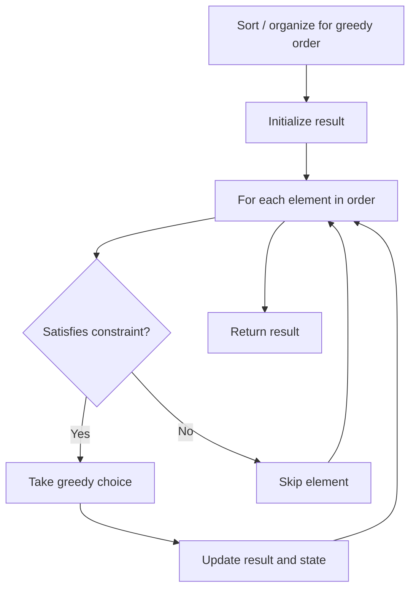

# Problem 2241: Design an ATM Machine

**Difficulty:** Medium  
**Tags:** Array, Greedy, Design  
**Pattern:** Greedy  
**Link:** [leetcode.com/problems/design-an-atm-machine](https://leetcode.com/problems/design-an-atm-machine/)

## Description

There is an ATM machine that stores banknotes of `5` denominations: `20`, `50`, `100`, `200`, and `500` dollars. Initially the ATM is empty. The user can use the machine to deposit or withdraw any amount of money.

When withdrawing, the machine prioritizes using banknotes of **larger** values.

	- For example, if you want to withdraw `$300` and there are `2` `$50` banknotes, `1` `$100` banknote, and `1` `$200` banknote, then the machine will use the `$100` and `$200` banknotes.
	- However, if you try to withdraw `$600` and there are `3` `$200` banknotes and `1` `$500` banknote, then the withdraw request will be rejected because the machine will first try to use the `$500` banknote and then be unable to use banknotes to complete the remaining `$100`. Note that the machine is **not** allowed to use the `$200` banknotes instead of the `$500` banknote.

Implement the ATM class:

	- `ATM()` Initializes the ATM object.
	- `void deposit(int[] banknotesCount)` Deposits new banknotes in the order `$20`, `$50`, `$100`, `$200`, and `$500`.
	- `int[] withdraw(int amount)` Returns an array of length `5` of the number of banknotes that will be handed to the user in the order `$20`, `$50`, `$100`, `$200`, and `$500`, and update the number of banknotes in the ATM after withdrawing. Returns `[-1]` if it is not possible (do **not** withdraw any banknotes in this case).

 

Example 1:

```

**Input**
["ATM", "deposit", "withdraw", "deposit", "withdraw", "withdraw"]
[[], [[0,0,1,2,1]], [600], [[0,1,0,1,1]], [600], [550]]
**Output**
[null, null, [0,0,1,0,1], null, [-1], [0,1,0,0,1]]

**Explanation**
ATM atm = new ATM();
atm.deposit([0,0,1,2,1]); // Deposits 1 $100 banknote, 2 $200 banknotes,
                          // and 1 $500 banknote.
atm.withdraw(600);        // Returns [0,0,1,0,1]. The machine uses 1 $100 banknote
                          // and 1 $500 banknote. The banknotes left over in the
                          // machine are [0,0,0,2,0].
atm.deposit([0,1,0,1,1]); // Deposits 1 $50, $200, and $500 banknote.
                          // The banknotes in the machine are now [0,1,0,3,1].
atm.withdraw(600);        // Returns [-1]. The machine will try to use a $500 banknote
                          // and then be unable to complete the remaining $100,
                          // so the withdraw request will be rejected.
                          // Since the request is rejected, the number of banknotes
                          // in the machine is not modified.
atm.withdraw(550);        // Returns [0,1,0,0,1]. The machine uses 1 $50 banknote
                          // and 1 $500 banknote.
```

 

**Constraints:**

	- `banknotesCount.length == 5`
	- `0 <= banknotesCount[i] <= 10^9`
	- `1 <= amount <= 10^9`
	- At most `5000` calls **in total** will be made to `withdraw` and `deposit`.
	- At least **one** call will be made to each function `withdraw` and `deposit`.
	- Sum of `banknotesCount[i]` in all deposits doesn't exceed `10^9`

## Approach: Greedy

Make the locally optimal choice at each step, trusting it leads to a global optimum. Greedy works when the problem has the greedy-choice property and optimal substructure.

## Pseudocode

```
1. Sort or organize data for greedy ordering
2. Initialize result
3. For each element in greedy order:
   a. If element satisfies constraint:
      - Take the greedy choice
      - Update result and state
4. Return result
```

## Algorithm Flow



## Complexity Analysis

- **Time:** O(n log n)
- **Space:** O(1)

## Solution (Python3)

```python
class ATM:
    def __init__(self):
        # Initialize data structure
        pass

    def deposit(self, banknotesCount: List[int]) -> None:
        return None

    def withdraw(self, amount: int) -> List[int]:
        return []

```

## Solution (C++)

```cpp
#include <algorithm>
#include <string>
#include <vector>
using namespace std;

class ATM {
public:
    ATM() {
        // Initialize
    }

    void deposit(vector<int>& banknotesCount) {
        return ;
    }

    vector<int> withdraw(int amount) {
        return {};
    }

};
```
