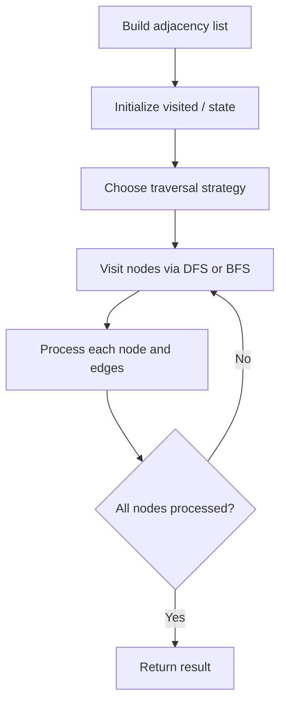

# Problem 2242: Maximum Score of a Node Sequence

**Difficulty:** Hard  
**Tags:** Array, Graph Theory, Sorting, Enumeration  
**Pattern:** Graph Algorithm  
**Link:** [leetcode.com/problems/maximum-score-of-a-node-sequence](https://leetcode.com/problems/maximum-score-of-a-node-sequence/)

## Description

There is an **undirected** graph with `n` nodes, numbered from `0` to `n - 1`.

You are given a **0-indexed** integer array `scores` of length `n` where `scores[i]` denotes the score of node `i`. You are also given a 2D integer array `edges` where `edges[i] = [ai, bi]` denotes that there exists an **undirected** edge connecting nodes `ai` and `bi`.

A node sequence is **valid** if it meets the following conditions:

	- There is an edge connecting every pair of **adjacent** nodes in the sequence.
	- No node appears more than once in the sequence.

The score of a node sequence is defined as the **sum** of the scores of the nodes in the sequence.

Return *the **maximum score** of a valid node sequence with a length of *`4`*. *If no such sequence exists, return* *`-1`.

 

Example 1:

```

**Input:** scores = [5,2,9,8,4], edges = [[0,1],[1,2],[2,3],[0,2],[1,3],[2,4]]
**Output:** 24
**Explanation:** The figure above shows the graph and the chosen node sequence [0,1,2,3].
The score of the node sequence is 5 + 2 + 9 + 8 = 24.
It can be shown that no other node sequence has a score of more than 24.
Note that the sequences [3,1,2,0] and [1,0,2,3] are also valid and have a score of 24.
The sequence [0,3,2,4] is not valid since no edge connects nodes 0 and 3.

```

Example 2:

```

**Input:** scores = [9,20,6,4,11,12], edges = [[0,3],[5,3],[2,4],[1,3]]
**Output:** -1
**Explanation:** The figure above shows the graph.
There are no valid node sequences of length 4, so we return -1.

```

 

**Constraints:**

	- `n == scores.length`
	- `4 <= n <= 5 * 10^4`
	- `1 <= scores[i] <= 10^8`
	- `0 <= edges.length <= 5 * 10^4`
	- `edges[i].length == 2`
	- `0 <= ai, bi <= n - 1`
	- `ai != bi`
	- There are no duplicate edges.

## Approach: Graph Algorithm

Build an adjacency list/matrix from the input. Apply graph traversal (DFS/BFS), shortest path, or connectivity algorithm as needed.

## Pseudocode

```
1. Build adjacency list from edges
2. Initialize visited/distance arrays
3. Apply traversal algorithm:
   - DFS/BFS for reachability
   - Dijkstra/Bellman-Ford for shortest path
   - Union-Find for connectivity
4. Return result
```

## Algorithm Flow



## Complexity Analysis

- **Time:** O(V + E)
- **Space:** O(V + E)

## Solution (Python3)

```python
class Solution:
    def maximumScore(self, scores: List[int], edges: List[List[int]]) -> int:
        # Graph traversal - O(V+E) time
        from collections import defaultdict
        graph = defaultdict(list)
        # Build adjacency list from input
        n = len(scores) if isinstance(scores, list) else scores
        visited = [False] * n
        result = 0
        
        def dfs(node):
            visited[node] = True
            for neighbor in graph[node]:
                if not visited[neighbor]:
                    dfs(neighbor)
        
        for i in range(n):
            if not visited[i]:
                dfs(i)
                result += 1
        return result
```

## Solution (C++)

```cpp
#include <functional>
#include <string>
#include <vector>
using namespace std;

class Solution {
public:
    int maximumScore(vector<int>& scores, vector<vector<int>>& edges) {
        // Graph traversal - O(V+E) time
        int n = scores.size();
        vector<vector<int>> graph(n);
        vector<bool> visited(n, false);
        int result = 0;
        function<void(int)> dfs = [&](int node) {
            visited[node] = true;
            for (int neighbor : graph[node]) {
                if (!visited[neighbor]) dfs(neighbor);
            }
        };
        for (int i = 0; i < n; i++) {
            if (!visited[i]) {
                dfs(i);
                result++;
            }
        }
        return result;
    }
};
```
