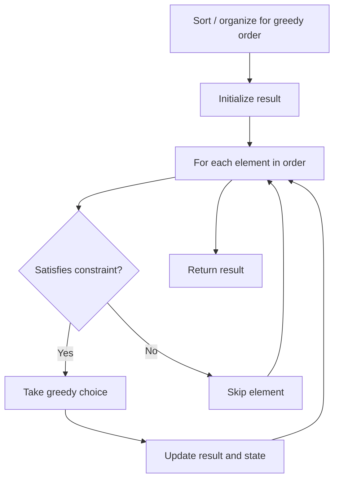

# Problem 2244: Minimum Rounds to Complete All Tasks

**Difficulty:** Medium  
**Tags:** Array, Hash Table, Greedy, Counting  
**Pattern:** Greedy  
**Link:** [leetcode.com/problems/minimum-rounds-to-complete-all-tasks](https://leetcode.com/problems/minimum-rounds-to-complete-all-tasks/)

## Description

You are given a **0-indexed** integer array `tasks`, where `tasks[i]` represents the difficulty level of a task. In each round, you can complete either 2 or 3 tasks of the **same difficulty level**.

Return *the **minimum** rounds required to complete all the tasks, or *`-1`* if it is not possible to complete all the tasks.*

 

Example 1:

```

**Input:** tasks = [2,2,3,3,2,4,4,4,4,4]
**Output:** 4
**Explanation:** To complete all the tasks, a possible plan is:
- In the first round, you complete 3 tasks of difficulty level 2. 
- In the second round, you complete 2 tasks of difficulty level 3. 
- In the third round, you complete 3 tasks of difficulty level 4. 
- In the fourth round, you complete 2 tasks of difficulty level 4.  
It can be shown that all the tasks cannot be completed in fewer than 4 rounds, so the answer is 4.

```

Example 2:

```

**Input:** tasks = [2,3,3]
**Output:** -1
**Explanation:** There is only 1 task of difficulty level 2, but in each round, you can only complete either 2 or 3 tasks of the same difficulty level. Hence, you cannot complete all the tasks, and the answer is -1.

```

 

**Constraints:**

	- `1 <= tasks.length <= 10^5`
	- `1 <= tasks[i] <= 10^9`

 

**Note:** This question is the same as 2870: Minimum Number of Operations to Make Array Empty.

## Approach: Greedy

Make the locally optimal choice at each step, trusting it leads to a global optimum. Greedy works when the problem has the greedy-choice property and optimal substructure.

## Pseudocode

```
1. Sort or organize data for greedy ordering
2. Initialize result
3. For each element in greedy order:
   a. If element satisfies constraint:
      - Take the greedy choice
      - Update result and state
4. Return result
```

## Algorithm Flow



## Complexity Analysis

- **Time:** O(n log n)
- **Space:** O(1)

## Solution (Python3)

```python
class Solution:
    def minimumRounds(self, tasks: List[int]) -> int:
        # Greedy approach - O(n) time
        result = 0
        curr_max = 0
        for i in range(len(tasks)):
            if isinstance(tasks[i], int):
                curr_max = max(curr_max, tasks[i])
                result = max(result, curr_max)
            else:
                result += 1
        return result
```

## Solution (C++)

```cpp
#include <algorithm>
#include <string>
#include <vector>
using namespace std;

class Solution {
public:
    int minimumRounds(vector<int>& tasks) {
        // Greedy approach - O(n) time
        int result = 0, curr_max = 0;
        for (int i = 0; i < (int)tasks.size(); i++) {
            curr_max = max(curr_max, tasks[i]);
            result = max(result, curr_max);
        }
        return result;
    }
};
```
